Exercicio 5
================
Helena Santos

### Carregue o banco de dados `world` que está no pacote `poliscidata`.

``` r
library(poliscidata)
library(tidyverse)
```

    ## -- Attaching packages ----------------------------------------------- tidyverse 1.3.0 --

    ## v ggplot2 3.3.1     v purrr   0.3.4
    ## v tibble  3.0.1     v dplyr   1.0.0
    ## v tidyr   1.1.0     v stringr 1.4.0
    ## v readr   1.3.1     v forcats 0.5.0

    ## -- Conflicts -------------------------------------------------- tidyverse_conflicts() --
    ## x dplyr::filter() masks stats::filter()
    ## x dplyr::lag()    masks stats::lag()

``` r
banco <- world
```

### Existem diversas medidas de democracia para os países: `dem_score14`, `democ11`, `fhrate04_rev`, `fhrate08_rev`, `polity`. Descreva-as graficamente e diga quais são as diferenças entre tais medidas.

``` r
?world 
```

    ## starting httpd help server ... done

``` r
banco$dem_score14
```

    ##   [1] 2.77 5.67 3.83 3.35 6.84 4.13 9.01 8.54 2.83 2.87 5.78 3.69 7.93 5.65 4.87
    ##  [16] 5.79 4.78 7.87 7.38 6.73 4.09 3.05 3.33 4.78 3.41 9.08 7.81 1.49 1.50 7.80
    ##  [31] 3.00 6.55 3.52 1.75 2.89 8.03 3.53 6.93 3.52 7.40 7.94 9.11 2.99 6.67 5.87
    ##  [46] 3.16 6.53 1.66 2.44 7.74 3.72 5.61 9.03 8.04 3.76 3.05 5.82 8.64 6.33 7.45
    ##  [61] 5.81 3.01 1.93 5.91 3.82 5.84 6.46 6.90 9.58 7.92 6.95 1.98 4.23 8.72 7.63
    ##  [76] 7.85 7.39 8.08 3.76 3.17 5.13 1.08 8.06 3.78 5.24 2.21 7.48 5.12 6.66 4.95
    ##  [91] 3.80 7.54 8.88 6.25 4.42 5.66 6.49 5.79 8.39 4.17 8.17 6.68 6.32 6.62 5.94
    ## [106] 4.00 4.66 6.24 4.77 8.92 9.26 5.32 4.02 3.76 9.93 3.15 4.64 4.72 7.08 6.03
    ## [121] 6.26 6.54 6.77 7.47 7.79 3.18 6.68 3.39 3.25 1.82 6.15 6.71 4.56 6.03 7.35
    ## [136] 7.57 7.82 8.05 5.69 2.54 6.77 3.09 9.73 9.09 1.74 7.65 2.37 5.77 5.39 7.24
    ## [151] 3.45 6.99 6.31 5.12 1.83 5.22 5.42 2.64 8.31 8.11 8.17 2.45 5.07 3.41 2.79
    ## [166] 6.39 2.78

``` r
banco$democ11
```

    ##   [1] NA  9  3  2  8  5 10 10  0  0  6  0  8  7  3  7 NA  8  8  9  2 NA  7  3  1
    ##  [26] 10 10 NA  1 10  0  7  9 NA NA 10 NA  9  0 10  8 10  3 NA  5  0  8  0  0  9
    ##  [51]  3  0 10  9  4 NA  7 10  8 10  8  5  7  6 NA  7 NA 10 NA  9  8  0  4 10 10
    ##  [76] 10  9 10  2  0  8 NA NA  0  7  0  8  8  8  7 NA 10 NA  9  4  6  6  7 NA  0
    ## [101] 10  8  8 10  9  1  5  6  6 10 10  9  7  4 10  0  6 NA  9  4  9  9  8 10 10
    ## [126]  0  9  5  0  0  7  9  8  2 NA 10  9 10  5  1  6  0 10 10  0 10  1  2  7 NA
    ## [151]  1 NA NA  9  0  1  6 NA 10 10 10  0  1  0  1  7  3

``` r
banco$fhrate04_rev
```

    ##   [1] 2.5 5.0 2.5 2.5 6.0 3.5 7.0 7.0 2.5 3.0 4.0 1.5 7.0 6.0 2.5 5.0 4.5 6.0
    ##  [19] 5.5 6.5 3.5  NA 3.0 2.5 2.0 7.0 7.0 2.5 2.5 7.0 1.5 4.0 4.0  NA  NA 7.0
    ##  [37] 4.5 6.0 1.0 7.0 7.0 7.0 3.0  NA 5.0 2.5 5.5 1.5 1.5 7.0 3.0 4.5 7.0 7.0
    ##  [55] 3.5  NA 4.5 7.0 6.0 6.5 4.0 2.5 4.0 6.0 1.5 5.0  NA 7.0 7.0 5.5 4.5 2.0
    ##  [73] 2.0 7.0 6.0 7.0 5.5 6.5 3.5 2.5 5.0  NA  NA 3.5 2.5 1.5 6.5 2.5 5.5 3.5
    ##  [91] 1.0 6.0 7.0 5.0 5.0 4.0 4.0 6.0 7.0 2.5 7.0 6.0 4.5 6.0  NA 3.5 4.5 5.5
    ## [109] 3.0 7.0 7.0 5.0 5.0 4.0 7.0 2.5 2.5  NA 6.5 5.0 5.0 5.5 5.5 7.0 7.0 2.5
    ## [127] 5.5 2.5 2.5 1.0 5.5  NA 4.5 3.5 7.0 7.0 6.5 7.0 5.0 1.0 6.5 2.0 7.0 7.0
    ## [145] 1.0 6.5 2.5 4.5 5.5  NA 2.5  NA 2.5 5.0 1.0 3.5 4.5  NA 7.0 7.0 7.0 1.5
    ## [163] 4.5 1.5 3.0 4.0 1.5
    ## attr(,"value.labels")
    ##  Most free Least free 
    ##          7          1

``` r
banco$fhrate08_rev
```

    ##   [1]  3  8  3  3 10  4 12 12  3  4  6  1 12 10  5  8  7 10 10 10  6 NA  5  3  2
    ##  [26] 12 12  4  1 12  1  7  7 NA NA 12 NA 10  1 12 12 12  4 NA  8  3  9  0  1 12
    ##  [51]  4  4 12 12  4 NA  6 12 11 11  7  2  6  9  5  8 NA 12 12  9  9  2  2 12 11
    ##  [76] 11  9 11  4  3  7 NA NA  6  5  1 11  5  9  7  0 12 12  8  7  6  6  9 12  3
    ## [101] 11  9  6 10 NA  5  8 10  6 12 12  7  7  5 12  3  5 NA 11  7  8  9  7 12 12
    ## [126]  3 10  3  3  1  8 NA  8  5 12 12 10 12  6  0 10  2 12 12  1 11  3  7  5 NA
    ## [151]  4 NA  2  8  0  5  9 NA 12 12 12  0  6  2  4  8  1

``` r
banco$polity
```

    ##   [1]  NA   9   2  -2   8   5  10  10  -7  -8   5  -7   8   7   3   7  NA   8
    ##  [19]   8   9   0  NA   6   2  -4  10  10  NA  -2  10  -7   7   9  NA  NA  10
    ##  [37]  NA   9  -7  10   8  10   2  NA   5  -2   8  -5  -7   9   1  -4  10   9
    ##  [55]   3  NA   6  10   8  10   8   5   6   6  NA   7  NA  10  NA   9   8  -7
    ##  [73]   3  10  10  10   9  10  -3  -6   8  NA  NA  -7   7  -7   8   7   8   6
    ##  [91]  NA  10  NA   9   3   6   6   7  NA  -2  10   8   8  10   9  -4   5   6
    ## [109]   6  10  10   9   6   4  10  -8   6  NA   9   4   8   9   8  10  10 -10
    ## [127]   9   4  -4 -10   7   8   7  -2  NA  10   9  10   4  -2   5  -9  10  10
    ## [145]  -7  10  -3  -1   7  NA  -2  NA  NA   9  -9  -1   6  NA  10  10  10  -9
    ## [163]  -3  -7  -2   7   1

``` r
ggplot(banco, aes("",dem_score14)) +
 geom_boxplot()
```

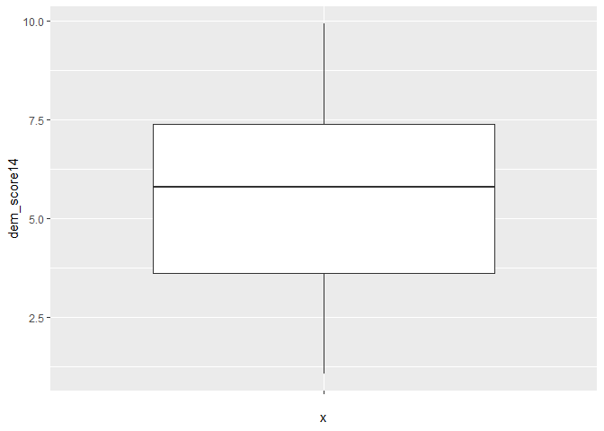<!-- -->

``` r
ggplot(banco, aes("",democ11)) +
 geom_boxplot()
```

    ## Warning: Removed 23 rows containing non-finite values (stat_boxplot).

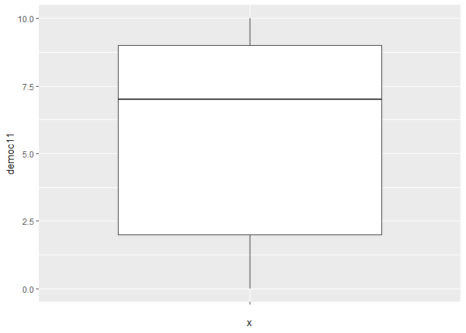<!-- -->

``` r
ggplot(banco, aes ("",fhrate04_rev))+
 geom_boxplot()
```

    ## Warning: Removed 14 rows containing non-finite values (stat_boxplot).

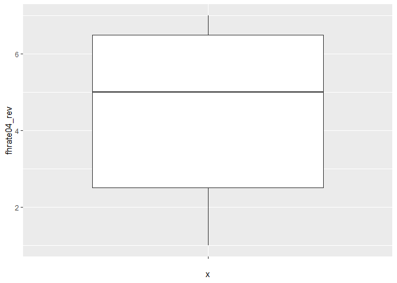<!-- -->

``` r
ggplot(banco, aes ("",fhrate08_rev))+
  geom_boxplot()
```

    ## Warning: Removed 15 rows containing non-finite values (stat_boxplot).

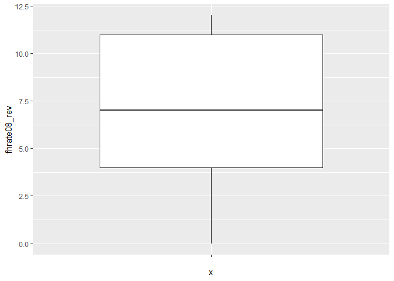<!-- -->

``` r
ggplot(banco, aes ("",polity))+
geom_boxplot()
```

    ## Warning: Removed 23 rows containing non-finite values (stat_boxplot).

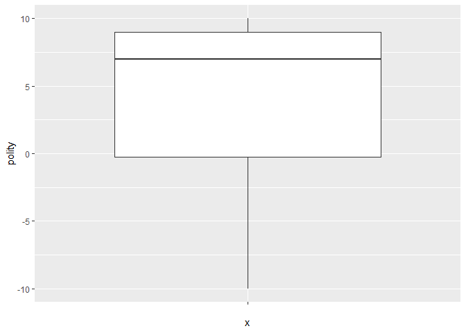<!-- -->

### Resposta: As variáveis democ11, fhrate08\_rev, polity, dem\_score14 e fhrate04\_rev, podem ser classificadas como contínuas, pois mesmo que representando graus de democracia elas têm valores numéricos na sua classificação. A variável democ11 mostra o Democracy score, 2011 (UN)e varia de 0 a 10. A variável fhrate08\_rev representa o Freedom House 1-7 scale reversed, rescaled 0-12, e vai de 0 a 12 sendo cada número uma categora difernte de democracia. A variável polity representa scores de democracia, quanto mais alto o score mais democrático é o país, variando de scores negativos a positivos. Já as variáveis dem\_score14 e fhrate04\_rev possuem valores fracionados.

### Avalie a relação entre todas as medidas de democracia e desigualdade, utilizando a variável `gini08`. Descreva graficamente esta variável, a relação entre as duas variáveis, meça a correlação entre elas e faça regressões lineares (interpretando em profundidade os resultados dos coeficientes e medidas de desempenho dos modelos). Enfatize as semelhanças e diferenças entre os resultados. Quais são suas conclusões?

``` r
banco$gini08
```

    ##   [1]   NA 31.1 35.3   NA 51.3 33.8 35.2 29.1 36.5   NA 33.4 29.7 33.0 36.5   NA
    ##  [16] 60.1 26.2 60.5 57.0 29.2 39.5   NA 42.4 41.7 44.6 32.6   NA 61.3   NA 54.9
    ##  [31] 46.9 58.6   NA   NA   NA 49.8 44.6 29.0   NA   NA 25.4 24.7   NA   NA 53.6
    ##  [46] 34.4 52.4   NA   NA 35.8 30.0   NA 26.9 32.7   NA   NA 40.4 28.3 40.8 34.3
    ##  [61] 55.1 38.6 47.0   NA 59.2 53.8   NA 26.9   NA 36.8 34.3 43.0   NA 34.3 39.2
    ##  [76] 36.0 45.5 24.9 38.8 33.9 42.5   NA   NA   NA 30.3 34.6 37.7   NA 63.2   NA
    ##  [91]   NA 36.0 31.0 39.0 47.5 39.0 49.2 40.1   NA 39.0   NA 46.1 33.2 32.8   NA
    ## [106] 39.5 47.3 74.3 47.2 30.9 36.2 43.1 50.5 43.7 25.8   NA 30.6   NA 56.1 50.9
    ## [121] 58.4 52.0 44.5 34.5 38.5   NA 31.0 39.9 46.8   NA 41.3   NA 62.9 42.5 25.8
    ## [136] 28.4 57.8 34.7 40.2   NA   NA 50.4 25.0 33.7   NA   NA 32.6 34.6 42.0   NA
    ## [151]   NA   NA 39.8 43.6 40.8 45.7 28.1   NA 36.0 40.8 44.9 36.8 48.2 34.4 33.4
    ## [166] 50.8 50.1

``` r
ggplot(banco, aes("",y = gini08)) + 
  geom_boxplot()
```

    ## Warning: Removed 45 rows containing non-finite values (stat_boxplot).

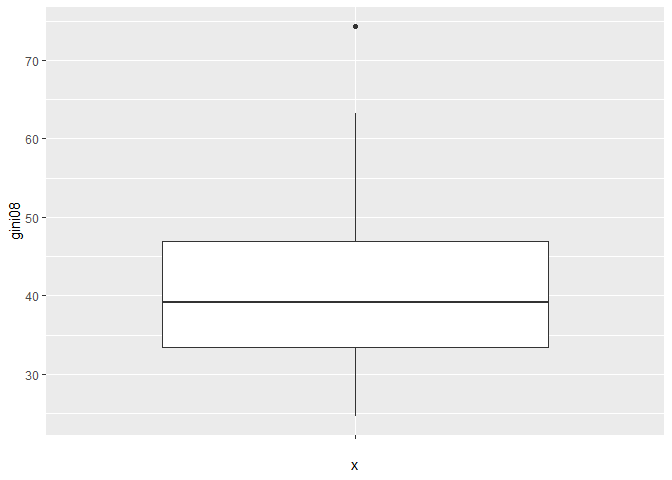<!-- -->

``` r
ggplot(banco, aes(gini08,dem_score14)) +
 geom_point()+
 geom_smooth(method = "lm")
```

    ## `geom_smooth()` using formula 'y ~ x'

    ## Warning: Removed 45 rows containing non-finite values (stat_smooth).

    ## Warning: Removed 45 rows containing missing values (geom_point).

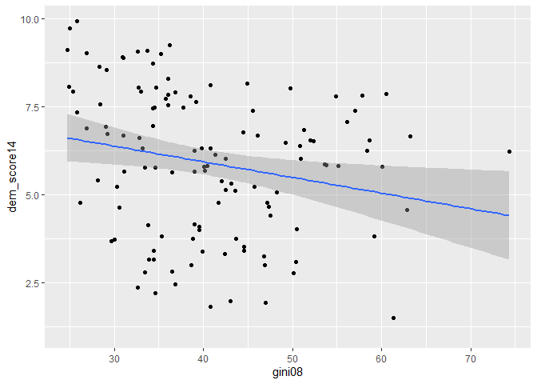<!-- -->

``` r
cor.test(banco$gini08, banco$dem_score14) 
```

    ## 
    ##  Pearson's product-moment correlation
    ## 
    ## data:  banco$gini08 and banco$dem_score14
    ## t = -2.4621, df = 120, p-value = 0.01523
    ## alternative hypothesis: true correlation is not equal to 0
    ## 95 percent confidence interval:
    ##  -0.38215203 -0.04321115
    ## sample estimates:
    ##        cor 
    ## -0.2192877

``` r
regressao1 <- lm(dem_score14 ~ gini08, data = banco)
summary (regressao1)
```

    ## 
    ## Call:
    ## lm(formula = dem_score14 ~ gini08, data = banco)
    ## 
    ## Residuals:
    ##     Min      1Q  Median      3Q     Max 
    ## -4.0728 -1.7583  0.3513  1.6742  3.3600 
    ## 
    ## Coefficients:
    ##             Estimate Std. Error t value Pr(>|t|)    
    ## (Intercept)  7.71756    0.75639  10.203   <2e-16 ***
    ## gini08      -0.04448    0.01807  -2.462   0.0152 *  
    ## ---
    ## Signif. codes:  0 '***' 0.001 '**' 0.01 '*' 0.05 '.' 0.1 ' ' 1
    ## 
    ## Residual standard error: 2.003 on 120 degrees of freedom
    ##   (45 observations deleted due to missingness)
    ## Multiple R-squared:  0.04809,    Adjusted R-squared:  0.04015 
    ## F-statistic: 6.062 on 1 and 120 DF,  p-value: 0.01523

``` r
ggplot(banco, aes(gini08, democ11)) +
 geom_point()+
 geom_smooth(method = "lm")
```

    ## `geom_smooth()` using formula 'y ~ x'

    ## Warning: Removed 52 rows containing non-finite values (stat_smooth).

    ## Warning: Removed 52 rows containing missing values (geom_point).

<!-- -->

``` r
cor.test(banco$gini08, banco$democ11)
```

    ## 
    ##  Pearson's product-moment correlation
    ## 
    ## data:  banco$gini08 and banco$democ11
    ## t = -0.90439, df = 113, p-value = 0.3677
    ## alternative hypothesis: true correlation is not equal to 0
    ## 95 percent confidence interval:
    ##  -0.26378781  0.09988899
    ## sample estimates:
    ##         cor 
    ## -0.08477203

``` r
regressao2 <- lm(democ11 ~ gini08, data = banco)
summary (regressao2)
```

    ## 
    ## Call:
    ## lm(formula = democ11 ~ gini08, data = banco)
    ## 
    ## Residuals:
    ##    Min     1Q Median     3Q    Max 
    ## -6.796 -2.213  1.302  3.049  3.958 
    ## 
    ## Coefficients:
    ##             Estimate Std. Error t value Pr(>|t|)    
    ## (Intercept)  7.68568    1.38306   5.557 1.85e-07 ***
    ## gini08      -0.02994    0.03311  -0.904    0.368    
    ## ---
    ## Signif. codes:  0 '***' 0.001 '**' 0.01 '*' 0.05 '.' 0.1 ' ' 1
    ## 
    ## Residual standard error: 3.47 on 113 degrees of freedom
    ##   (52 observations deleted due to missingness)
    ## Multiple R-squared:  0.007186,   Adjusted R-squared:  -0.0016 
    ## F-statistic: 0.8179 on 1 and 113 DF,  p-value: 0.3677

``` r
ggplot(banco, aes(gini08, fhrate04_rev)) +
 geom_point()+
 geom_smooth(method = "lm")
```

    ## `geom_smooth()` using formula 'y ~ x'

    ## Warning: Removed 45 rows containing non-finite values (stat_smooth).

    ## Warning: Removed 45 rows containing missing values (geom_point).

<!-- -->

``` r
cor.test(banco$gini08, banco$fhrate04_rev)
```

    ## 
    ##  Pearson's product-moment correlation
    ## 
    ## data:  banco$gini08 and banco$fhrate04_rev
    ## t = -1.9869, df = 120, p-value = 0.04921
    ## alternative hypothesis: true correlation is not equal to 0
    ## 95 percent confidence interval:
    ##  -0.3452745300 -0.0007294745
    ## sample estimates:
    ##        cor 
    ## -0.1784673

``` r
regressao3 <- lm(fhrate04_rev ~ gini08, data = banco)
summary (regressao3)
```

    ## 
    ## Call:
    ## lm(formula = fhrate04_rev ~ gini08, data = banco)
    ## 
    ## Residuals:
    ##     Min      1Q  Median      3Q     Max 
    ## -3.8312 -1.3896  0.4312  1.6729  2.6199 
    ## 
    ## Coefficients:
    ##             Estimate Std. Error t value Pr(>|t|)    
    ## (Intercept)  6.13654    0.67419   9.102 2.35e-15 ***
    ## gini08      -0.03199    0.01610  -1.987   0.0492 *  
    ## ---
    ## Signif. codes:  0 '***' 0.001 '**' 0.01 '*' 0.05 '.' 0.1 ' ' 1
    ## 
    ## Residual standard error: 1.786 on 120 degrees of freedom
    ##   (45 observations deleted due to missingness)
    ## Multiple R-squared:  0.03185,    Adjusted R-squared:  0.02378 
    ## F-statistic: 3.948 on 1 and 120 DF,  p-value: 0.04921

``` r
ggplot(banco, aes(gini08, fhrate08_rev)) +
 geom_point()+
 geom_smooth(method = "lm")
```

    ## `geom_smooth()` using formula 'y ~ x'

    ## Warning: Removed 46 rows containing non-finite values (stat_smooth).

    ## Warning: Removed 46 rows containing missing values (geom_point).

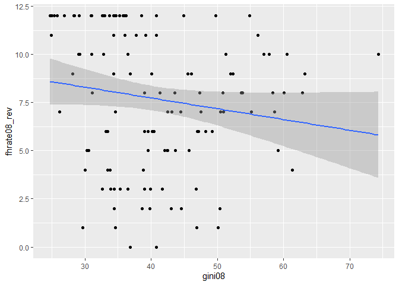<!-- -->

``` r
cor.test(banco$gini08, banco$fhrate08_rev) 
```

    ## 
    ##  Pearson's product-moment correlation
    ## 
    ## data:  banco$gini08 and banco$fhrate08_rev
    ## t = -1.7432, df = 119, p-value = 0.08387
    ## alternative hypothesis: true correlation is not equal to 0
    ## 95 percent confidence interval:
    ##  -0.32708386  0.02129614
    ## sample estimates:
    ##        cor 
    ## -0.1578002

``` r
regressao4 <- lm(fhrate08_rev ~ gini08, data = banco)
summary (regressao4)
```

    ## 
    ## Call:
    ## lm(formula = fhrate08_rev ~ gini08, data = banco)
    ## 
    ## Residuals:
    ##     Min      1Q  Median      3Q     Max 
    ## -7.9157 -2.5971  0.6712  3.4091  5.0961 
    ## 
    ## Coefficients:
    ##             Estimate Std. Error t value Pr(>|t|)    
    ## (Intercept)  9.97288    1.34188   7.432 1.79e-11 ***
    ## gini08      -0.05590    0.03207  -1.743   0.0839 .  
    ## ---
    ## Signif. codes:  0 '***' 0.001 '**' 0.01 '*' 0.05 '.' 0.1 ' ' 1
    ## 
    ## Residual standard error: 3.554 on 119 degrees of freedom
    ##   (46 observations deleted due to missingness)
    ## Multiple R-squared:  0.0249, Adjusted R-squared:  0.01671 
    ## F-statistic: 3.039 on 1 and 119 DF,  p-value: 0.08387

``` r
ggplot(banco, aes(gini08, polity)) +
 geom_point()+
 geom_smooth(method = "lm")
```

    ## `geom_smooth()` using formula 'y ~ x'

    ## Warning: Removed 52 rows containing non-finite values (stat_smooth).

    ## Warning: Removed 52 rows containing missing values (geom_point).

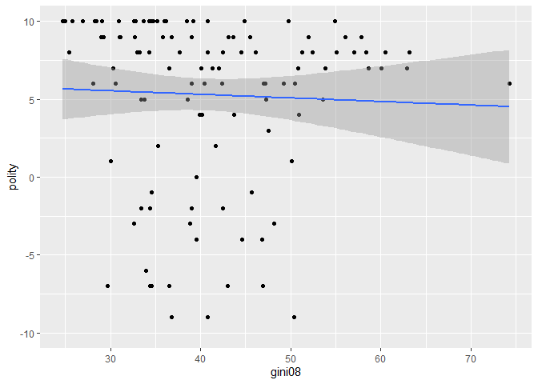<!-- -->

``` r
cor.test(banco$gini08, banco$polity) 
```

    ## 
    ##  Pearson's product-moment correlation
    ## 
    ## data:  banco$gini08 and banco$polity
    ## t = -0.43417, df = 113, p-value = 0.665
    ## alternative hypothesis: true correlation is not equal to 0
    ## 95 percent confidence interval:
    ##  -0.2222590  0.1433725
    ## sample estimates:
    ##         cor 
    ## -0.04080936

``` r
regressao5 <- lm(polity ~ gini08, data = banco)
summary(regressao5)
```

    ## 
    ## Call:
    ## lm(formula = polity ~ gini08, data = banco)
    ## 
    ## Residuals:
    ##     Min      1Q  Median      3Q     Max 
    ## -14.374  -1.300   2.364   4.087   5.040 
    ## 
    ## Coefficients:
    ##             Estimate Std. Error t value Pr(>|t|)   
    ## (Intercept)  6.21813    2.20594   2.819  0.00569 **
    ## gini08      -0.02292    0.05280  -0.434  0.66499   
    ## ---
    ## Signif. codes:  0 '***' 0.001 '**' 0.01 '*' 0.05 '.' 0.1 ' ' 1
    ## 
    ## Residual standard error: 5.535 on 113 degrees of freedom
    ##   (52 observations deleted due to missingness)
    ## Multiple R-squared:  0.001665,   Adjusted R-squared:  -0.007169 
    ## F-statistic: 0.1885 on 1 and 113 DF,  p-value: 0.665

### Resposta (gini08): A relação entre as variáveis que classificam a democracia e o Índice de Gini é negativa, ou seja, quanto menor o Índice de Gini, maior é o grau de democracia. O que faz bastante sentido, levando em conta que o Índice de Gini indica que quanto mais próximo de 0 mais igual é o país e, portanto, a situação é melhor. De acordo com os cinco modelos de regressão o que melhor explica a variação na democracia, levando em conta o R2, é o modelo que compara o Índice de Gini e dem\_score14.

  - Correlação entre Índice de Gini e dem\_score14: existe uma
    correlação negativa significativa entre o Índice de Gini e
    dem\_score14 com base num p-valor de 0,05. No resultado dessa
    correlação com o p-valor = 0,01523, e com um intervalo de confiança
    de 95% de resultado = -0,38215203 a -0,04321115, é possível rejeitar
    a hipótese nula de que a correlação é igual a 0. Regressão entre
    Índice de Gini e dem\_score14: nesse resultado o valor de
    dem\_score14 quando o Índice de Gini for igual a 0 é 7,71756
    (*intercept*), já o valor estimado para que dem\_score14 varie
    quando o Índice de Gini for igual a 1 é -0,04448, de acordo com os
    p-valores é possível considerar esses coeficientes significantes. De
    acordo com o *residual standard error* (RMSE) a distância média
    entre os valores observados e os valores estimados do *intercept* e
    do Índice de Gini é de 2,003. De acordo com o R2 esse modelo explica
    apenas 4% do total de variação em dem\_score14.
  - Correlação entre Índice de Gini e democ11: de acordo com o resultado
    não é possível detectar a correlação entre o Índice de Gini e
    dem\_score14, com o p-valor do resultado = 0,3677. Nesse resultado é
    ainda mais difícil rejeitar a hipótese nula que no resultado
    anterior, levando em conta o intervalo de confiança de 95% de
    resultado = -0,26378781 a 0,09988899. Regressão entre Índice de Gini
    e democ11: o *intercept* é 7,68568 e o coeficiente de inclinação da
    regressão é -0,02994. Porém, apenas o valor do *intercept* é
    estatisticamente significante, o valor da inclinação não. O RMSE é
    igual a 3,47 e esse modelo explica apenas 0,7% da variação em
    democ11.
  - Correlação entre Índice de Gini e fhrate04\_rev: existe uma
    correlação negativa significativa entre o Índice de Gini e
    fhrate04\_rev com base num p-valor de 0,05. No resultado dessa
    correlação o p-valor = 0,04921, e com um intervalo de confiança de
    95% de resultado = -0,3452745300 a -0,0007294745, é possível
    rejeitar a hipótese nula de que a correlação é igual a 0. Regressão
    entre Índice de Gini e fhrate04\_rev: o *intercept* é 6,13654 e o
    coeficiente de inclinação da regressão é -0,03199, de acordo com os
    p-valores ambos os coeficientes são estatisticamente significantes.
    O RMSE é igual a 1,786 e esse modelo explica apenas 3% da variação
    em fhrate04\_rev.
  - Correlação entre Índice de Gini e fhrate08\_rev: de acordo com o
    resultado não é possível detectar a correlação entre o Índice de
    Gini e fhrate08\_rev, com o p-valor do resultado = 0,08387. Com um
    intervalo de 95% de resultado -0,32708386 a 0,02129614, não é
    possível rejeitar a hipótese nula de que a correlação é igual a 0.
    Regressão entre Índice de Gini e fhrate08\_rev: o *intercept* é
    9,97288 e o coeficiente de inclinação da regressão é -0,05590. De
    acordo com os p-valores ambos apenas o *intercept* é
    estatisticamente significante. O RMSE é igual a 3,554 e esse modelo
    explica apenas 2% da variação em fhrate08\_rev.
  - Correlação entre Índice de Gini e polity, com um p-valor de 0,665
    não é possível detectar a correlação entre o Índice de Gini e
    polity. Com um intervalo de confiança de 95% de resultado =
    -0,2222590 a 0,1433725, não é possível rejeitar a hipótese nula de
    que a correlação é igual a 0. Regressão entre Índice de Gini e
    polity: o *intercept* é 6,21813, o coeficiente de inclinação da
    regressão é -0,02292. Porém, apenas o valor do *intercept* é
    estatisticamente significante, o valor da inclinação não. O RMSE é
    igual a 5,535 e esse modelo explica apenas 0,16% da variação em
    polity.

### Avalie a relação entre todas as medidas de democracia e crescimento econômico, utilizando a variável `gdppcap08`. Descreva graficamente esta variável, a relação entre as duas variáveis, meça a correlação entre elas e faça regressões lineares (interpretando em profundidade os resultados dos coeficientes e medidas de desempenho dos modelos). Enfatize as semelhanças e diferenças entre os resultados. Quais são suas conclusões?

``` r
banco$gdppcap08
```

    ##   [1]    NA  7715  8033  5899 14333  6070 35677 38152  8765 34605  1334 12261
    ##  [13] 34493  1468  4755  4278  8390 13392 10296 12393  1161    NA   383  1905
    ##  [25]  2215 36444  3504   736  1455 14465  5962  8885  1169    NA    NA 11241
    ##  [37]  1651 19084  9500 29853 24712 36607  2140    NA  8009  5416  6794 33873
    ##  [49]   632 20662   868  4382 35427 34045 14527    NA  4896 35613  1452 29361
    ##  [61]  4760  1204   538  2542  1177  3965    NA 19330 36775  2972  3975 11666
    ##  [73]  3570 44200 27548 30756  7705 34099  5283 11315  1590    NA    NA 39914
    ##  [85]  2188  2134 17100 11570  1588   388 15402 18824 78599 10041  1049   837
    ##  [97] 14215  1128 23760  2052 12079 14495  2925  3566    NA  4388   855  6343
    ## [109]  1112 40849 27029  2682   684  2082 58138 22478  2644    NA 12504  2208
    ## [121]  4709  8507  3510 17625 23074 85868 14065 16139  1022 23920  1772    NA
    ## [133]   766 49284 22081 27605 10109 31954  4560  2153  7506  4928 37383 42536
    ## [145]  4440 30881  1906  1263  7703    NA   829    NA  7996 13920  6641  1165
    ## [157]  7271    NA 35445 46716 12734  2656 12804  2785  2400  1356   188

``` r
ggplot(banco, aes("",y = gdppcap08)) + 
  geom_boxplot()
```

    ## Warning: Removed 15 rows containing non-finite values (stat_boxplot).

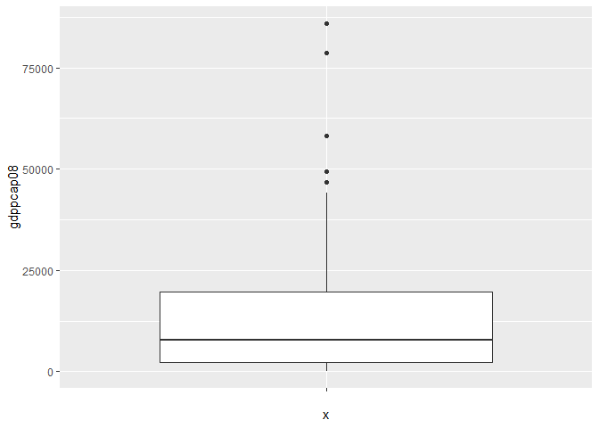<!-- -->

``` r
ggplot(banco, aes(gdppcap08,dem_score14)) +
 geom_point()+
 geom_smooth(method = "lm")
```

    ## `geom_smooth()` using formula 'y ~ x'

    ## Warning: Removed 15 rows containing non-finite values (stat_smooth).

    ## Warning: Removed 15 rows containing missing values (geom_point).

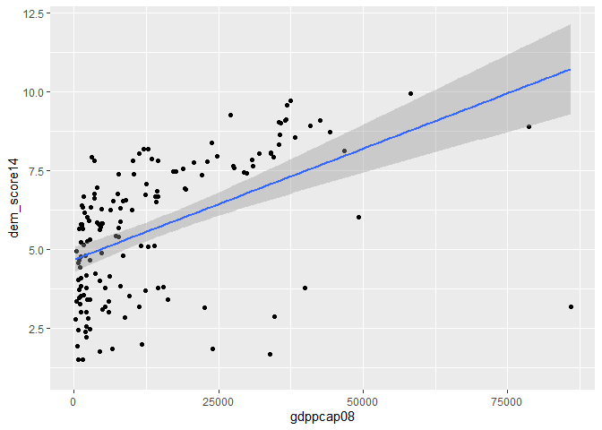<!-- -->

``` r
cor.test(banco$gdppcap08, banco$dem_score14) 
```

    ## 
    ##  Pearson's product-moment correlation
    ## 
    ## data:  banco$gdppcap08 and banco$dem_score14
    ## t = 7.1713, df = 150, p-value = 3.159e-11
    ## alternative hypothesis: true correlation is not equal to 0
    ## 95 percent confidence interval:
    ##  0.3763618 0.6150148
    ## sample estimates:
    ##       cor 
    ## 0.5052872

``` r
regressao6 <- lm(dem_score14 ~ gdppcap08, data = banco)
summary (regressao6)
```

    ## 
    ## Call:
    ## lm(formula = dem_score14 ~ gdppcap08, data = banco)
    ## 
    ## Residuals:
    ##     Min      1Q  Median      3Q     Max 
    ## -7.5428 -1.3420  0.6982  1.2843  3.0329 
    ## 
    ## Coefficients:
    ##              Estimate Std. Error t value Pr(>|t|)    
    ## (Intercept) 4.678e+00  2.017e-01  23.197  < 2e-16 ***
    ## gdppcap08   7.040e-05  9.817e-06   7.171 3.16e-11 ***
    ## ---
    ## Signif. codes:  0 '***' 0.001 '**' 0.01 '*' 0.05 '.' 0.1 ' ' 1
    ## 
    ## Residual standard error: 1.864 on 150 degrees of freedom
    ##   (15 observations deleted due to missingness)
    ## Multiple R-squared:  0.2553, Adjusted R-squared:  0.2504 
    ## F-statistic: 51.43 on 1 and 150 DF,  p-value: 3.159e-11

``` r
ggplot(banco, aes(gdppcap08, democ11)) +
 geom_point()+
 geom_smooth(method = "lm")
```

    ## `geom_smooth()` using formula 'y ~ x'

    ## Warning: Removed 25 rows containing non-finite values (stat_smooth).

    ## Warning: Removed 25 rows containing missing values (geom_point).

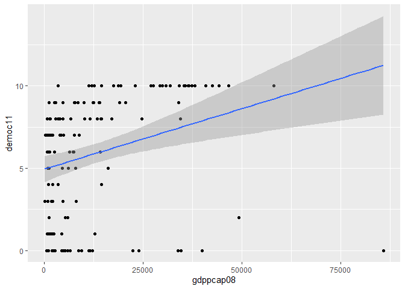<!-- -->

``` r
cor.test(banco$gdppcap08, banco$democ11)
```

    ## 
    ##  Pearson's product-moment correlation
    ## 
    ## data:  banco$gdppcap08 and banco$democ11
    ## t = 3.6037, df = 140, p-value = 0.000435
    ## alternative hypothesis: true correlation is not equal to 0
    ## 95 percent confidence interval:
    ##  0.1330147 0.4351981
    ## sample estimates:
    ##      cor 
    ## 0.291358

``` r
regressao7 <- lm(democ11 ~ gdppcap08, data = banco)
summary (regressao7)
```

    ## 
    ## Call:
    ## lm(formula = democ11 ~ gdppcap08, data = banco)
    ## 
    ## Residuals:
    ##     Min      1Q  Median      3Q     Max 
    ## -11.258  -3.030   1.723   2.783   4.803 
    ## 
    ## Coefficients:
    ##              Estimate Std. Error t value Pr(>|t|)    
    ## (Intercept) 4.939e+00  4.026e-01  12.270  < 2e-16 ***
    ## gdppcap08   7.359e-05  2.042e-05   3.604 0.000435 ***
    ## ---
    ## Signif. codes:  0 '***' 0.001 '**' 0.01 '*' 0.05 '.' 0.1 ' ' 1
    ## 
    ## Residual standard error: 3.57 on 140 degrees of freedom
    ##   (25 observations deleted due to missingness)
    ## Multiple R-squared:  0.08489,    Adjusted R-squared:  0.07835 
    ## F-statistic: 12.99 on 1 and 140 DF,  p-value: 0.000435

``` r
ggplot(banco, aes(gdppcap08, fhrate04_rev)) +
 geom_point()+
 geom_smooth(method = "lm")
```

    ## `geom_smooth()` using formula 'y ~ x'

    ## Warning: Removed 15 rows containing non-finite values (stat_smooth).

    ## Warning: Removed 15 rows containing missing values (geom_point).

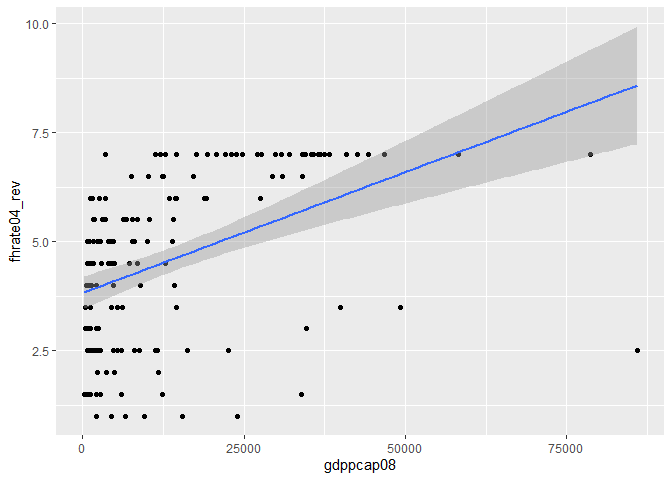<!-- -->

``` r
cor.test(banco$gdppcap08, banco$fhrate04_rev)
```

    ## 
    ##  Pearson's product-moment correlation
    ## 
    ## data:  banco$gdppcap08 and banco$fhrate04_rev
    ## t = 6.0129, df = 150, p-value = 1.331e-08
    ## alternative hypothesis: true correlation is not equal to 0
    ## 95 percent confidence interval:
    ##  0.3027442 0.5605748
    ## sample estimates:
    ##       cor 
    ## 0.4407043

``` r
regressao8 <- lm(fhrate04_rev ~ gdppcap08, data = banco)
summary (regressao8)
```

    ## 
    ## Call:
    ## lm(formula = fhrate04_rev ~ gdppcap08, data = banco)
    ## 
    ## Residuals:
    ##     Min      1Q  Median      3Q     Max 
    ## -6.0897 -1.4154  0.5914  1.2481  2.9773 
    ## 
    ## Coefficients:
    ##              Estimate Std. Error t value Pr(>|t|)    
    ## (Intercept) 3.828e+00  1.894e-01  20.210  < 2e-16 ***
    ## gdppcap08   5.545e-05  9.222e-06   6.013 1.33e-08 ***
    ## ---
    ## Signif. codes:  0 '***' 0.001 '**' 0.01 '*' 0.05 '.' 0.1 ' ' 1
    ## 
    ## Residual standard error: 1.751 on 150 degrees of freedom
    ##   (15 observations deleted due to missingness)
    ## Multiple R-squared:  0.1942, Adjusted R-squared:  0.1888 
    ## F-statistic: 36.16 on 1 and 150 DF,  p-value: 1.331e-08

``` r
ggplot(banco, aes(gdppcap08, fhrate08_rev)) +
 geom_point()+
 geom_smooth(method = "lm")
```

    ## `geom_smooth()` using formula 'y ~ x'

    ## Warning: Removed 16 rows containing non-finite values (stat_smooth).

    ## Warning: Removed 16 rows containing missing values (geom_point).

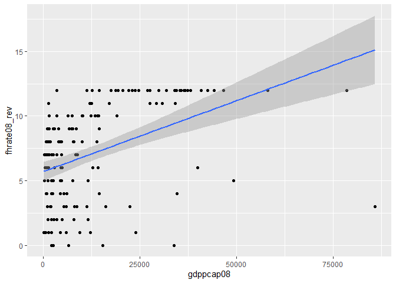<!-- -->

``` r
cor.test(banco$gdppcap08, banco$fhrate08_rev) 
```

    ## 
    ##  Pearson's product-moment correlation
    ## 
    ## data:  banco$gdppcap08 and banco$fhrate08_rev
    ## t = 6.0508, df = 149, p-value = 1.115e-08
    ## alternative hypothesis: true correlation is not equal to 0
    ## 95 percent confidence interval:
    ##  0.3061176 0.5638582
    ## sample estimates:
    ##     cor 
    ## 0.44413

``` r
regressao9 <- lm(fhrate08_rev ~ gdppcap08, data = banco)
summary (regressao9)
```

    ## 
    ## Call:
    ## lm(formula = fhrate08_rev ~ gdppcap08, data = banco)
    ## 
    ## Residuals:
    ##     Min      1Q  Median      3Q     Max 
    ## -12.124  -2.345   1.164   2.510   5.918 
    ## 
    ## Coefficients:
    ##              Estimate Std. Error t value Pr(>|t|)    
    ## (Intercept) 5.698e+00  3.739e-01  15.237  < 2e-16 ***
    ## gdppcap08   1.098e-04  1.814e-05   6.051 1.11e-08 ***
    ## ---
    ## Signif. codes:  0 '***' 0.001 '**' 0.01 '*' 0.05 '.' 0.1 ' ' 1
    ## 
    ## Residual standard error: 3.438 on 149 degrees of freedom
    ##   (16 observations deleted due to missingness)
    ## Multiple R-squared:  0.1973, Adjusted R-squared:  0.1919 
    ## F-statistic: 36.61 on 1 and 149 DF,  p-value: 1.115e-08

``` r
ggplot(banco, aes(gdppcap08, polity)) +
 geom_point()+
 geom_smooth(method = "lm")
```

    ## `geom_smooth()` using formula 'y ~ x'

    ## Warning: Removed 25 rows containing non-finite values (stat_smooth).

    ## Warning: Removed 25 rows containing missing values (geom_point).

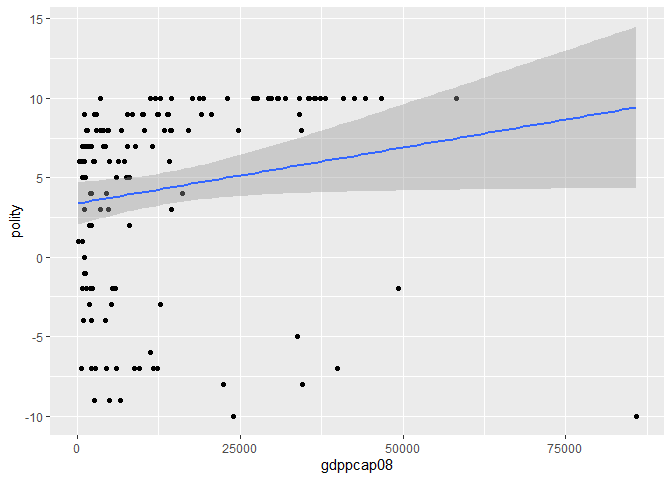<!-- -->

``` r
cor.test(banco$gdppcap08, banco$polity) 
```

    ## 
    ##  Pearson's product-moment correlation
    ## 
    ## data:  banco$gdppcap08 and banco$polity
    ## t = 2.0332, df = 140, p-value = 0.04392
    ## alternative hypothesis: true correlation is not equal to 0
    ## 95 percent confidence interval:
    ##  0.004758504 0.325013386
    ## sample estimates:
    ##      cor 
    ## 0.169353

``` r
regressao10 <- lm(polity ~ gdppcap08, data = banco)
summary(regressao10)
```

    ## 
    ## Call:
    ## lm(formula = polity ~ gdppcap08, data = banco)
    ## 
    ## Residuals:
    ##     Min      1Q  Median      3Q     Max 
    ## -19.426  -4.207   2.847   4.332   6.378 
    ## 
    ## Coefficients:
    ##              Estimate Std. Error t value Pr(>|t|)    
    ## (Intercept) 3.375e+00  6.833e-01   4.940  2.2e-06 ***
    ## gdppcap08   7.047e-05  3.466e-05   2.033   0.0439 *  
    ## ---
    ## Signif. codes:  0 '***' 0.001 '**' 0.01 '*' 0.05 '.' 0.1 ' ' 1
    ## 
    ## Residual standard error: 6.059 on 140 degrees of freedom
    ##   (25 observations deleted due to missingness)
    ## Multiple R-squared:  0.02868,    Adjusted R-squared:  0.02174 
    ## F-statistic: 4.134 on 1 and 140 DF,  p-value: 0.04392

### Resposta (gdppcap08): A relação entre as variáveis que classificam a democracia e o crescimento econômico é positiva, ou seja, quanto maior o gdppcap08, maior é o grau de democracia. De acordo com os cinco modelos de regressão o que melhor explica a variação na democracia, levando em conta o R2, é o modelo que compara o gdppcap08 e dem\_score14.

  - Correlação entre gdppcap08 e dem\_score14: existe uma correlação
    positiva significativa entre gdppcap08 e dem\_score14. No resultado
    dessa correlação com o p-valor = 3,159e-11, e com um intervalo de
    confiança de 95% de resultado = 0,3763618 a 0,6150148 é possível
    rejeitar a hipótese nula. Regressão entre gdppcap08 e dem\_score14:
    o *intercept* é 4,678e+00 e o coeficiente de inclinação da regressão
    é 7,040e-05. De acordo com o p-valores ambos os coeficientes são
    estatisticamente significantes. O RMSE é igual a 1,864 e esse modelo
    explica 25% da variação em dem\_score14.
  - Correlação entre gdppcap08 e democ11: existe uma correlação positiva
    significativa entre gdppcap08 e democ11. No resultado dessa
    correlação com o p-valor = 0,000435, e com um intervalo de
    confiança de 95% de resultado = 0,1330147 a 0,4351981 é possível
    rejeitar a hipótese nula. Regressão entre gdppcap08 e democ11: o
    *intercept* é 4.939e+00 e o coeficiente de inclinação da regressão é
    7.359e-05. De acordo com o p-valores ambos os coeficientes são
    estatisticamente significantes. O RMSE é igual a 3,57 e esse modelo
    explica 8% da variação em democ11.
  - Correlação entre gdppcap08 e fhrate04\_rev: No resultado dessa
    correlação com o p-valor = 1,331e-08, e com um intervalo de
    confiança de 95% de resultado = 0,3027442 a 0,5605748 é possível
    rejeitar a hipótese nula. Regressão entre gdppcap08 e fhrate04\_rev:
    o *intercept* é 3,828e+00 e o coeficiente de inclinação da regressão
    é 5,545e-05. De acordo com o p-valores ambos os coeficientes são
    estatisticamente significantes. O RMSE é igual a 1.751 e esse modelo
    explica 19% da variação em fhrate04\_rev.
  - Correlação entre gdppcap08 e fhrate08\_rev: No resultado dessa
    correlação com o p-valor = 1,115e-08, e com um intervalo de
    confiança de 95% de resultado = 0,3061176 a 0,5638582 é possível
    rejeitar a hipótese nula. Regressão entre gdppcap08 e fhrate08\_rev:
    o *intercept* é 5,698e+00 e o coeficiente de inclinação da regressão
    é 1.098e-04. De acordo com o p-valores ambos os coeficientes são
    estatisticamente significantes. O RMSE é igual a 3,438 e esse modelo
    explica 19% da variação em fhrate08\_rev.
  - Correlação entre gdppcap08 e polity: No resultado dessa correlação
    com o p-valor = 0,04392, e com um intervalo de confiança de 95% de
    resultado = 0,004758504 a 0,325013386 é possível rejeitar a hipótese
    nula. Regressão entre gdppcap08 e polity: o *intercept* é 3,375e+00
    e o coeficiente de inclinação da regressão é 7,047e-05. De acordo
    com o p-valores ambos os coeficientes são estatisticamente
    significantes. O RMSE é igual a 6,059 e esse modelo explica 2% da
    variação em polity.

### Avalie a relação entre todas as medidas de democracia e produção de petróleo, utilizando a variável `oil`. Descreva graficamente esta variável, a relação entre as duas variáveis, meça a correlação entre elas e faça regressões lineares (interpretando em profundidade os resultados dos coeficientes e medidas de desempenho dos modelos). Enfatize as semelhanças e diferenças entre os resultados. Quais são suas conclusões?

``` r
banco$oil
```

    ##   [1] 0.000e+00 5.400e+03 2.125e+06 1.948e+06 7.963e+05 0.000e+00 5.892e+05
    ##   [8] 2.188e+04 1.011e+06 4.856e+04 5.733e+03 3.140e+04 1.122e+04 0.000e+00
    ##  [15] 0.000e+00 4.374e+04        NA 0.000e+00 2.572e+06 3.227e+03 0.000e+00
    ##  [22] 1.888e+04 0.000e+00 0.000e+00 7.731e+04 3.289e+06 0.000e+00 0.000e+00
    ##  [29] 1.150e+05 1.085e+04 3.991e+06 7.850e+05 0.000e+00 1.636e+04 2.744e+05
    ##  [36] 0.000e+00 5.895e+04 2.396e+04 4.834e+04 0.000e+00 1.097e+04 2.621e+05
    ##  [43] 0.000e+00 0.000e+00 4.857e+05 6.805e+05 0.000e+00 3.460e+05 0.000e+00
    ##  [50] 7.600e+03 0.000e+00 0.000e+00 8.718e+03 7.082e+04 2.417e+05 0.000e+00
    ##  [57] 9.949e+02 1.568e+05 7.081e+03 6.779e+03 1.353e+04 0.000e+00 0.000e+00
    ##  [64] 0.000e+00 0.000e+00 0.000e+00 0.000e+00 2.143e+04 0.000e+00 8.787e+05
    ##  [71] 1.023e+06 4.172e+06 2.399e+06 0.000e+00 3.806e+03 1.465e+05 0.000e+00
    ##  [78] 1.327e+05 0.000e+00 1.540e+06 0.000e+00 1.180e+02 4.818e+04 2.494e+06
    ##  [85] 9.791e+02 0.000e+00 0.000e+00 0.000e+00 0.000e+00 0.000e+00 1.790e+06
    ##  [92] 6.333e+03 0.000e+00 0.000e+00 0.000e+00 0.000e+00 6.937e+05 0.000e+00
    ##  [99] 0.000e+00 1.651e+04 0.000e+00 3.001e+06 0.000e+00 5.975e+03 0.000e+00
    ## [106] 4.053e+03 0.000e+00 0.000e+00 0.000e+00 5.719e+04 6.115e+04 0.000e+00
    ## [113] 0.000e+00 2.211e+06 2.350e+06 8.160e+05 5.914e+04        NA 0.000e+00
    ## [120] 3.509e+04 3.096e+01 1.572e+05 9.671e+03 3.414e+04 4.721e+03 1.213e+06
    ## [127] 1.170e+05 1.012e+07 0.000e+00 9.764e+06 0.000e+00 1.140e+04 2.898e+01
    ## [134] 1.091e+04 4.114e+03 5.000e+00 1.910e+05 2.723e+04 0.000e+00 4.867e+05
    ## [141] 1.519e+04 0.000e+00 4.833e+03 3.488e+03 4.004e+05 2.768e+05 2.210e+02
    ## [148] 0.000e+00 3.800e+05 9.627e+04 0.000e+00 1.516e+05 9.138e+04 5.298e+04
    ## [155] 1.977e+05 0.000e+00 9.993e+04 2.798e+06 1.502e+06 9.056e+06 4.011e+04
    ## [162] 7.091e+04 2.472e+06 3.006e+05 2.884e+05 1.595e+02 0.000e+00

``` r
ggplot(banco, aes(oil)) + 
  geom_histogram(bins=25)
```

    ## Warning: Removed 2 rows containing non-finite values (stat_bin).

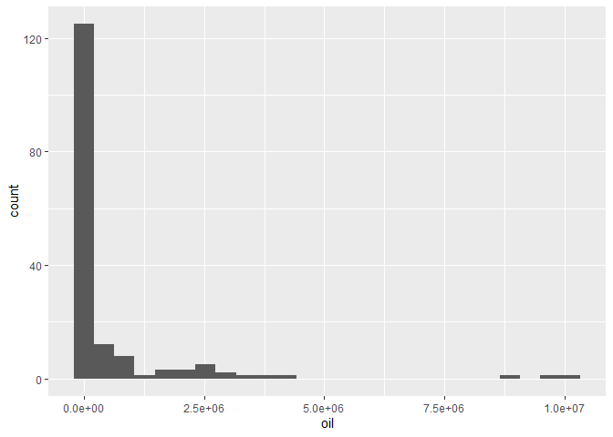<!-- -->

``` r
ggplot(banco, aes(oil,dem_score14)) +
 geom_point()+
 geom_smooth(method = "lm")
```

    ## `geom_smooth()` using formula 'y ~ x'

    ## Warning: Removed 2 rows containing non-finite values (stat_smooth).

    ## Warning: Removed 2 rows containing missing values (geom_point).

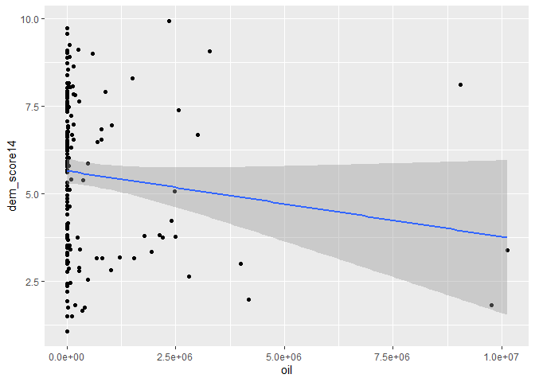<!-- -->

``` r
cor.test(banco$oil, banco$dem_score14) 
```

    ## 
    ##  Pearson's product-moment correlation
    ## 
    ## data:  banco$oil and banco$dem_score14
    ## t = -1.6344, df = 163, p-value = 0.1041
    ## alternative hypothesis: true correlation is not equal to 0
    ## 95 percent confidence interval:
    ##  -0.27443572  0.02631799
    ## sample estimates:
    ##        cor 
    ## -0.1269762

``` r
regressao11 <- lm(dem_score14 ~ oil, data = banco)
summary (regressao11)
```

    ## 
    ## Call:
    ## lm(formula = dem_score14 ~ oil, data = banco)
    ## 
    ## Residuals:
    ##    Min     1Q Median     3Q    Max 
    ## -4.574 -1.934  0.144  1.797  4.718 
    ## 
    ## Coefficients:
    ##               Estimate Std. Error t value Pr(>|t|)    
    ## (Intercept)  5.654e+00  1.795e-01  31.503   <2e-16 ***
    ## oil         -1.881e-07  1.151e-07  -1.634    0.104    
    ## ---
    ## Signif. codes:  0 '***' 0.001 '**' 0.01 '*' 0.05 '.' 0.1 ' ' 1
    ## 
    ## Residual standard error: 2.177 on 163 degrees of freedom
    ##   (2 observations deleted due to missingness)
    ## Multiple R-squared:  0.01612,    Adjusted R-squared:  0.01009 
    ## F-statistic: 2.671 on 1 and 163 DF,  p-value: 0.1041

``` r
ggplot(banco, aes(oil, democ11)) +
 geom_point()+
 geom_smooth(method = "lm")
```

    ## `geom_smooth()` using formula 'y ~ x'

    ## Warning: Removed 23 rows containing non-finite values (stat_smooth).

    ## Warning: Removed 23 rows containing missing values (geom_point).

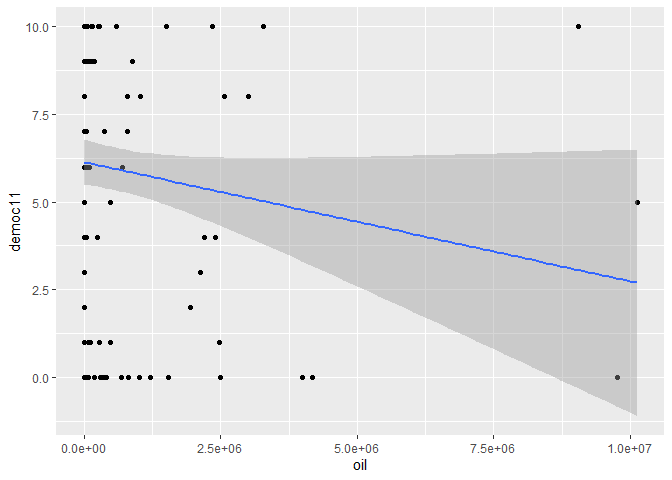<!-- -->

``` r
cor.test(banco$oil, banco$democ11)
```

    ## 
    ##  Pearson's product-moment correlation
    ## 
    ## data:  banco$oil and banco$democ11
    ## t = -1.718, df = 142, p-value = 0.08798
    ## alternative hypothesis: true correlation is not equal to 0
    ## 95 percent confidence interval:
    ##  -0.29928445  0.02138076
    ## sample estimates:
    ##        cor 
    ## -0.1426942

``` r
regressao12 <- lm(democ11 ~ oil, data = banco)
summary (regressao12)
```

    ## 
    ## Call:
    ## lm(formula = democ11 ~ oil, data = banco)
    ## 
    ## Residuals:
    ##     Min      1Q  Median      3Q     Max 
    ## -6.1387 -3.2230  0.8616  2.8893  6.9421 
    ## 
    ## Coefficients:
    ##               Estimate Std. Error t value Pr(>|t|)    
    ## (Intercept)  6.139e+00  3.259e-01  18.837   <2e-16 ***
    ## oil         -3.402e-07  1.980e-07  -1.718    0.088 .  
    ## ---
    ## Signif. codes:  0 '***' 0.001 '**' 0.01 '*' 0.05 '.' 0.1 ' ' 1
    ## 
    ## Residual standard error: 3.685 on 142 degrees of freedom
    ##   (23 observations deleted due to missingness)
    ## Multiple R-squared:  0.02036,    Adjusted R-squared:  0.01346 
    ## F-statistic: 2.951 on 1 and 142 DF,  p-value: 0.08798

``` r
ggplot(banco, aes(oil, fhrate04_rev)) +
 geom_point()+
 geom_smooth(method = "lm")
```

    ## `geom_smooth()` using formula 'y ~ x'

    ## Warning: Removed 15 rows containing non-finite values (stat_smooth).

    ## Warning: Removed 15 rows containing missing values (geom_point).

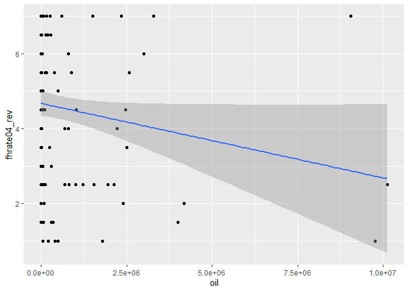<!-- -->

``` r
cor.test(banco$oil, banco$fhrate04_rev)
```

    ## 
    ##  Pearson's product-moment correlation
    ## 
    ## data:  banco$oil and banco$fhrate04_rev
    ## t = -1.9244, df = 150, p-value = 0.0562
    ## alternative hypothesis: true correlation is not equal to 0
    ## 95 percent confidence interval:
    ##  -0.306837012  0.004083069
    ## sample estimates:
    ##        cor 
    ## -0.1552185

``` r
regressao13 <- lm(fhrate04_rev ~ oil, data = banco)
summary (regressao13)
```

    ## 
    ## Call:
    ## lm(formula = fhrate04_rev ~ oil, data = banco)
    ## 
    ## Residuals:
    ##     Min      1Q  Median      3Q     Max 
    ## -3.6658 -1.7613  0.3246  1.8334  4.1268 
    ## 
    ## Coefficients:
    ##               Estimate Std. Error t value Pr(>|t|)    
    ## (Intercept)  4.675e+00  1.663e-01  28.109   <2e-16 ***
    ## oil         -1.990e-07  1.034e-07  -1.924   0.0562 .  
    ## ---
    ## Signif. codes:  0 '***' 0.001 '**' 0.01 '*' 0.05 '.' 0.1 ' ' 1
    ## 
    ## Residual standard error: 1.934 on 150 degrees of freedom
    ##   (15 observations deleted due to missingness)
    ## Multiple R-squared:  0.02409,    Adjusted R-squared:  0.01759 
    ## F-statistic: 3.703 on 1 and 150 DF,  p-value: 0.0562

``` r
ggplot(banco, aes(oil, fhrate08_rev)) +
 geom_point()+
 geom_smooth(method = "lm")
```

    ## `geom_smooth()` using formula 'y ~ x'

    ## Warning: Removed 16 rows containing non-finite values (stat_smooth).

    ## Warning: Removed 16 rows containing missing values (geom_point).

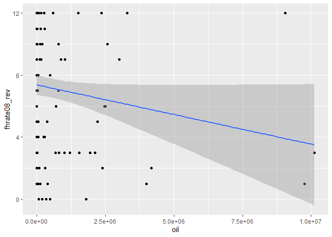<!-- -->

``` r
cor.test(banco$oil, banco$fhrate08_rev) 
```

    ## 
    ##  Pearson's product-moment correlation
    ## 
    ## data:  banco$oil and banco$fhrate08_rev
    ## t = -1.8779, df = 149, p-value = 0.06235
    ## alternative hypothesis: true correlation is not equal to 0
    ## 95 percent confidence interval:
    ##  -0.304387817  0.007867529
    ## sample estimates:
    ##       cor 
    ## -0.152052

``` r
regressao14 <- lm(fhrate08_rev ~ oil, data = banco)
summary (regressao14)
```

    ## 
    ## Call:
    ## lm(formula = fhrate08_rev ~ oil, data = banco)
    ## 
    ## Residuals:
    ##     Min      1Q  Median      3Q     Max 
    ## -7.3506 -3.3777 -0.3643  3.6243  8.0856 
    ## 
    ## Coefficients:
    ##               Estimate Std. Error t value Pr(>|t|)    
    ## (Intercept)  7.378e+00  3.286e-01  22.449   <2e-16 ***
    ## oil         -3.824e-07  2.037e-07  -1.878   0.0624 .  
    ## ---
    ## Signif. codes:  0 '***' 0.001 '**' 0.01 '*' 0.05 '.' 0.1 ' ' 1
    ## 
    ## Residual standard error: 3.808 on 149 degrees of freedom
    ##   (16 observations deleted due to missingness)
    ## Multiple R-squared:  0.02312,    Adjusted R-squared:  0.01656 
    ## F-statistic: 3.526 on 1 and 149 DF,  p-value: 0.06235

``` r
ggplot(banco, aes(oil, polity)) +
 geom_point()+
 geom_smooth(method = "lm")
```

    ## `geom_smooth()` using formula 'y ~ x'

    ## Warning: Removed 23 rows containing non-finite values (stat_smooth).

    ## Warning: Removed 23 rows containing missing values (geom_point).

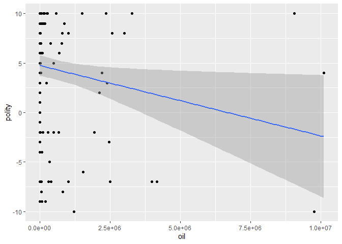<!-- -->

``` r
cor.test(banco$oil, banco$polity) 
```

    ## 
    ##  Pearson's product-moment correlation
    ## 
    ## data:  banco$oil and banco$polity
    ## t = -2.195, df = 142, p-value = 0.02979
    ## alternative hypothesis: true correlation is not equal to 0
    ## 95 percent confidence interval:
    ##  -0.33480603 -0.01811182
    ## sample estimates:
    ##        cor 
    ## -0.1811511

``` r
regressao15 <- lm(polity ~ oil, data = banco)
summary(regressao15)
```

    ## 
    ## Call:
    ## lm(formula = polity ~ oil, data = banco)
    ## 
    ## Residuals:
    ##     Min      1Q  Median      3Q     Max 
    ## -13.890  -4.906   2.248   4.505  11.681 
    ## 
    ## Coefficients:
    ##               Estimate Std. Error t value Pr(>|t|)    
    ## (Intercept)  4.752e+00  5.327e-01   8.922 2.09e-15 ***
    ## oil         -7.105e-07  3.237e-07  -2.195   0.0298 *  
    ## ---
    ## Signif. codes:  0 '***' 0.001 '**' 0.01 '*' 0.05 '.' 0.1 ' ' 1
    ## 
    ## Residual standard error: 6.024 on 142 degrees of freedom
    ##   (23 observations deleted due to missingness)
    ## Multiple R-squared:  0.03282,    Adjusted R-squared:  0.026 
    ## F-statistic: 4.818 on 1 and 142 DF,  p-value: 0.02979

### Resposta(oil): A relação entre as variáveis que classificam a democracia e a produção de petróleo é negativa, ou seja, quanto menor a produção de petróleo, maior é o grau de democracia. De acordo com os cinco modelos de regressão o que melhor explica a variação na democracia, levando em conta o R2, é o modelo que compara o oil e polity.

  - Correlação entre oil e dem\_score14: não existe uma correlação
    significativa entre oil e dem\_score14. No resultado dessa
    correlação com o p-valor = 0,1041, e com um intervalo de confiança
    de 95% de resultado = -0,27443572 a 0,02631799, não é possível
    rejeitar a hipótese nula. Regressão entre oil e dem\_score14: o
    *intercept* é 5,654e+00 e o coeficiente de inclinação da regressão é
    -1,881e-07. De acordo com os p-valores apenas o *intercept* é
    estatisticamente significante. O RMSE é igual a 2,177 e esse modelo
    explica apenas 1,6% da variação em democ\_score14.
  - Correlação entre oil e democ11: não existe uma correlação
    significativa entre oil e democ11. No resultado dessa correlação com
    o p-valor = 0,08798, e com um intervalo de confiança de 95% de
    resultado = -0,29928445 a 0,02138076, não é possível rejeitar a
    hipótese nula. Regressão entre oil e democ11: o *intercept* é
    6,139e+00 e o coeficiente de inclinação da regressão é -3,402e-07.
    De acordo com os p-valores apenas o *intercept* é estatisticamente
    significante. O RMSE é igual a 3,685 e esse modelo explica 2% da
    variação em democ11.
  - Correlação entre oil e fhrate04\_rev: No resultado dessa correlação
    com o p-valor = 0,0562, e com um intervalo de confiança de 95% de
    resultado = -0,306837012 a 0,004083069 não é possível rejeitar a
    hipótese nula. Regressão entre oil e fhrate04\_rev: o *intercept* é
    4,675e+00 e o coeficiente de inclinação da regressão é -1,990e-07.
    De acordo com os p-valores apenas o *intercept* é estatisticamente
    significante. O RMSE é igual a 1,934 e esse modelo explica 2,4% da
    variação em fhrate04\_rev.
  - Correlação entre oil e fhrate08\_rev: No resultado dessa correlação
    com o p-valor = 0,06235, e com um intervalo de confiança de 95% de
    resultado = -0.304387817 a 0.007867529 não é possível rejeitar a
    hipótese nula. Regressão entre oil e fhrate08\_rev: o *intercept* é
    7,378e+00 e o coeficiente de inclinação da regressão é -3,824e-07.
    De acordo com os p-valores apenas o *intercept* é estatisticamente
    significante. O RMSE é igual a 3,808 e esse modelo explica 2,3% da
    variação em fhrate08\_rev.
  - Correlação entre oil e polity: No resultado dessa correlação com o
    p-valor = 0,02979., e com um intervalo de confiança de 95% de
    resultado = -0,33480603 a -0,01811182 é possível rejeitar a hipótese
    nula e indicar que existe uma correlação entre as variáveis.
    Regressão entre oil e polity: o *intercept* é 4,752e+00 e o
    coeficiente de inclinação da regressão é -7,105e-07. De acordo com o
    p-valores ambos os coeficientes são estatisticamente significantes.
    O RMSE é igual a 6.024 e esse modelo explica 3,2% da variação em
    polity.

### Avalie a relação entre crescimento econômico e produção de petróleo. Descreva a relação entre as duas variáveis, meça a correlação entre elas e faça regressões lineares (interpretando em profundidade os resultados dos coeficientes e medidas de desempenho dos modelos). Enfatize as semelhanças e diferenças entre os resultados. Quais são suas conclusões?

``` r
#gdppcap08 e oil 

ggplot(banco, aes(oil, gdppcap08)) +
 geom_point()+
 geom_smooth(method = "lm")
```

    ## `geom_smooth()` using formula 'y ~ x'

    ## Warning: Removed 16 rows containing non-finite values (stat_smooth).

    ## Warning: Removed 16 rows containing missing values (geom_point).

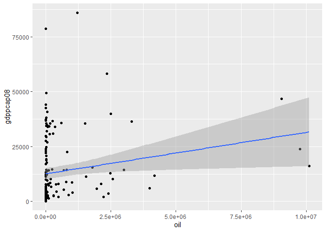<!-- -->

``` r
cor.test(banco$oil, banco$gdppcap08) 
```

    ## 
    ##  Pearson's product-moment correlation
    ## 
    ## data:  banco$oil and banco$gdppcap08
    ## t = 2.3051, df = 149, p-value = 0.02254
    ## alternative hypothesis: true correlation is not equal to 0
    ## 95 percent confidence interval:
    ##  0.02661893 0.33534756
    ## sample estimates:
    ##       cor 
    ## 0.1855584

``` r
regressao16 <- lm(gdppcap08 ~ oil, data = banco)
summary(regressao16)
```

    ## 
    ## Call:
    ## lm(formula = gdppcap08 ~ oil, data = banco)
    ## 
    ## Residuals:
    ##    Min     1Q Median     3Q    Max 
    ## -15541 -10735  -6347   6549  70967 
    ## 
    ## Coefficients:
    ##              Estimate Std. Error t value Pr(>|t|)    
    ## (Intercept) 1.262e+04  1.319e+03   9.566   <2e-16 ***
    ## oil         1.884e-03  8.173e-04   2.305   0.0225 *  
    ## ---
    ## Signif. codes:  0 '***' 0.001 '**' 0.01 '*' 0.05 '.' 0.1 ' ' 1
    ## 
    ## Residual standard error: 15280 on 149 degrees of freedom
    ##   (16 observations deleted due to missingness)
    ## Multiple R-squared:  0.03443,    Adjusted R-squared:  0.02795 
    ## F-statistic: 5.313 on 1 and 149 DF,  p-value: 0.02254

### Resposta(gdppcap08 e oil): A relação entre as duas variáveis é positiva, ou seja, quanto maior a produção de petróleo, maior é o crescimento econômico. É possível afirmar que existe uma correlação entre gdppcap08 e oil, com o p-valor = 0,02254 e um intervalo de confiança de 95%. No modelo de regressão o valor do *intercept* é 1,262e+04 e o coeficiente de inclinação é 1,884e-03, ambos os p-valores indicam que esses coeficientes são significantes. O RMSE é igual a 15280, indicando que a distância média entre os valores observados e os valores estimados é alta, ou seja, podem existir outliers significativos nessa distribuição. De acordo com o R2 esse modelo explica 3,4% da variação em gdppcap08.

### A partir das suas conclusões sobre a relação entre democracia, economia e produção de petróleo, quais considerações são possíveis fazer sobre a relação CAUSAL entre estas variáveis? Lembre dos 4 “hurdles” do livro *Fundamentals of Political Science Research*

### Resposta entre democracia e desigualdade (Índice de Gini) a correlação só é detectada quando é feito o teste com dem\_score14 e fhrate04\_rev. Na regressão os valores do intercept e do coeficiente de inclinação só são significativo quando é feito o teste com dem\_score14 e fhrate04\_rev. Entre os modelos de regressão o que melhor explicou a variação nos graus de democracia foi o que comparou o índice de Gini com o dem\_score14, explicando 4% da variação na democracia. Entre democracia e desenvolvimento econômico (gdppcap08) a correlação existe entre todas as variáveis de democracia e a relação entre as variáveis é positiva. Ao analisar a regressão dessa etapa a que melhor explica a variação na democracia é o modelo com dem\_score14, no qual o gdppcap08 explica 25% da variação no nível de democracia. A literatura discute bastante a relação entre democracia (Y) e crescimento econômico (X) ou democracia (Y) e desigualdade (X) (1º *“hurdle”*), no entanto nem todas as medidas de democracia passam pelo 3º *“hurdle”*, pois entre algumas variáveis de democracia não existe correlação com as outras medidas. A literatura também discute o fato de ser o nível de democracia que causa variação no Índice de Gini ou no crescimento econômico, portanto não podemos descartar a chance de Y causar X. Por fim os modelos não levam em consideração outras outras variáveis Z que podem fazer a associação entre X e Y desaparecer. Entre democracia e produção de petróleo (oil) existe uma relação negativa. E só existe correlação entre oil e polity. O único modelo de regressão que possui os dois coeficientes significativos é o modelo com polity, nele oil explica 3,2% da variação na democracia.

### Entre crescimento econômico (Y) e produção de petróleo (X) existe uma correlação e a relação é positiva. No entanto, a produção de petróleo explica apenas 3,4% da variação no crescimento econômico. Nesse caso o modelo passa pelo 1º e 3º *“hurdle”*, porém o modelo não leva em consideração outras outras variáveis Z que podem fazer a associação entre X e Y desaparecer, além do mais não podemos descartar a chance de Y causar X, pois um país mais desenvolvido economicamente possui mais capacidade para produção de petróleo.
