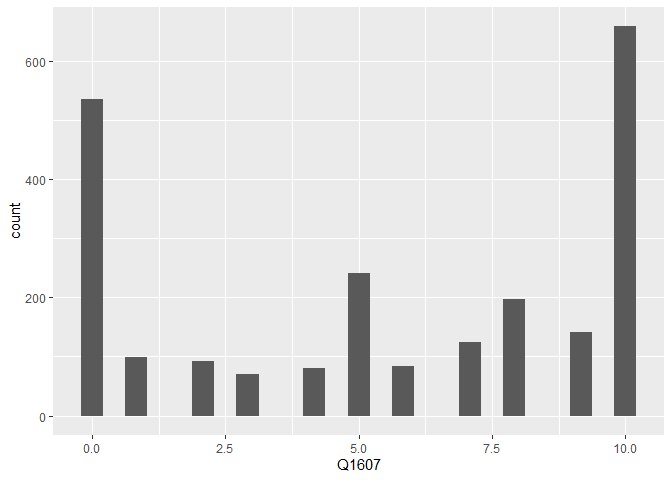
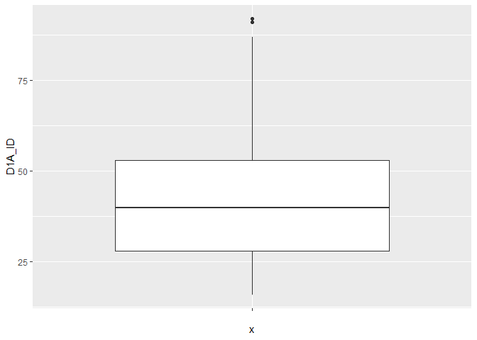
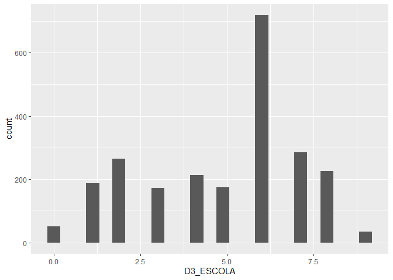
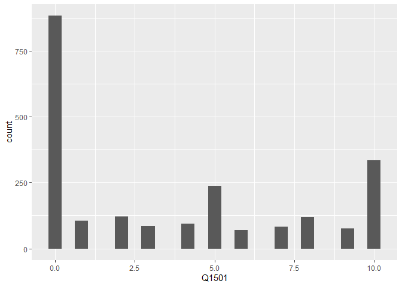
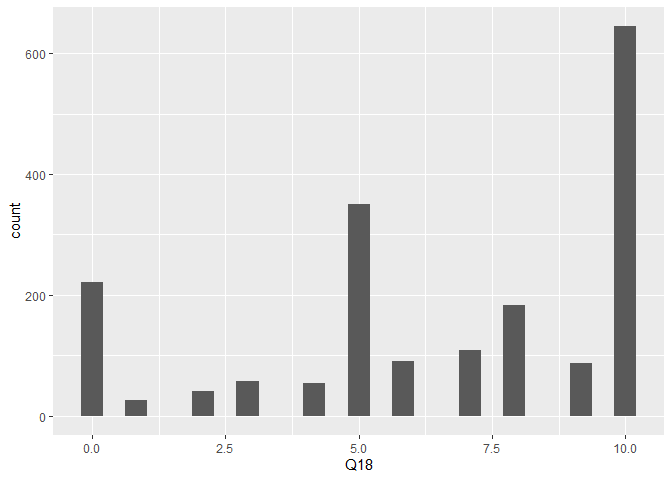

Exercicio 6
================
Helena Santos

### Neste exercício usaremos o banco de dados do ESEB 2018. Para maiores detalhes sobre o survey, ver neste [link](https://www.cesop.unicamp.br/por/eseb). O questionário da pesquisa de 2018 está [aqui](https://www.cesop.unicamp.br/vw/1IMr0S64wNQ_MDA_91ea3_/quest_04622.pdf) e pode ser consultado para ter maiores detalhes sobre as variáveis.

### O banco de dados está disponível no site do CESOP para usuários cadastrados. Para facilitar o acesso, deixei o banco de dados dispónivel no seguinte endereço: <https://github.com/MartinsRodrigo/Analise-de-dados/raw/master/04622.sav>

### Baixe o banco de dados pelo R

``` r
url <- "https://github.com/MartinsRodrigo/Analise-de-dados/raw/master/04622.sav"

download.file(url, "banco.sav", mode = "wb")
```

### O banco foi feito em SPSS e está em formato SAV. Carregue-o

``` r
library(haven)

# SPSS
banco <- read_sav("banco.sav")
write_sav(banco, "banco.sav") 
```

### Utilize as funções para observar o banco de dados

``` r
library(tidyverse)
```

    ## -- Attaching packages ----------------------------------------------- tidyverse 1.3.0 --

    ## v ggplot2 3.3.1     v purrr   0.3.4
    ## v tibble  3.0.1     v dplyr   1.0.0
    ## v tidyr   1.1.0     v stringr 1.4.0
    ## v readr   1.3.1     v forcats 0.5.0

    ## -- Conflicts -------------------------------------------------- tidyverse_conflicts() --
    ## x dplyr::filter() masks stats::filter()
    ## x dplyr::lag()    masks stats::lag()

``` r
glimpse(banco)
```

    ## Rows: 2,506
    ## Columns: 286
    ## $ A1_Nquest           <dbl> 1, 2, 3, 4, 5, 6, 7, 8, 9, 10, 11, 12, 13, 14, ...
    ## $ DIAENTR             <dbl> 15, 15, 15, 16, 16, 16, 16, 17, 17, 17, 17, 17,...
    ## $ MESENTR             <dbl+lbl> 11, 11, 11, 11, 11, 11, 11, 11, 11, 11, 11,...
    ## $ ANOENTR             <dbl> 2018, 2018, 2018, 2018, 2018, 2018, 2018, 2018,...
    ## $ D1A_ID              <dbl> 41, 23, 21, 39, 64, 45, 18, 29, 25, 31, 23, 45,...
    ## $ D1A_FAIXAID         <dbl+lbl> 4, 2, 2, 4, 6, 5, 2, 3, 3, 3, 2, 5, 6, 3, 6...
    ## $ D2_SEXO             <dbl+lbl> 2, 1, 2, 1, 1, 2, 2, 1, 2, 1, 1, 1, 2, 2, 1...
    ## $ D3_ESCOLA           <dbl+lbl> 5, 5, 6, 3, 0, 0, 4, 8, 8, 6, 2, 2, 1, 2, 6...
    ## $ RAMOATIV            <dbl+lbl>  6,  4, 10,  3,  1,  7, 10,  5,  4,  7, 10,...
    ## $ RAMOCHEFEF          <dbl+lbl> 99, 99, 99, 99, 99, 99, 99, 99, 99, 99, 99,...
    ## $ OCUPA               <dbl+lbl> 2, 1, 4, 3, 3, 1, 4, 2, 1, 1, 4, 4, 4, 4, 3...
    ## $ UF                  <dbl+lbl> 12, 12, 12, 12, 12, 12, 12, 12, 12, 12, 12,...
    ## $ CID                 <dbl+lbl> 1, 1, 1, 1, 1, 1, 1, 1, 1, 1, 1, 1, 1, 1, 2...
    ## $ REG                 <dbl+lbl> 1, 1, 1, 1, 1, 1, 1, 1, 1, 1, 1, 1, 1, 1, 1...
    ## $ Q1                  <dbl+lbl> 4, 4, 4, 4, 1, 4, 4, 3, 4, 2, 3, 3, 3, 4, 3...
    ## $ Q2                  <dbl+lbl> 3, 3, 4, 3, 4, 3, 4, 3, 4, 2, 3, 3, 4, 4, 3...
    ## $ Q3                  <dbl+lbl> 2, 3, 3, 2, 1, 2, 4, 2, 4, 1, 5, 2, 3, 5, 1...
    ## $ Q401                <dbl+lbl> 3, 2, 5, 1, 4, 2, 2, 1, 2, 3, 4, 1, 2, 1, 1...
    ## $ Q402                <dbl+lbl> 1, 1, 3, 1, 1, 1, 1, 1, 1, 1, 1, 1, 1, 2, 1...
    ## $ Q403                <dbl+lbl> 5, 1, 5, 3, 5, 3, 5, 5, 1, 5, 4, 5, 2, 5, 5...
    ## $ Q404                <dbl+lbl> 1, 1, 1, 1, 1, 1, 2, 1, 1, 1, 4, 1, 3, 1, 1...
    ## $ Q405                <dbl+lbl> 3, 3, 3, 1, 1, 3, 4, 5, 1, 5, 2, 2, 5, 5, 1...
    ## $ Q406                <dbl+lbl> 1, 1, 3, 1, 4, 1, 2, 1, 2, 1, 1, 1, 2, 1, 4...
    ## $ Q407                <dbl+lbl> 1, 1, 1, 1, 1, 1, 1, 1, 1, 1, 1, 1, 1, 1, 1...
    ## $ Q501                <dbl+lbl> 3, 3, 3, 3, 4, 2, 4, 1, 2, 2, 2, 5, 3, 1, 1...
    ## $ Q502                <dbl+lbl> 1, 4, 2, 2, 2, 4, 3, 1, 1, 1, 5, 5, 2, 3, 5...
    ## $ Q503                <dbl+lbl> 2, 2, 1, 3, 1, 8, 3, 5, 2, 2, 2, 5, 3, 2, 5...
    ## $ Q504                <dbl+lbl> 3, 5, 1, 3, 3, 2, 5, 1, 4, 4, 4, 1, 3, 1, 1...
    ## $ Q505                <dbl+lbl> 3, 3, 3, 3, 4, 5, 4, 1, 5, 4, 5, 4, 3, 1, 1...
    ## $ Q601                <dbl+lbl> 1, 1, 1, 1, 1, 1, 4, 4, 2, 1, 3, 1, 2, 4, 1...
    ## $ Q602                <dbl+lbl> 1, 3, 1, 3, 3, 1, 2, 1, 1, 3, 1, 2, 4, 3, 1...
    ## $ Q603                <dbl+lbl> 1, 3, 1, 1, 1, 1, 3, 1, 1, 2, 2, 3, 3, 4, 1...
    ## $ Q604                <dbl+lbl> 1, 2, 2, 1, 1, 1, 1, 1, 2, 1, 1, 1, 4, 2, 1...
    ## $ Q7                  <dbl+lbl> 1, 1, 1, 1, 1, 1, 1, 1, 1, 1, 1, 1, 2, 3, 4...
    ## $ Q8                  <dbl+lbl> 1, 2, 3, 2, 1, 1, 3, 1, 1, 1, 1, 1, 3, 1, 1...
    ## $ Q9                  <dbl+lbl> 5, 5, 5, 5, 5, 5, 5, 5, 4, 5, 4, 5, 4, 5, 5...
    ## $ Q10A                <dbl+lbl> 5, 5, 5, 1, 1, 5, 5, 1, 5, 5, 5, 5, 5, 5, 5...
    ## $ Q10B                <dbl+lbl> 99, 99, 99, 17, 13, 99, 99, 17, 99, 99, 99,...
    ## $ Q11                 <dbl+lbl> 5, 3, 5, 5, 5, 5, 5, 5, 5, 4, 4, 4, 3, 5, 5...
    ## $ Q12P1_A             <dbl+lbl> 1, 1, 1, 1, 1, 1, 1, 1, 1, 7, 6, 1, 1, 1, 1...
    ## $ Q12P1_B             <dbl+lbl>  9,  9,  9,  9,  9,  9,  9,  9,  9, 99, 99,...
    ## $ Q12P2_A             <dbl+lbl> 1, 1, 1, 1, 1, 1, 1, 1, 1, 4, 6, 1, 1, 1, 1...
    ## $ Q12P2_B             <dbl+lbl>  2,  2,  2,  2,  2,  2,  2,  2,  2, 99, 99,...
    ## $ Q12G_1A             <dbl+lbl> 9950, 1203, 9998, 1203, 1203, 1203, 1203, 1...
    ## $ Q12G_2              <dbl+lbl> 9999, 9999, 9999, 9999, 9999, 9999, 9999, 9...
    ## $ Q12S1               <dbl+lbl> 1206, 1203, 9998, 1206, 1206, 1201, 1204, 1...
    ## $ Q12S2               <dbl+lbl> 9998, 1202, 9998, 1202, 1202, 1206, 1201, 1...
    ## $ Q12CD               <dbl+lbl> 2037, 9950, 9998, 9998, 9998, 2038, 9960,  ...
    ## $ Q12CD_recode        <dbl+lbl>   1,   4,   3,   3,   3,   1,   4,   1,   1...
    ## $ Q12AL               <dbl+lbl> 9998, 2084, 9998, 1174, 9998, 1092, 9960,  ...
    ## $ Q12AL_recode        <dbl+lbl>   3,   1,   3,   1,   3,   1,   4,   1,   1...
    ## $ Q13A                <dbl+lbl>  1,  5,  1,  1,  1,  1,  3,  1,  1,  1,  1,...
    ## $ Q13B                <dbl+lbl>  2, 99,  2,  2,  7, 98, 99,  2, 98,  1,  2,...
    ## $ Q13B_2              <dbl+lbl>  4,  5,  1,  1,  1,  1,  3,  1,  1,  1,  1,...
    ## $ Q13B2A              <dbl+lbl> 99, 99,  2,  2,  1,  2, 99,  2, 60,  1,  2,...
    ## $ Q13G1               <dbl+lbl> 9950, 9999, 1204, 1204, 1203, 1204, 9999, 1...
    ## $ Q13G2               <dbl+lbl> 9999, 9999, 1204, 1204, 1203, 1204, 9999, 1...
    ## $ Q13S                <dbl+lbl> 9950, 9999, 1203, 1201, 1203, 1202, 9999, 1...
    ## $ Q13CD               <dbl+lbl> 9950, 9999, 9998, 1175, 9998, 9998, 9999, 9...
    ## $ Q13CD_recode        <dbl+lbl>   4, 999,   3,   2,   3,   3, 999,   3,   1...
    ## $ Q13AL               <dbl+lbl> 9950, 9999, 9998, 9998,  770, 9998, 9999,  ...
    ## $ Q13AL_recode        <dbl+lbl>   4, 999,   3,   3,   3,   3, 999,   3,   3...
    ## $ Q14A                <dbl+lbl> 5, 5, 4, 5, 5, 5, 5, 5, 3, 5, 5, 2, 3, 5, 3...
    ## $ Q14B                <dbl+lbl> 5, 5, 5, 5, 5, 5, 4, 5, 4, 5, 5, 5, 1, 5, 5...
    ## $ Q1501               <dbl+lbl>  1,  0,  0,  0,  0, 10,  0, 96,  2,  0,  0,...
    ## $ Q1502               <dbl+lbl> 96,  5, 96,  0,  5,  5, 96, 96, 96,  4,  0,...
    ## $ Q1503               <dbl+lbl> 96, 96,  2, 96,  8, 96, 98, 96,  5,  2,  0,...
    ## $ Q1504               <dbl+lbl> 96, 96, 96,  0, 96, 96, 96, 96, 96,  2,  0,...
    ## $ Q1505               <dbl+lbl>  1,  0,  3,  0, 10, 10,  0, 96,  8,  5,  6,...
    ## $ Q1506               <dbl+lbl> 98, 96, 96,  0, 96,  5,  0, 96,  5,  8,  0,...
    ## $ Q1507               <dbl+lbl> 96, 96, 96,  0, 96, 96,  0, 96, 96,  6,  0,...
    ## $ Q1508               <dbl+lbl>  1,  0, 96,  0,  7, 96,  0, 96,  8,  8,  4,...
    ## $ Q1509               <dbl+lbl> 96,  0, 96,  0, 96, 96, 96, 96, 96, 96,  0,...
    ## $ Q1510               <dbl+lbl> 96, 96, 96, 96, 96, 96, 96, 96, 96, 96,  0,...
    ## $ Q1511               <dbl+lbl>  1, 96, 96,  0, 10, 96,  0, 96,  3, 96,  5,...
    ## $ Q1512               <dbl+lbl> 96,  9,  2, 10, 96,  5, 96, 10,  7,  8,  5,...
    ## $ Q1513               <dbl+lbl>  1, 96, 96,  0, 96, 96,  0, 96, 96,  1,  0,...
    ## $ Q1514               <dbl+lbl> 96, 96,  3,  0,  8, 96, 10, 96,  4,  0,  0,...
    ## $ Q1515               <dbl+lbl> 96, 96, 96,  0, 96, 96, 96, 96, 96,  0,  0,...
    ## $ Q1516               <dbl+lbl> 96, 96, 96, 96, 96, 96, 96, 96, 96,  8,  0,...
    ## $ Q1517               <dbl+lbl> 96, 96,  2,  0, 96, 96,  7, 96,  5, 96,  6,...
    ## $ Q1518               <dbl+lbl>  1, 96, 96,  0, 96,  5, 96, 96,  5,  5,  0,...
    ## $ Q1519               <dbl+lbl> 96, 96, 96, 96, 96, 96,  0, 96,  5,  2,  0,...
    ## $ Q1520               <dbl+lbl> 96, 96, 96, 96,  5,  5,  0, 96,  7,  5,  4,...
    ## $ Q1521               <dbl+lbl> 96, 96, 96,  0,  8, 96,  4, 96,  4,  8,  0,...
    ## $ Q1522               <dbl+lbl> 96, 96, 96,  0, 96, 96,  1, 96,  6,  5,  0,...
    ## $ Q1523               <dbl+lbl> 96, 96, 96, 96,  4, 96, 98, 96,  4,  2,  0,...
    ## $ Q1524               <dbl+lbl> 96, 96, 96,  0, 96, 96,  0, 96, 96,  1,  0,...
    ## $ Q1525               <dbl+lbl> 96, 96, 96,  0, 10, 96, 96, 96, 96, 96,  0,...
    ## $ Q1526               <dbl+lbl> 96, 96, 96, 96, 96, 96, 96, 96, 96,  2,  5,...
    ## $ Q1601               <dbl+lbl>  1,  0,  0,  0, 96,  5,  8,  0,  1,  8,  0,...
    ## $ Q1602               <dbl+lbl>  0,  0, 96, 96, 96, 96, 96,  0, 96,  0,  0,...
    ## $ Q1603               <dbl+lbl>  1,  0, 96,  0, 96, 96,  0,  0, 96,  0,  0,...
    ## $ Q1604               <dbl+lbl>  0,  3,  3,  0, 10,  5,  0,  5,  5,  8,  0,...
    ## $ Q1605               <dbl+lbl> 0, 0, 2, 0, 8, 5, 0, 0, 5, 0, 0, 0, 0, 0, 5...
    ## $ Q1606               <dbl+lbl>  1,  0,  0,  0, 96, 96, 98,  6,  7,  0,  7,...
    ## $ Q1607               <dbl+lbl> 10, 10,  3, 10, 10, 10, 10, 10,  8, 10, 10,...
    ## $ Q1608               <dbl+lbl>  1,  0,  0,  0, 10, 96,  6,  0,  2,  5,  8,...
    ## $ Q1609               <dbl+lbl>  1,  0, 96, 96, 96, 96, 96,  0, 96,  0,  7,...
    ## $ Q1610               <dbl+lbl>  1,  0,  1,  0, 10,  5,  0,  0,  0,  0,  0,...
    ## $ Q1611               <dbl+lbl>  1,  0, 96,  0, 96, 96,  7,  0,  3,  0,  6,...
    ## $ Q1612               <dbl+lbl>  1,  0, 96,  0, 96, 96, 96,  0, 96,  2, 96,...
    ## $ Q1613               <dbl+lbl>  1,  3, 96,  6, 96, 96,  9, 10, 96,  0,  0,...
    ## $ Q1614               <dbl+lbl>  1,  0, 96,  0, 96, 96, 96,  0, 96, 96,  0,...
    ## $ Q1615               <dbl+lbl>  1, 96, 96, 96, 96, 96, 96,  3, 96, 96, 96,...
    ## $ Q1616               <dbl+lbl>  1,  0,  1,  0, 96, 96, 96,  0, 96, 96, 96,...
    ## $ Q1617               <dbl+lbl>  1,  0,  1,  0,  8, 96, 98,  0,  3,  8,  0,...
    ## $ Q1618               <dbl+lbl>  0,  0,  0,  0,  0,  5,  0,  0,  0,  0,  0,...
    ## $ Q1619               <dbl+lbl>  1,  0, 96,  0, 96, 96, 96,  0, 96, 96, 96,...
    ## $ Q1620               <dbl+lbl>  1,  0, 96,  0, 96, 96, 96,  0,  3,  0,  0,...
    ## $ Q1621               <dbl+lbl> 1, 0, 0, 0, 8, 0, 0, 0, 1, 0, 0, 0, 0, 0, 0...
    ## $ Q1701               <dbl+lbl>  0,  0,  0,  0,  0,  5,  0,  0,  2, 10,  1,...
    ## $ Q1702               <dbl+lbl>  0,  0, 96, 96,  5,  0, 96, 96,  8,  8, 96,...
    ## $ Q1703               <dbl+lbl>  1,  0,  0,  0,  5,  0,  4, 96, 10,  7,  3,...
    ## $ Q1704               <dbl+lbl>  0, 96, 96,  0, 96,  0, 96, 96,  5, 96,  6,...
    ## $ Q1705               <dbl+lbl>  0,  0, 10,  4,  5,  5,  2, 96,  8,  7,  7,...
    ## $ Q1706               <dbl+lbl>  2, 96, 96,  0, 96,  0, 96,  2,  4,  5,  6,...
    ## $ Q1707               <dbl+lbl>  2,  0, 96, 96, 96,  0, 96, 96,  3,  5, 96,...
    ## $ Q1708               <dbl+lbl>  2,  0, 96,  0,  4,  0,  3,  5,  1,  1,  5,...
    ## $ Q1709               <dbl+lbl>  3,  0, 96, 96, 96,  0, 96,  5,  2, 96,  6,...
    ## $ Q1710               <dbl+lbl>  0, 96, 96,  0,  5,  0, 96, 96,  6, 96, 96,...
    ## $ Q1711               <dbl+lbl>  2,  0, 96,  0, 10,  0, 96, 96,  6,  6,  7,...
    ## $ Q1712               <dbl+lbl>  4,  8,  0, 10,  5,  5, 96, 10,  3,  3,  5,...
    ## $ Q1713               <dbl+lbl>  2,  0, 96,  1, 96,  0, 96,  2,  5, 96, 96,...
    ## $ Q1714               <dbl+lbl>  2,  0,  0,  1,  5,  5,  8,  0, 10, 10,  3,...
    ## $ Q1715               <dbl+lbl> 96, 96, 96, 96, 96,  0, 96, 96,  3, 96, 96,...
    ## $ Q1716               <dbl+lbl>  2,  0, 96,  0,  4,  0, 96, 96,  4,  8, 96,...
    ## $ Q1717               <dbl+lbl>  2,  0,  0,  3,  4,  5,  4, 96,  6,  6,  6,...
    ## $ Q1718               <dbl+lbl>  2,  0, 96,  0,  4,  0, 96, 96,  3,  5, 96,...
    ## $ Q1719               <dbl+lbl>  2,  0, 96,  0, 96,  0, 96, 96,  7,  7, 96,...
    ## $ Q1720               <dbl+lbl>  2,  0, 10,  0,  5,  0,  9, 96,  8,  8,  4,...
    ## $ Q1721               <dbl+lbl>  2,  0, 96,  0,  0,  0,  5, 96,  2, 96,  4,...
    ## $ Q1722               <dbl+lbl>  2,  0, 96, 96,  0,  0, 96, 96,  1,  3, 96,...
    ## $ Q1723               <dbl+lbl>  2,  0, 96,  6,  8,  0,  7,  2,  7,  3, 96,...
    ## $ Q1724               <dbl+lbl>  0,  0,  0, 96, 96,  0, 96,  0,  5, 96, 96,...
    ## $ Q1725               <dbl+lbl>  2, 96, 96, 96, 96,  0, 96, 96,  7, 96, 96,...
    ## $ Q1726               <dbl+lbl>  1,  0, 96,  0, 96,  0, 96,  2,  4, 96,  4,...
    ## $ Q18                 <dbl+lbl> 10, 10, 10, 10, 10, 10,  7,  0, 10, 10, 10,...
    ## $ Q21                 <dbl+lbl> 5, 4, 5, 4, 5, 5, 5, 5, 4, 5, 2, 4, 4, 4, 5...
    ## $ Q22A                <dbl+lbl> 2, 2, 2, 2, 1, 2, 2, 2, 2, 2, 2, 2, 2, 2, 2...
    ## $ Q22B                <dbl+lbl>  2,  1,  2,  1, 99,  1,  2,  2,  2,  1,  2,...
    ## $ Q22C                <dbl+lbl> 99, 17, 99, 17, 17, 98, 99, 99, 99, 50, 99,...
    ## $ Q22D                <dbl+lbl> 99,  2, 99,  2,  2, 99, 99, 99, 99,  2, 99,...
    ## $ P1                  <dbl+lbl> 1, 1, 1, 1, 1, 2, 1, 1, 1, 1, 1, 1, 1, 1, 2...
    ## $ P1A                 <dbl+lbl>  13,  13,  13,  13,  13, 999,  13,  13,  13...
    ## $ D5_1                <dbl+lbl> 2, 2, 2, 2, 2, 2, 2, 1, 2, 1, 2, 2, 2, 2, 2...
    ## $ D5_2                <dbl+lbl> 2, 2, 2, 2, 2, 2, 2, 2, 2, 1, 2, 2, 2, 2, 2...
    ## $ P201                <dbl+lbl> 2, 2, 2, 2, 1, 2, 2, 2, 2, 2, 2, 2, 2, 2, 2...
    ## $ P202                <dbl+lbl> 2, 2, 2, 2, 1, 2, 2, 2, 2, 2, 2, 2, 2, 2, 2...
    ## $ P203                <dbl+lbl> 2, 2, 2, 2, 1, 2, 2, 2, 2, 2, 2, 2, 2, 2, 2...
    ## $ P204                <dbl+lbl> 2, 2, 2, 2, 2, 2, 2, 2, 2, 1, 2, 2, 2, 2, 2...
    ## $ P205                <dbl+lbl> 2, 2, 1, 2, 2, 2, 2, 2, 2, 2, 2, 2, 2, 2, 2...
    ## $ P206                <dbl+lbl> 1, 2, 1, 2, 1, 1, 1, 2, 2, 1, 1, 2, 2, 2, 2...
    ## $ P207                <dbl+lbl> 2, 2, 2, 2, 1, 2, 2, 2, 2, 2, 2, 1, 2, 2, 1...
    ## $ P208                <dbl+lbl> 2, 2, 2, 2, 2, 2, 2, 2, 2, 1, 2, 2, 2, 2, 2...
    ## $ P209                <dbl+lbl> 2, 2, 2, 2, 2, 2, 1, 2, 2, 2, 2, 2, 2, 2, 1...
    ## $ P210                <dbl+lbl> 2, 2, 2, 2, 2, 2, 2, 2, 2, 2, 2, 2, 2, 2, 2...
    ## $ P211                <dbl+lbl> 2, 2, 2, 2, 2, 2, 2, 2, 2, 2, 2, 2, 2, 2, 2...
    ## $ P212                <dbl+lbl> 2, 2, 2, 2, 2, 2, 2, 2, 2, 1, 2, 2, 2, 2, 2...
    ## $ P213                <dbl+lbl> 2, 2, 2, 2, 2, 2, 2, 2, 2, 2, 2, 2, 2, 2, 2...
    ## $ P214                <dbl+lbl> 2, 2, 2, 2, 1, 2, 2, 2, 2, 2, 2, 1, 2, 2, 2...
    ## $ P215                <dbl+lbl> 2, 2, 2, 2, 2, 2, 2, 2, 2, 2, 2, 2, 2, 2, 2...
    ## $ P216                <dbl+lbl> 2, 2, 2, 2, 2, 2, 2, 2, 2, 2, 2, 2, 2, 2, 2...
    ## $ P217                <dbl+lbl> 2, 2, 1, 2, 1, 2, 2, 2, 2, 2, 2, 1, 2, 2, 2...
    ## $ P301                <dbl+lbl> 5, 2, 1, 2, 2, 1, 3, 6, 2, 2, 2, 5, 2, 2, 6...
    ## $ P302                <dbl+lbl> 1, 2, 1, 2, 2, 2, 1, 1, 2, 2, 2, 4, 2, 1, 1...
    ## $ P303                <dbl+lbl> 1, 2, 2, 2, 2, 1, 1, 2, 1, 2, 1, 2, 2, 2, 6...
    ## $ P304                <dbl+lbl> 6, 2, 6, 6, 6, 6, 6, 6, 2, 6, 2, 5, 3, 6, 6...
    ## $ P305                <dbl+lbl> 6, 1, 6, 6, 2, 6, 6, 6, 1, 6, 2, 4, 2, 6, 6...
    ## $ P306                <dbl+lbl> 5, 2, 2, 6, 2, 2, 3, 6, 5, 2, 1, 4, 2, 5, 2...
    ## $ P307                <dbl+lbl> 5, 6, 2, 6, 5, 6, 2, 6, 6, 5, 5, 6, 5, 6, 6...
    ## $ P308                <dbl+lbl> 6, 5, 5, 6, 6, 6, 2, 6, 6, 6, 5, 6, 5, 6, 6...
    ## $ P309                <dbl+lbl> 1, 2, 2, 2, 2, 1, 1, 1, 2, 6, 2, 3, 2, 2, 6...
    ## $ P310                <dbl+lbl> 6, 2, 6, 6, 2, 6, 4, 6, 5, 6, 5, 2, 3, 2, 6...
    ## $ P311                <dbl+lbl> 5, 6, 6, 6, 2, 1, 2, 6, 6, 6, 6, 6, 3, 6, 6...
    ## $ P312                <dbl+lbl> 1, 2, 2, 6, 2, 1, 1, 1, 5, 2, 2, 2, 2, 1, 6...
    ## $ P401                <dbl+lbl> 3, 1, 1, 4, 1, 1, 3, 4, 3, 3, 2, 4, 3, 3, 3...
    ## $ P402                <dbl+lbl> 1, 3, 1, 4, 1, 3, 1, 1, 3, 3, 2, 3, 2, 1, 3...
    ## $ P403                <dbl+lbl> 1, 1, 4, 1, 1, 1, 3, 1, 2, 4, 1, 2, 2, 1, 3...
    ## $ P404                <dbl+lbl> 3, 1, 3, 4, 3, 4, 4, 4, 3, 4, 2, 4, 4, 3, 3...
    ## $ P405                <dbl+lbl> 4, 3, 3, 4, 1, 4, 2, 3, 3, 4, 2, 3, 2, 3, 3...
    ## $ P406                <dbl+lbl> 3, 3, 3, 4, 1, 1, 4, 4, 3, 4, 2, 3, 2, 3, 3...
    ## $ P407                <dbl+lbl> 4, 3, 4, 4, 3, 4, 4, 4, 4, 4, 3, 4, 4, 3, 3...
    ## $ P408                <dbl+lbl> 4, 3, 4, 4, 3, 4, 4, 4, 4, 4, 2, 4, 4, 3, 3...
    ## $ P409                <dbl+lbl> 1, 1, 3, 1, 1, 1, 1, 1, 2, 4, 2, 2, 3, 1, 3...
    ## $ P410                <dbl+lbl> 3, 3, 3, 4, 1, 4, 2, 4, 3, 4, 2, 2, 3, 3, 3...
    ## $ P411                <dbl+lbl> 3, 4, 4, 4, 1, 4, 3, 4, 4, 4, 4, 4, 3, 3, 3...
    ## $ P412                <dbl+lbl> 1, 3, 3, 4, 1, 4, 2, 1, 4, 3, 2, 3, 2, 3, 3...
    ## $ P5                  <dbl+lbl> 2, 2, 2, 2, 1, 1, 2, 2, 2, 2, 1, 2, 2, 2, 2...
    ## $ P601                <dbl+lbl> 0, 0, 0, 0, 0, 0, 9, 0, 1, 0, 4, 0, 0, 5, 0...
    ## $ P602                <dbl+lbl> 3, 0, 0, 0, 0, 0, 5, 0, 0, 0, 3, 4, 0, 5, 0...
    ## $ P603                <dbl+lbl> 0, 0, 0, 0, 0, 5, 1, 0, 4, 0, 4, 1, 0, 5, 0...
    ## $ P604                <dbl+lbl>  0,  0,  0,  0,  0, 10,  7,  0,  5,  0,  3,...
    ## $ P605                <dbl+lbl>  2,  0,  0,  0,  0, 10,  2,  0,  2,  0,  5,...
    ## $ P606                <dbl+lbl>  0,  0,  0,  0, 10,  0,  1,  0,  2,  0,  2,...
    ## $ P607                <dbl+lbl>  1,  3,  2,  0, 10, 10,  5,  0,  3,  8,  5,...
    ## $ P608                <dbl+lbl>  1,  3,  1,  0, 10, 10,  2,  0,  3,  8,  5,...
    ## $ P609                <dbl+lbl>  1,  5,  5,  0,  0,  5,  0,  0,  0,  5,  8,...
    ## $ P610                <dbl+lbl>  0, 10,  0,  0,  0,  0,  0,  0,  4,  0,  3,...
    ## $ P611                <dbl+lbl>  0,  0,  0,  0, 98,  0,  4,  0,  5,  0,  6,...
    ## $ P612                <dbl+lbl>  3,  0,  0,  0, 99,  0,  9,  0,  2,  5,  5,...
    ## $ P613                <dbl+lbl>  2,  0,  0,  0, 10, 10,  9,  0,  0,  0,  8,...
    ## $ P614                <dbl+lbl> 2, 0, 0, 0, 0, 5, 6, 0, 0, 0, 6, 2, 0, 5, 0...
    ## $ P615                <dbl+lbl>  0,  0,  0,  0,  0, 10,  2,  0,  0,  0,  5,...
    ## $ P616                <dbl+lbl> 3, 0, 5, 0, 0, 0, 3, 0, 2, 0, 8, 0, 0, 5, 0...
    ## $ P7_aberta_agregada  <dbl+lbl>  70, 998,  50,  72, 998, 998, 998,  72, 998...
    ## $ P8                  <dbl+lbl> 8, 2, 2, 1, 2, 1, 8, 1, 3, 1, 1, 2, 8, 8, 8...
    ## $ P9                  <dbl+lbl> 2, 1, 2, 1, 8, 2, 8, 2, 1, 1, 1, 2, 8, 8, 8...
    ## $ P1001               <dbl+lbl> 1, 1, 2, 1, 5, 1, 2, 1, 1, 1, 5, 1, 2, 1, 1...
    ## $ P1002               <dbl+lbl> 1, 2, 4, 1, 1, 1, 1, 1, 1, 2, 5, 1, 2, 1, 1...
    ## $ P1003               <dbl+lbl> 1, 4, 1, 2, 3, 1, 3, 1, 2, 2, 1, 4, 4, 2, 2...
    ## $ P1004               <dbl+lbl> 1, 1, 4, 5, 1, 1, 3, 1, 1, 1, 1, 1, 5, 2, 1...
    ## $ P1101               <dbl+lbl> 1, 1, 2, 1, 1, 1, 2, 1, 2, 4, 1, 1, 2, 5, 1...
    ## $ P1102               <dbl+lbl> 1, 1, 1, 1, 1, 1, 1, 1, 2, 1, 5, 1, 2, 1, 1...
    ## $ P1103               <dbl+lbl> 1, 1, 4, 1, 5, 1, 3, 1, 4, 2, 4, 1, 3, 8, 1...
    ## $ P1104               <dbl+lbl> 1, 1, 5, 1, 1, 1, 4, 5, 1, 1, 2, 1, 2, 5, 1...
    ## $ P1105               <dbl+lbl> 1, 1, 5, 1, 5, 1, 4, 5, 1, 1, 5, 1, 4, 5, 5...
    ## $ P12                 <dbl+lbl> 1, 1, 1, 1, 1, 1, 1, 1, 1, 1, 1, 1, 1, 1, 1...
    ## $ P13_aberta_agregada <dbl+lbl>  20,  11,  10,  10,  10,  10,  25,  20, 998...
    ## $ P14A                <dbl+lbl>  2, 99,  1, 99,  3, 99,  2, 99,  2, 99,  2,...
    ## $ P14B                <dbl+lbl> 99,  2, 99,  1, 99,  2, 99,  4, 99,  2, 99,...
    ## $ P15                 <dbl+lbl> 2, 1, 1, 2, 8, 2, 8, 2, 2, 2, 1, 2, 8, 1, 2...
    ## $ P1601               <dbl+lbl> 10, 10,  7,  9, 10, 10,  5,  7,  5,  5, 10,...
    ## $ P1602               <dbl+lbl>  2,  1,  3,  1, 10,  5,  2,  1,  2,  2,  8,...
    ## $ P1603               <dbl+lbl> 10,  1,  4,  1, 10,  5,  3,  1,  2,  6,  9,...
    ## $ P1604               <dbl+lbl> 10,  1,  2,  1, 10, 10,  3,  1,  5,  3,  8,...
    ## $ P1605               <dbl+lbl>  2, 10,  3,  1, 10,  5,  1,  1,  3,  3, 10,...
    ## $ P1606               <dbl+lbl>  2, 10,  5,  1, 10,  5,  3,  1,  5,  4,  9,...
    ## $ P1607               <dbl+lbl>  2, 10,  6,  1, 10, 10,  2,  1,  2,  4,  9,...
    ## $ P1608               <dbl+lbl>  2,  1,  2,  1, 10, 10,  1,  1,  1,  6,  7,...
    ## $ P1609               <dbl+lbl> 10, 10,  4,  1, 10,  5,  8,  1,  2,  6,  8,...
    ## $ P1610               <dbl+lbl> 10, 10,  5,  1, 10, 10,  1,  1,  3,  5,  9,...
    ## $ P1611               <dbl+lbl> 10,  1,  6,  1, 10,  5,  5,  1,  6,  6,  5,...
    ## $ P1701               <dbl+lbl> 5, 5, 5, 5, 3, 4, 3, 5, 5, 1, 1, 5, 5, 5, 5...
    ## $ P1702               <dbl+lbl> 1, 1, 1, 1, 3, 3, 1, 1, 1, 1, 1, 1, 1, 5, 1...
    ## $ P1703               <dbl+lbl> 1, 5, 1, 5, 3, 4, 5, 5, 5, 5, 2, 5, 5, 5, 4...
    ## $ P1704               <dbl+lbl> 5, 1, 5, 1, 3, 1, 5, 5, 1, 1, 4, 1, 2, 2, 1...
    ## $ P1705               <dbl+lbl> 1, 2, 1, 1, 3, 1, 8, 5, 2, 3, 2, 5, 4, 5, 5...
    ## $ P1706               <dbl+lbl> 1, 1, 2, 1, 1, 1, 8, 1, 1, 1, 1, 1, 1, 1, 5...
    ## $ P1707               <dbl+lbl> 5, 2, 4, 5, 3, 2, 8, 2, 2, 4, 4, 5, 4, 1, 1...
    ## $ P1708               <dbl+lbl> 1, 4, 1, 1, 3, 2, 8, 1, 2, 4, 4, 3, 2, 5, 5...
    ## $ P1709               <dbl+lbl> 5, 5, 4, 5, 3, 2, 5, 5, 4, 4, 5, 4, 3, 5, 5...
    ## $ P1710               <dbl+lbl> 5, 2, 4, 5, 1, 4, 8, 5, 2, 5, 2, 1, 5, 1, 5...
    ## $ P1711               <dbl+lbl> 1, 1, 1, 1, 3, 4, 5, 5, 1, 1, 2, 1, 2, 1, 5...
    ## $ P1712               <dbl+lbl> 1, 4, 1, 1, 3, 2, 8, 1, 2, 1, 2, 1, 2, 2, 5...
    ## $ P1713               <dbl+lbl> 5, 2, 2, 5, 3, 2, 3, 1, 1, 1, 5, 1, 5, 2, 1...
    ## $ P18                 <dbl+lbl> 5, 2, 2, 5, 8, 4, 1, 5, 2, 5, 1, 5, 8, 1, 5...
    ## $ P19                 <dbl+lbl> 1, 1, 1, 1, 1, 1, 1, 1, 1, 3, 1, 1, 5, 5, 3...
    ## $ P20                 <dbl+lbl> 1, 1, 1, 1, 1, 1, 1, 1, 2, 1, 1, 1, 2, 1, 1...
    ## $ P2101               <dbl+lbl> 5, 1, 5, 5, 1, 2, 5, 5, 4, 5, 5, 5, 2, 5, 5...
    ## $ P2102               <dbl+lbl> 5, 4, 5, 5, 3, 5, 5, 5, 5, 5, 5, 5, 1, 5, 1...
    ## $ P2103               <dbl+lbl> 5, 5, 5, 5, 3, 2, 1, 5, 5, 5, 5, 5, 4, 5, 5...
    ## $ P2104               <dbl+lbl> 5, 2, 5, 5, 1, 2, 5, 5, 5, 5, 5, 5, 5, 5, 5...
    ## $ P2105               <dbl+lbl> 5, 5, 5, 5, 1, 2, 1, 5, 1, 5, 5, 5, 4, 5, 5...
    ## $ P2106               <dbl+lbl> 1, 1, 2, 1, 5, 2, 8, 1, 2, 1, 4, 1, 2, 1, 1...
    ## $ P22                 <dbl+lbl> 4, 4, 4, 4, 1, 4, 4, 4, 4, 4, 4, 4, 4, 4, 3...
    ## $ P24                 <dbl+lbl> 1, 2, 2, 1, 1, 2, 2, 2, 2, 2, 1, 2, 2, 2, 2...
    ## $ P25                 <dbl+lbl> 10,  1,  4,  1,  5,  2,  5,  8,  2,  1,  2,...
    ## $ P26                 <dbl+lbl> 999,   1,   1,   3,   3,   7,   4,   3,   1...
    ## $ P27                 <dbl+lbl>  2, 12,  2,  2,  2,  4, 98,  8,  4,  7,  1,...
    ## $ P28                 <dbl+lbl> 2, 2, 1, 2, 1, 2, 8, 2, 2, 2, 2, 1, 2, 1, 2...
    ## $ P28A                <dbl+lbl> 3, 2, 4, 4, 2, 4, 3, 4, 4, 4, 4, 5, 4, 4, 3...
    ## $ P28B                <dbl+lbl> 999, 999,   2, 999,   4, 999, 999, 999, 999...
    ## $ P29                 <dbl+lbl> 2, 2, 1, 1, 2, 2, 2, 2, 1, 2, 1, 2, 2, 2, 2...
    ## $ P30                 <dbl+lbl> 2, 1, 1, 2, 1, 1, 2, 2, 2, 1, 1, 1, 1, 2, 2...
    ## $ D4                  <dbl+lbl> 1, 2, 3, 2, 3, 2, 3, 2, 2, 3, 3, 3, 3, 2, 3...
    ## $ D7                  <dbl+lbl>  3, 10, 11,  3, 16,  1, 98,  3,  3,  1, 16,...
    ## $ D8                  <dbl+lbl>    5, 9999, 9999,    5, 9999,    2, 9999,  ...
    ## $ D8A                 <dbl+lbl>   3, 999, 999,   3, 999,   3, 999,   3,   3...
    ## $ D6                  <dbl+lbl>   1, 999, 999,   1, 999,   2, 999,   1,   1...
    ## $ D9                  <dbl+lbl>    5000,   12000,   40000,    1500,     954...
    ## $ D9A                 <dbl+lbl> 999, 999, 999, 999, 999, 999,  98, 999, 999...
    ## $ D9B_FAIXA_RENDAF    <dbl+lbl>  4,  5,  7,  2,  1,  1, 98,  3,  3,  3,  2,...
    ## $ D11                 <dbl+lbl> 3, 4, 2, 4, 3, 3, 2, 5, 5, 2, 2, 6, 4, 2, 5...
    ## $ D10                 <dbl+lbl>  5,  3,  3,  3,  5,  3,  5,  5,  5,  5,  5,...
    ## $ D10A                <dbl+lbl>  100, 9999, 9999, 9999,    1, 9999,    8,  ...
    ## $ D12                 <dbl+lbl> 1, 2, 8, 5, 5, 9, 8, 7, 8, 8, 8, 7, 8, 8, 8...
    ## $ D12A                <dbl+lbl> 2, 2, 2, 2, 8, 1, 2, 5, 2, 2, 2, 1, 2, 2, 2...
    ## $ D14                 <dbl+lbl> 1, 1, 1, 1, 1, 1, 1, 1, 1, 1, 1, 1, 1, 1, 1...
    ## $ D15                 <dbl+lbl> 2, 2, 2, 2, 2, 2, 1, 2, 2, 2, 2, 2, 2, 2, 2...
    ## $ D16                 <dbl+lbl> 7, 1, 8, 1, 1, 3, 1, 1, 1, 3, 1, 1, 7, 1, 1...
    ## $ D20                 <dbl+lbl> 3, 3, 2, 5, 3, 3, 2, 4, 4, 3, 8, 1, 4, 2, 4...
    ## $ DIAANIVER           <dbl> 5, 3, 11, 3, 17, 5, 4, 18, 25, 3, 15, 24, 7, 14...
    ## $ MESANIVER           <dbl+lbl> 12,  3, 12, 11,  3,  2, 11,  4, 10, 12,  2,...
    ## $ ANOANIVER           <dbl> 1977, 1995, 1997, 1979, 1954, 1973, 2000, 1989,...
    ## $ A3                  <dbl+lbl> 1, 1, 1, 1, 1, 1, 1, 1, 1, 1, 1, 1, 1, 1, 1...

``` r
str(banco)
```

    ## tibble [2,506 x 286] (S3: tbl_df/tbl/data.frame)
    ##  $ A1_Nquest          : num [1:2506] 1 2 3 4 5 6 7 8 9 10 ...
    ##   ..- attr(*, "label")= chr "Número questionário"
    ##   ..- attr(*, "format.spss")= chr "F4.0"
    ##   ..- attr(*, "display_width")= int 9
    ##  $ DIAENTR            : num [1:2506] 15 15 15 16 16 16 16 17 17 17 ...
    ##   ..- attr(*, "label")= chr "DATA ENTREVISTA - DIA"
    ##   ..- attr(*, "format.spss")= chr "F8.0"
    ##   ..- attr(*, "display_width")= int 3
    ##  $ MESENTR            : dbl+lbl [1:2506] 11, 11, 11, 11, 11, 11, 11, 11, 11, 11, 11, 11, 11, 1...
    ##    ..@ label        : chr "DATA ENTREVISTA - MES"
    ##    ..@ format.spss  : chr "F8.0"
    ##    ..@ display_width: int 3
    ##    ..@ labels       : Named num 11
    ##    .. ..- attr(*, "names")= chr "Novembro"
    ##  $ ANOENTR            : num [1:2506] 2018 2018 2018 2018 2018 ...
    ##   ..- attr(*, "label")= chr "DATA ENTREVISTA - ANO"
    ##   ..- attr(*, "format.spss")= chr "F8.0"
    ##   ..- attr(*, "display_width")= int 3
    ##  $ D1A_ID             : num [1:2506] 41 23 21 39 64 45 18 29 25 31 ...
    ##   ..- attr(*, "label")= chr "D1A) IDADE"
    ##   ..- attr(*, "format.spss")= chr "F8.0"
    ##   ..- attr(*, "display_width")= int 5
    ##  $ D1A_FAIXAID        : dbl+lbl [1:2506] 4, 2, 2, 4, 6, 5, 2, 3, 3, 3, 2, 5, 6, 3, 6, 2, 3, 3,...
    ##    ..@ label      : chr "D1A) FAIXA IDADE"
    ##    ..@ format.spss: chr "F8.0"
    ##    ..@ labels     : Named num [1:7] 1 2 3 4 5 6 7
    ##    .. ..- attr(*, "names")= chr [1:7] "16 E 17" "18 A 24" "25 A 34" "35 A 44" ...
    ##  $ D2_SEXO            : dbl+lbl [1:2506] 2, 1, 2, 1, 1, 2, 2, 1, 2, 1, 1, 1, 2, 2, 1, 2, 2, 1,...
    ##    ..@ label        : chr "D2) SEXO"
    ##    ..@ format.spss  : chr "F8.0"
    ##    ..@ display_width: int 13
    ##    ..@ labels       : Named num [1:2] 1 2
    ##    .. ..- attr(*, "names")= chr [1:2] "Masculino" "Feminino"
    ##  $ D3_ESCOLA          : dbl+lbl [1:2506] 5, 5, 6, 3, 0, 0, 4, 8, 8, 6, 2, 2, 1, 2, 6, 2, 6, 4,...
    ##    ..@ label        : chr "D3) ESCOLARIDADE"
    ##    ..@ format.spss  : chr "F8.0"
    ##    ..@ display_width: int 13
    ##    ..@ labels       : Named num [1:10] 0 1 2 3 4 5 6 7 8 9
    ##    .. ..- attr(*, "names")= chr [1:10] "Analfabeto/ Nunca frequentou escola" "Primário incompleto (até 3ª série ou 4º ano do ensino f" "Primário completo (4ª.série  ou 5º ano do ensino fundame" "Ginásio incompleto (até 7ª série ou 8º ano do ensino fu" ...
    ##  $ RAMOATIV           : dbl+lbl [1:2506]  6,  4, 10,  3,  1,  7, 10,  5,  4,  7, 10, 10, 10, 1...
    ##    ..@ label        : chr "RAMO DE ATIVIDADE"
    ##    ..@ format.spss  : chr "F8.0"
    ##    ..@ display_width: int 13
    ##    ..@ labels       : Named num [1:11] 1 2 3 4 5 6 7 8 9 10 ...
    ##    .. ..- attr(*, "names")= chr [1:11] "Agricultura" "Ind. Transformação" "Construção/ Outras" "Comércio" ...
    ##  $ RAMOCHEFEF         : dbl+lbl [1:2506] 99, 99, 99, 99, 99, 99, 99, 99, 99, 99, 99, 99, 99, 9...
    ##    ..@ label        : chr "RAMO DE ATIVIDADE CHEFE DE FAMILIA"
    ##    ..@ format.spss  : chr "F8.0"
    ##    ..@ display_width: int 13
    ##    ..@ labels       : Named num [1:12] 1 2 3 4 5 6 7 8 9 10 ...
    ##    .. ..- attr(*, "names")= chr [1:12] "Agricultura" "Ind. Transformação" "Construção/ Outras" "Comércio" ...
    ##  $ OCUPA              : dbl+lbl [1:2506] 2, 1, 4, 3, 3, 1, 4, 2, 1, 1, 4, 4, 4, 4, 3, 3, 4, 2,...
    ##    ..@ label        : chr "OCUPAÇÃO"
    ##    ..@ format.spss  : chr "F8.0"
    ##    ..@ display_width: int 13
    ##    ..@ labels       : Named num [1:4] 1 2 3 4
    ##    .. ..- attr(*, "names")= chr [1:4] "Empregado" "Patrão" "Conta própria" "Não aplicável"
    ##  $ UF                 : dbl+lbl [1:2506] 12, 12, 12, 12, 12, 12, 12, 12, 12, 12, 12, 12, 12, 1...
    ##    ..@ label        : chr "ESTADO"
    ##    ..@ format.spss  : chr "F8.0"
    ##    ..@ display_width: int 11
    ##    ..@ labels       : Named num [1:27] 11 12 13 14 15 16 17 21 22 23 ...
    ##    .. ..- attr(*, "names")= chr [1:27] "Rondônia" "Acre" "Amazonas" "Roraima" ...
    ##  $ CID                : dbl+lbl [1:2506] 1, 1, 1, 1, 1, 1, 1, 1, 1, 1, 1, 1, 1, 1, 2, 2, 2, 2,...
    ##    ..@ label        : chr "CIDADE"
    ##    ..@ format.spss  : chr "F8.0"
    ##    ..@ display_width: int 13
    ##    ..@ labels       : Named num [1:172] 1 2 3 4 5 6 7 8 9 10 ...
    ##    .. ..- attr(*, "names")= chr [1:172] "Rio Branco" "Manaus" "Parintins" "Macapá" ...
    ##  $ REG                : dbl+lbl [1:2506] 1, 1, 1, 1, 1, 1, 1, 1, 1, 1, 1, 1, 1, 1, 1, 1, 1, 1,...
    ##    ..@ label        : chr "REGIÃO"
    ##    ..@ format.spss  : chr "F8.0"
    ##    ..@ display_width: int 9
    ##    ..@ labels       : Named num [1:5] 1 2 3 4 5
    ##    .. ..- attr(*, "names")= chr [1:5] "Norte" "Nordeste" "Sudeste" "Sul" ...
    ##  $ Q1                 : dbl+lbl [1:2506] 4, 4, 4, 4, 1, 4, 4, 3, 4, 2, 3, 3, 3, 4, 3, 2, 3, 3,...
    ##    ..@ label        : chr "Q1. Quanto o(a) sr(a) se interessa por política? O(a) sr(a) diria que é:"
    ##    ..@ format.spss  : chr "F8.0"
    ##    ..@ display_width: int 13
    ##    ..@ labels       : Named num [1:7] 1 2 3 4 7 8 9
    ##    .. ..- attr(*, "names")= chr [1:7] "Muito interessado(a)" "Interessado(a)" "Pouco interessado(a)" "Nada interessado(a)" ...
    ##  $ Q2                 : dbl+lbl [1:2506] 3, 3, 4, 3, 4, 3, 4, 3, 4, 2, 3, 3, 4, 4, 3, 2, 3, 1,...
    ##    ..@ label        : chr "Q2. E com qual intensidade o(a) sr(a) acompanha política na TV, no rádio, nos jornais ou na internet: Muita int"| __truncated__
    ##    ..@ format.spss  : chr "F8.0"
    ##    ..@ display_width: int 13
    ##    ..@ labels       : Named num [1:7] 1 2 3 4 7 8 9
    ##    .. ..- attr(*, "names")= chr [1:7] "Muita intensidade" "Alguma intensidade" "Pouca intensidade" "Não acompanho" ...
    ##  $ Q3                 : dbl+lbl [1:2506] 2, 3, 3, 2, 1, 2, 4, 2, 4, 1, 5, 2, 3, 5, 1, 3, 3, 2,...
    ##    ..@ label        : chr "Q3. O quanto o(a) sr(a) concorda com a seguinte afirmação: “Você entende sobre os problemas políticos mais impo"| __truncated__
    ##    ..@ format.spss  : chr "F8.0"
    ##    ..@ display_width: int 13
    ##    ..@ labels       : Named num [1:8] 1 2 3 4 5 7 8 9
    ##    .. ..- attr(*, "names")= chr [1:8] "Concorda totalmente" "Concorda em parte" "Nem concorda nem discorda" "Discorda em parte" ...
    ##  $ Q401               : dbl+lbl [1:2506] 3, 2, 5, 1, 4, 2, 2, 1, 2, 3, 4, 1, 2, 1, 1, 1, 1, 2,...
    ##    ..@ label        : chr "Q4A. Destas frases, gostaria que o(a) sr(a) dissesse se concorda ou discorda: O que as pessoas chamam de compro"| __truncated__
    ##    ..@ format.spss  : chr "F8.0"
    ##    ..@ display_width: int 13
    ##    ..@ labels       : Named num [1:7] 1 2 3 4 5 7 8
    ##    .. ..- attr(*, "names")= chr [1:7] "Concorda muito" "Concorda um pouco" "Nem concorda nem discorda" "Discorda um pouco" ...
    ##  $ Q402               : dbl+lbl [1:2506] 1, 1, 3, 1, 1, 1, 1, 1, 1, 1, 1, 1, 1, 2, 1, 1, 4, 1,...
    ##    ..@ label        : chr "Q4B. Destas frases, gostaria que o(a) sr(a) dissesse se concorda ou discorda: A maior parte dos políticos não s"| __truncated__
    ##    ..@ format.spss  : chr "F8.0"
    ##    ..@ display_width: int 13
    ##    ..@ labels       : Named num [1:7] 1 2 3 4 5 7 8
    ##    .. ..- attr(*, "names")= chr [1:7] "Concorda muito" "Concorda um pouco" "Nem concorda nem discorda" "Discorda um pouco" ...
    ##  $ Q403               : dbl+lbl [1:2506] 5, 1, 5, 3, 5, 3, 5, 5, 1, 5, 4, 5, 2, 5, 5, 5, 5, 5,...
    ##    ..@ label        : chr "Q4C. Destas frases, gostaria que o(a) sr(a) dissesse se concorda ou discorda: A maior parte dos políticos é confiável."
    ##    ..@ format.spss  : chr "F8.0"
    ##    ..@ display_width: int 13
    ##    ..@ labels       : Named num [1:7] 1 2 3 4 5 7 8
    ##    .. ..- attr(*, "names")= chr [1:7] "Concorda muito" "Concorda um pouco" "Nem concorda nem discorda" "Discorda um pouco" ...
    ##  $ Q404               : dbl+lbl [1:2506] 1, 1, 1, 1, 1, 1, 2, 1, 1, 1, 4, 1, 3, 1, 1, 1, 1, 2,...
    ##    ..@ label        : chr "Q4D. Destas frases, gostaria que o(a) sr(a) dissesse se concorda ou discorda: Os políticos são o principal problema do Brasil"
    ##    ..@ format.spss  : chr "F8.0"
    ##    ..@ display_width: int 13
    ##    ..@ labels       : Named num [1:7] 1 2 3 4 5 7 8
    ##    .. ..- attr(*, "names")= chr [1:7] "Concorda muito" "Concorda um pouco" "Nem concorda nem discorda" "Discorda um pouco" ...
    ##  $ Q405               : dbl+lbl [1:2506] 3, 3, 3, 1, 1, 3, 4, 5, 1, 5, 2, 2, 5, 5, 1, 5, 4, 2,...
    ##    ..@ label        : chr "Q4E. Destas frases, gostaria que o(a) sr(a) dissesse se concorda ou discorda: Ter um líder forte no governo é b"| __truncated__
    ##    ..@ format.spss  : chr "F8.0"
    ##    ..@ display_width: int 13
    ##    ..@ labels       : Named num [1:7] 1 2 3 4 5 7 8
    ##    .. ..- attr(*, "names")= chr [1:7] "Concorda muito" "Concorda um pouco" "Nem concorda nem discorda" "Discorda um pouco" ...
    ##  $ Q406               : dbl+lbl [1:2506] 1, 1, 3, 1, 4, 1, 2, 1, 2, 1, 1, 1, 2, 1, 4, 1, 1, 1,...
    ##    ..@ label        : chr "Q4F. Destas frases, gostaria que o(a) sr(a) dissesse se concorda ou discorda: O povo, e não os políticos, dever"| __truncated__
    ##    ..@ format.spss  : chr "F8.0"
    ##    ..@ display_width: int 13
    ##    ..@ labels       : Named num [1:7] 1 2 3 4 5 7 8
    ##    .. ..- attr(*, "names")= chr [1:7] "Concorda muito" "Concorda um pouco" "Nem concorda nem discorda" "Discorda um pouco" ...
    ##  $ Q407               : dbl+lbl [1:2506] 1, 1, 1, 1, 1, 1, 1, 1, 1, 1, 1, 1, 1, 1, 1, 1, 1, 2,...
    ##    ..@ label        : chr "Q4G. Destas frases, gostaria que o(a) sr(a) dissesse se concorda ou discorda: A maior parte dos políticos se pr"| __truncated__
    ##    ..@ format.spss  : chr "F8.0"
    ##    ..@ display_width: int 13
    ##    ..@ labels       : Named num [1:7] 1 2 3 4 5 7 8
    ##    .. ..- attr(*, "names")= chr [1:7] "Concorda muito" "Concorda um pouco" "Nem concorda nem discorda" "Discorda um pouco" ...
    ##  $ Q501               : dbl+lbl [1:2506] 3, 3, 3, 3, 4, 2, 4, 1, 2, 2, 2, 5, 3, 1, 1, 3, 2, 1,...
    ##    ..@ label        : chr "Q5A. Pensando sobre as minorias no Brasil, vou ler algumas frases e gostaria que o(a) sr(a) dissesse se concord"| __truncated__
    ##    ..@ format.spss  : chr "F8.0"
    ##    ..@ display_width: int 13
    ##    ..@ labels       : Named num [1:7] 1 2 3 4 5 7 8
    ##    .. ..- attr(*, "names")= chr [1:7] "Concorda muito" "Concorda um pouco" "Nem concorda nem discorda" "Discorda um pouco" ...
    ##  $ Q502               : dbl+lbl [1:2506] 1, 4, 2, 2, 2, 4, 3, 1, 1, 1, 5, 5, 2, 3, 5, 3, 2, 4,...
    ##    ..@ label        : chr "Q5B. Pensando sobre as minorias no Brasil, vou ler algumas frases e gostaria que o(a) sr(a) dissesse se concord"| __truncated__
    ##    ..@ format.spss  : chr "F8.0"
    ##    ..@ display_width: int 13
    ##    ..@ labels       : Named num [1:7] 1 2 3 4 5 7 8
    ##    .. ..- attr(*, "names")= chr [1:7] "Concorda muito" "Concorda um pouco" "Nem concorda nem discorda" "Discorda um pouco" ...
    ##  $ Q503               : dbl+lbl [1:2506] 2, 2, 1, 3, 1, 8, 3, 5, 2, 2, 2, 5, 3, 2, 5, 5, 5, 5,...
    ##    ..@ label        : chr "Q5C. Pensando sobre as minorias no Brasil, vou ler algumas frases e gostaria que o(a) sr(a) dissesse se concord"| __truncated__
    ##    ..@ format.spss  : chr "F8.0"
    ##    ..@ display_width: int 13
    ##    ..@ labels       : Named num [1:7] 1 2 3 4 5 7 8
    ##    .. ..- attr(*, "names")= chr [1:7] "Concorda muito" "Concorda um pouco" "Nem concorda nem discorda" "Discorda um pouco" ...
    ##  $ Q504               : dbl+lbl [1:2506] 3, 5, 1, 3, 3, 2, 5, 1, 4, 4, 4, 1, 3, 1, 1, 1, 1, 1,...
    ##    ..@ label        : chr "Q5D. Pensando sobre as minorias no Brasil, vou ler algumas frases e gostaria que o(a) sr(a) dissesse se concord"| __truncated__
    ##    ..@ format.spss  : chr "F8.0"
    ##    ..@ display_width: int 13
    ##    ..@ labels       : Named num [1:7] 1 2 3 4 5 7 8
    ##    .. ..- attr(*, "names")= chr [1:7] "Concorda muito" "Concorda um pouco" "Nem concorda nem discorda" "Discorda um pouco" ...
    ##  $ Q505               : dbl+lbl [1:2506] 3, 3, 3, 3, 4, 5, 4, 1, 5, 4, 5, 4, 3, 1, 1, 2, 1, 2,...
    ##    ..@ label        : chr "Q5E. Pensando sobre as minorias no Brasil, vou ler algumas frases e gostaria que o(a) sr(a) dissesse se concord"| __truncated__
    ##    ..@ format.spss  : chr "F8.0"
    ##    ..@ display_width: int 13
    ##    ..@ labels       : Named num [1:7] 1 2 3 4 5 7 8
    ##    .. ..- attr(*, "names")= chr [1:7] "Concorda muito" "Concorda um pouco" "Nem concorda nem discorda" "Discorda um pouco" ...
    ##  $ Q601               : dbl+lbl [1:2506] 1, 1, 1, 1, 1, 1, 4, 4, 2, 1, 3, 1, 2, 4, 1, 1, 1, 1,...
    ##    ..@ label        : chr "Q6A. O quanto você acha que é importante ter nascido no Brasil para ser considerado verdadeiramente brasileiro?"
    ##    ..@ format.spss  : chr "F8.0"
    ##    ..@ display_width: int 13
    ##    ..@ labels       : Named num [1:7] 1 2 3 4 7 8 99
    ##    .. ..- attr(*, "names")= chr [1:7] "Muito importante" "Mais ou menos importante" "Pouco importante" "Nada importante" ...
    ##  $ Q602               : dbl+lbl [1:2506] 1, 3, 1, 3, 3, 1, 2, 1, 1, 3, 1, 2, 4, 3, 1, 2, 3, 2,...
    ##    ..@ label        : chr "Q6B. O quanto você acha que é importante ter antepassados brasileiros para ser considerado verdadeiramente brasileiro?"
    ##    ..@ format.spss  : chr "F8.0"
    ##    ..@ display_width: int 13
    ##    ..@ labels       : Named num [1:7] 1 2 3 4 7 8 99
    ##    .. ..- attr(*, "names")= chr [1:7] "Muito importante" "Mais ou menos importante" "Pouco importante" "Nada importante" ...
    ##  $ Q603               : dbl+lbl [1:2506] 1, 3, 1, 1, 1, 1, 3, 1, 1, 2, 2, 3, 3, 4, 1, 1, 1, 1,...
    ##    ..@ label        : chr "Q6C. O quanto você acha que é importante ser capaz de falar a língua portuguesa para ser considerado verdadeira"| __truncated__
    ##    ..@ format.spss  : chr "F8.0"
    ##    ..@ display_width: int 13
    ##    ..@ labels       : Named num [1:7] 1 2 3 4 7 8 99
    ##    .. ..- attr(*, "names")= chr [1:7] "Muito importante" "Mais ou menos importante" "Pouco importante" "Nada importante" ...
    ##  $ Q604               : dbl+lbl [1:2506] 1, 2, 2, 1, 1, 1, 1, 1, 2, 1, 1, 1, 4, 2, 1, 1, 1, 1,...
    ##    ..@ label        : chr "Q6D. O quanto você acha que é importante seguir os costumes e tradições do Brasil para ser considerado verdadei"| __truncated__
    ##    ..@ format.spss  : chr "F8.0"
    ##    ..@ display_width: int 13
    ##    ..@ labels       : Named num [1:7] 1 2 3 4 7 8 99
    ##    .. ..- attr(*, "names")= chr [1:7] "Muito importante" "Mais ou menos importante" "Pouco importante" "Nada importante" ...
    ##  $ Q7                 : dbl+lbl [1:2506] 1, 1, 1, 1, 1, 1, 1, 1, 1, 1, 1, 1, 2, 3, 4, 1, 1, 1,...
    ##    ..@ label        : chr "Q7.  O quanto você acha que a corrupção está generalizada no Brasil, como por exemplo, as propinas entre políticos?"
    ##    ..@ format.spss  : chr "F8.0"
    ##    ..@ display_width: int 13
    ##    ..@ labels       : Named num [1:7] 1 2 3 4 7 8 9
    ##    .. ..- attr(*, "names")= chr [1:7] "Muito generalizada" "Bem generalizada" "Pouco generalizada" "Dificilmente acontece" ...
    ##  $ Q8                 : dbl+lbl [1:2506] 1, 2, 3, 2, 1, 1, 3, 1, 1, 1, 1, 1, 3, 1, 1, 1, 1, 1,...
    ##    ..@ label        : chr "Q8. O quanto o(a) sr(a) concorda com a seguinte afirmação “O governo deveria tomar medidas para reduzir as dife"| __truncated__
    ##    ..@ format.spss  : chr "F8.0"
    ##    ..@ display_width: int 13
    ##    ..@ labels       : Named num [1:8] 1 2 3 4 5 7 8 9
    ##    .. ..- attr(*, "names")= chr [1:8] "Concorda totalmente" "Concorda em parte" "Nem concorda nem discorda" "Discorda em parte" ...
    ##  $ Q9                 : dbl+lbl [1:2506] 5, 5, 5, 5, 5, 5, 5, 5, 4, 5, 4, 5, 4, 5, 5, 5, 5, 5,...
    ##    ..@ label        : chr "Q9. Na sua opinião, de uma maneira geral o Governo do Presidente Michel Temer nos últimos 2 anos foi ótimo, bom"| __truncated__
    ##    ..@ format.spss  : chr "F8.0"
    ##    ..@ display_width: int 13
    ##    ..@ labels       : Named num [1:8] 1 2 3 4 5 7 8 9
    ##    .. ..- attr(*, "names")= chr [1:8] "Ótimo" "Bom" "Regular (Esp.)" "Ruim" ...
    ##  $ Q10A               : dbl+lbl [1:2506] 5, 5, 5, 1, 1, 5, 5, 1, 5, 5, 5, 5, 5, 5, 5, 5, 5, 1,...
    ##    ..@ label      : chr "Q10A. Existe algum partido político que representa a maneira como o(a) sr(a) pensa? (Espontânea)"
    ##    ..@ format.spss: chr "F8.0"
    ##    ..@ labels     : Named num [1:5] 1 5 7 8 9
    ##    .. ..- attr(*, "names")= chr [1:5] "Sim" "Não" "Não respondeu" "Não sabe" ...
    ##  $ Q10B               : dbl+lbl [1:2506] 99, 99, 99, 17, 13, 99, 99, 17, 99, 99, 99, 99, 99, 9...
    ##    ..@ label      : chr "Q10B. Qual partido melhor representa a maneira como o(a) sr(a) pensa? (Espontânea)"
    ##    ..@ format.spss: chr "F8.0"
    ##    ..@ labels     : Named num [1:38] 10 11 12 13 14 15 16 17 18 19 ...
    ##    .. ..- attr(*, "names")= chr [1:38] "PRB" "PP" "PDT" "PT" ...
    ##  $ Q11                : dbl+lbl [1:2506] 5, 3, 5, 5, 5, 5, 5, 5, 5, 4, 4, 4, 3, 5, 5, 3, 3, 2,...
    ##    ..@ label      : chr "Q11. O(A) sr(a) considera que a situação econômica atual do país está muito melhor, um pouco melhor, está igual"| __truncated__
    ##    ..@ format.spss: chr "F8.0"
    ##    ..@ labels     : Named num [1:8] 1 2 3 4 5 7 8 9
    ##    .. ..- attr(*, "names")= chr [1:8] "Muito melhor" "Um pouco melhor" "Igual" "Um pouco pior" ...
    ##  $ Q12P1_A            : dbl+lbl [1:2506] 1, 1, 1, 1, 1, 1, 1, 1, 1, 7, 6, 1, 1, 1, 1, 1, 1, 1,...
    ##    ..@ label      : chr "Q12P1.A. O(a) sr(a) votou no primeiro turno nesta eleição? (Espontânea)"
    ##    ..@ format.spss: chr "F8.0"
    ##    ..@ labels     : Named num [1:9] 1 2 3 4 5 6 7 98 99
    ##    .. ..- attr(*, "names")= chr [1:9] "Sim, votou" "Não, é maior de 70 anos" "Não, tem/ tinha 16 ou 17 anos" "Não, mas justificou o voto no primeiro turno" ...
    ##  $ Q12P1_B            : dbl+lbl [1:2506]  9,  9,  9,  9,  9,  9,  9,  9,  9, 99, 99,  9, 60,  ...
    ##    ..@ label        : chr "Q12P1.B. Em quem o(a) sr(a) votou para presidente no primeiro turno?"
    ##    ..@ format.spss  : chr "F8.0"
    ##    ..@ display_width: int 13
    ##    ..@ labels       : Named num [1:18] 1 2 3 4 5 6 7 8 9 10 ...
    ##    .. ..- attr(*, "names")= chr [1:18] "Alvaro Dias" "Cabo Daciolo" "Ciro Gomes" "Eymael" ...
    ##  $ Q12P2_A            : dbl+lbl [1:2506] 1, 1, 1, 1, 1, 1, 1, 1, 1, 4, 6, 1, 1, 1, 1, 1, 1, 1,...
    ##    ..@ label      : chr "Q12P2.A. O(A) sr(a) votou no segundo turno desta eleição? (Espontânea)"
    ##    ..@ format.spss: chr "F8.0"
    ##    ..@ labels     : Named num [1:9] 1 2 3 4 5 6 7 98 99
    ##    .. ..- attr(*, "names")= chr [1:9] "Sim, votou" "Não, é maior de 70 anos" "Não, tem/ tinha 16 ou 17 anos" "Não, mas justificou o voto no segundo turno" ...
    ##  $ Q12P2_B            : dbl+lbl [1:2506]  2,  2,  2,  2,  2,  2,  2,  2,  2, 99, 99,  2,  2,  ...
    ##    ..@ label        : chr "Q12P2.B. Em quem o(a) sr(a) votou para presidente no segundo turno?"
    ##    ..@ format.spss  : chr "F8.0"
    ##    ..@ display_width: int 13
    ##    ..@ labels       : Named num [1:7] 1 2 50 60 97 98 99
    ##    .. ..- attr(*, "names")= chr [1:7] "Fernando Haddad (PT)" "Jair Bolsonaro (PSL)" "Anulou o voto (Esp.)" "Votou em branco (Esp.)" ...
    ##  $ Q12G_1A            : dbl+lbl [1:2506] 9950, 1203, 9998, 1203, 1203, 1203, 1203, 1201, 1203,...
    ##    ..@ label        : chr "Q12G_1A. Em quem o(a) sr(a) votou para governador no primeiro turno nessa eleição?"
    ##    ..@ format.spss  : chr "F8.0"
    ##    ..@ display_width: int 13
    ##    ..@ labels       : Named num [1:204] 1101 1102 1103 1104 1105 ...
    ##    .. ..- attr(*, "names")= chr [1:204] "Acir Gurgacz" "Comendador Valclei Queiroz" "Coronel Charlon" "Expedito Junior" ...
    ##  $ Q12G_2             : dbl+lbl [1:2506] 9999, 9999, 9999, 9999, 9999, 9999, 9999, 9999, 9999,...
    ##    ..@ label        : chr "Q12G.2. E no segundo turno, em quem o(a) sr(a) votou para governador nessa eleição?"
    ##    ..@ format.spss  : chr "F8.0"
    ##    ..@ display_width: int 13
    ##    ..@ labels       : Named num [1:204] 1101 1102 1103 1104 1105 ...
    ##    .. ..- attr(*, "names")= chr [1:204] "Acir Gurgacz" "Comendador Valclei Queiroz" "Coronel Charlon" "Expedito Junior" ...
    ##  $ Q12S1              : dbl+lbl [1:2506] 1206, 1203, 9998, 1206, 1206, 1201, 1204, 1203, 1206,...
    ##    ..@ label        : chr "Q12S1. Neste ano, foram eleitos dois senadores por estado. Em quem o(a) sr(a) votou para a primeira vaga de Sen"| __truncated__
    ##    ..@ format.spss  : chr "F8.0"
    ##    ..@ display_width: int 13
    ##    ..@ labels       : Named num [1:345] 1101 1102 1103 1104 1106 ...
    ##    .. ..- attr(*, "names")= chr [1:345] "Aluízio Vidal" "Bosco da Federal" "Carlos Magno" "Confucio Moura" ...
    ##  $ Q12S2              : dbl+lbl [1:2506] 9998, 1202, 9998, 1202, 1202, 1206, 1201, 1204, 1203,...
    ##    ..@ label        : chr "Q12S2. E em quem o(a) sr(a) votou para a segunda vaga de Senador nessa eleição?"
    ##    ..@ format.spss  : chr "F8.0"
    ##    ..@ display_width: int 13
    ##    ..@ labels       : Named num [1:345] 1101 1102 1103 1104 1106 ...
    ##    .. ..- attr(*, "names")= chr [1:345] "Aluízio Vidal" "Bosco da Federal" "Carlos Magno" "Confucio Moura" ...
    ##  $ Q12CD              : dbl+lbl [1:2506] 2037, 9950, 9998, 9998, 9998, 2038, 9960,  762,  763,...
    ##    ..@ label        : chr "E em quem o(a) sr(a) votou para Deputado Federal? [Espontânea]"
    ##    ..@ format.spss  : chr "F8.0"
    ##    ..@ display_width: int 31
    ##    ..@ labels       : Named num [1:480] 13 15 17 30 45 50 113 128 134 135 ...
    ##    .. ..- attr(*, "names")= chr [1:480] "PT LEGENDA" "PMDB - MDB LEGENDA" "PSL LEGENDA" "PARTIDO NOVO LEGENDA" ...
    ##  $ Q12CD_recode       : dbl+lbl [1:2506]   1,   4,   3,   3,   3,   1,   4,   1,   1, 999, 999...
    ##    ..@ label        : chr "Q12CD_recode_2018 Dep Federal > Em quem votou? (Espontânea)"
    ##    ..@ format.spss  : chr "F8.0"
    ##    ..@ display_width: int 31
    ##    ..@ labels       : Named num [1:6] 1 2 3 4 777 999
    ##    .. ..- attr(*, "names")= chr [1:6] "Lembrou - (partido, nome e cargo CORRETOS)" "Lembrou (cargo TROCADO)" "Não sabe / Não lembra" "Nulo / Branco" ...
    ##  $ Q12AL              : dbl+lbl [1:2506] 9998, 2084, 9998, 1174, 9998, 1092, 9960,  767,  768,...
    ##    ..@ label        : chr "E em quem o(a) sr(a) votou para Deputado Estadual? [Espontânea]"
    ##    ..@ format.spss  : chr "F8.0"
    ##    ..@ display_width: int 7
    ##    ..@ labels       : Named num [1:515] 13 15 17 30 40 45 50 113 116 123 ...
    ##    .. ..- attr(*, "names")= chr [1:515] "PT  LEGENDA" "PMDB - MDB  LEGENDA" "PSL  LEGENDA" "PARTIDO NOVO  LEGENDA" ...
    ##  $ Q12AL_recode       : dbl+lbl [1:2506]   3,   1,   3,   1,   3,   1,   4,   1,   1, 999, 999...
    ##    ..@ label        : chr "Q12AL_recode_2018 Dep Estadual > Em quem votou? (Espontânea)"
    ##    ..@ format.spss  : chr "F8.0"
    ##    ..@ display_width: int 12
    ##    ..@ labels       : Named num [1:6] 1 2 3 4 777 999
    ##    .. ..- attr(*, "names")= chr [1:6] "Lembrou - (partido, nome e cargo CORRETOS)" "Lembrou (cargo TROCADO)" "Não sabe / Não lembra" "Nulo / Branco" ...
    ##  $ Q13A               : dbl+lbl [1:2506]  1,  5,  1,  1,  1,  1,  3,  1,  1,  1,  1,  1,  1,  ...
    ##    ..@ label        : chr "Q13A. O(A) sr(a) votou no primeiro turno na eleição de 2014?"
    ##    ..@ format.spss  : chr "F8.0"
    ##    ..@ display_width: int 10
    ##    ..@ labels       : Named num [1:9] 1 2 3 4 5 6 7 98 99
    ##    .. ..- attr(*, "names")= chr [1:9] "Sim, votou" "Não, é maior de 70 anos" "Não, tem/ tinha 16 ou 17 anos" "Não, mas justificou o voto no primeiro turno" ...
    ##  $ Q13B               : dbl+lbl [1:2506]  2, 99,  2,  2,  7, 98, 99,  2, 98,  1,  2,  2, 98, 9...
    ##    ..@ label        : chr "Q13B. Em quem o(a) sr(a) votou para presidente no primeiro turno da eleição de 2014?"
    ##    ..@ format.spss  : chr "F8.0"
    ##    ..@ display_width: int 10
    ##    ..@ labels       : Named num [1:16] 1 2 3 4 5 6 7 8 9 10 ...
    ##    .. ..- attr(*, "names")= chr [1:16] "Aécio Neves" "Dilma" "Eymael" "Eduardo Jorge" ...
    ##  $ Q13B_2             : dbl+lbl [1:2506]  4,  5,  1,  1,  1,  1,  3,  1,  1,  1,  1,  1,  1,  ...
    ##    ..@ label        : chr "Q13B_2. O(A) sr(a) votou no segundo turno na eleição para presidente de 2014?"
    ##    ..@ format.spss  : chr "F8.0"
    ##    ..@ display_width: int 10
    ##    ..@ labels       : Named num [1:9] 1 2 3 4 5 6 7 98 99
    ##    .. ..- attr(*, "names")= chr [1:9] "Sim, votou" "Não, é maior de 70 anos" "Não, tem/ tinha 16 ou 17 anos" "Não, mas justificou o voto no segundo turno" ...
    ##  $ Q13B2A             : dbl+lbl [1:2506] 99, 99,  2,  2,  1,  2, 99,  2, 60,  1,  2,  2, 98,  ...
    ##    ..@ label        : chr "Q13B2A. E no segundo turno das eleições de 2014, em quem o(a) sr(a) votou para presidente:"
    ##    ..@ format.spss  : chr "F8.0"
    ##    ..@ display_width: int 10
    ##    ..@ labels       : Named num [1:7] 1 2 50 60 97 98 99
    ##    .. ..- attr(*, "names")= chr [1:7] "Aécio Neves (PSBD)" "Dilma (PT)" "Anulou o voto (Esp.)" "Votou em branco (Esp.)" ...
    ##  $ Q13G1              : dbl+lbl [1:2506] 9950, 9999, 1204, 1204, 1203, 1204, 9999, 1204, 1203,...
    ##    ..@ label        : chr "Q13G1. E para governador, em quem o(a) sr(a) votou no primeiro turno em 2014?"
    ##    ..@ format.spss  : chr "F8.0"
    ##    ..@ display_width: int 13
    ##    ..@ labels       : Named num [1:173] 1101 1102 1103 1104 1105 ...
    ##    .. ..- attr(*, "names")= chr [1:173] "Confucio Moura" "Expedito Júnior" "Jaqueline Cassol" "Padre Ton" ...
    ##  $ Q13G2              : dbl+lbl [1:2506] 9999, 9999, 1204, 1204, 1203, 1204, 9999, 1204, 1203,...
    ##    ..@ label        : chr "Q13G2. E no segundo turno de 2014, em quem o(a) sr(a) votou para governador?"
    ##    ..@ format.spss  : chr "F8.0"
    ##    ..@ display_width: int 13
    ##    ..@ labels       : Named num [1:173] 1101 1102 1103 1104 1105 ...
    ##    .. ..- attr(*, "names")= chr [1:173] "Confucio Moura" "Expedito Júnior" "Jaqueline Cassol" "Padre Ton" ...
    ##  $ Q13S               : dbl+lbl [1:2506] 9950, 9999, 1203, 1201, 1203, 1202, 9999, 1203, 1201,...
    ##    ..@ label        : chr "Q13S. E para senador, em quem o(a) sr(a) votou em 2014?"
    ##    ..@ format.spss  : chr "F8.0"
    ##    ..@ display_width: int 35
    ##    ..@ labels       : Named num [1:101] 1101 1102 1103 1104 1201 ...
    ##    .. ..- attr(*, "names")= chr [1:101] "Acir Gurgacz - RO - PDT" "Aluizio Vidal - RO - PSOL" "Ivone Cassol - RO - PP" "Moreira Mendes - RO - PSD" ...
    ##  $ Q13CD              : dbl+lbl [1:2506] 9950, 9999, 9998, 1175, 9998, 9998, 9999, 9998,  770,...
    ##    ..@ label        : chr "Q13CD E em quem o(a) sr(a) votou para Deputado Federal em 2014? (Espontânea)"
    ##    ..@ format.spss  : chr "F8.0"
    ##    ..@ display_width: int 37
    ##    ..@ labels       : Named num [1:203] 13 15 50 115 159 167 202 214 225 226 ...
    ##    .. ..- attr(*, "names")= chr [1:203] "PT" "PMDB-MDB" "PSOL" "Zé Geraldo - PA - PT" ...
    ##  $ Q13CD_recode       : dbl+lbl [1:2506]   4, 999,   3,   2,   3,   3, 999,   3,   1,   3,   3...
    ##    ..@ label        : chr "Q13CD_recode_2014 Dep Federal  > Em quem votou? (Espontânea)"
    ##    ..@ format.spss  : chr "F8.0"
    ##    ..@ display_width: int 32
    ##    ..@ labels       : Named num [1:6] 1 2 3 4 777 999
    ##    .. ..- attr(*, "names")= chr [1:6] "Lembrou - (partido, nome e cargo CORRETOS)" "Lembrou (cargo TROCADO)" "Não sabe/Não lembra (Esp)" "Anulou/Em branco (Esp)" ...
    ##  $ Q13AL              : dbl+lbl [1:2506] 9950, 9999, 9998, 9998,  770, 9998, 9999,  838, 9998,...
    ##    ..@ label        : chr "Q13AL. E em quem o(a) sr(a) votou para Deputado Estadual em 2014? (Espontânea)"
    ##    ..@ format.spss  : chr "F8.0"
    ##    ..@ display_width: int 6
    ##    ..@ labels       : Named num [1:245] 13 15 40 50 113 127 193 218 225 226 ...
    ##    .. ..- attr(*, "names")= chr [1:245] "PT" "PMDB - MDB" "PSB - NÃO REGISTRADO TSE" "PSOL" ...
    ##  $ Q13AL_recode       : dbl+lbl [1:2506]   4, 999,   3,   3,   3,   3, 999,   3,   3,   3,   3...
    ##    ..@ label        : chr "Q13AL_recode_2014 Dep Estadual > Em quem votou? (Espontânea)"
    ##    ..@ format.spss  : chr "F8.0"
    ##    ..@ display_width: int 6
    ##    ..@ labels       : Named num [1:6] 1 2 3 4 777 999
    ##    .. ..- attr(*, "names")= chr [1:6] "Lembrou - (partido, nome e cargo CORRETOS)" "Lembrou (cargo TROCADO)" "Não sabe/Não lembra (Esp)" "Anulou/Em branco (Esp)" ...
    ##  $ Q14A               : dbl+lbl [1:2506] 5, 5, 4, 5, 5, 5, 5, 5, 3, 5, 5, 2, 3, 5, 3, 3, 5, 3,...
    ##    ..@ label        : chr "Q14A. Gostaria que o(a) sr(a) desse uma nota de 1 a 5, sendo que 1 significa que “não faz nenhuma diferença que"| __truncated__
    ##    ..@ format.spss  : chr "F8.0"
    ##    ..@ display_width: int 13
    ##    ..@ labels       : Named num [1:8] 1 2 3 4 5 7 8 9
    ##    .. ..- attr(*, "names")= chr [1:8] "(1) Não faz nenhuma diferença quem governa o Brasil" "(2)" "(3)" "(4)" ...
    ##  $ Q14B               : dbl+lbl [1:2506] 5, 5, 5, 5, 5, 5, 4, 5, 4, 5, 5, 5, 1, 5, 5, 3, 5, 5,...
    ##    ..@ label        : chr "Q14B. Gostaria que o(a) sr(a) desse uma nota de 1 a 5, sendo que  1 significa que o nosso voto “não influencia "| __truncated__
    ##    ..@ format.spss  : chr "F8.0"
    ##    ..@ display_width: int 13
    ##    ..@ labels       : Named num [1:8] 1 2 3 4 5 7 8 9
    ##    .. ..- attr(*, "names")= chr [1:8] "(1) Nosso voto não influencia nada no que acontece no Brasi" "(2)" "(3)" "(4)" ...
    ##  $ Q1501              : dbl+lbl [1:2506]  1,  0,  0,  0,  0, 10,  0, 96,  2,  0,  0,  0,  0,  ...
    ##    ..@ label        : chr "Q15.1. Usando uma nota de 0 a 10 para indicar o quanto o(a) sr(a) gosta do partido, sendo que zero significa qu"| __truncated__
    ##    ..@ format.spss  : chr "F8.0"
    ##    ..@ display_width: int 13
    ##    ..@ labels       : Named num [1:15] 0 1 2 3 4 5 6 7 8 9 ...
    ##    .. ..- attr(*, "names")= chr [1:15] "(00) Não gosta de jeito nenhum" "(01)" "(02)" "(03)" ...
    ##  $ Q1502              : dbl+lbl [1:2506] 96,  5, 96,  0,  5,  5, 96, 96, 96,  4,  0,  0, 96, 9...
    ##    ..@ label        : chr "Q15.2. Usando uma nota de 0 a 10 para indicar o quanto o(a) sr(a) gosta do partido, sendo que zero significa qu"| __truncated__
    ##    ..@ format.spss  : chr "F8.0"
    ##    ..@ display_width: int 13
    ##    ..@ labels       : Named num [1:15] 0 1 2 3 4 5 6 7 8 9 ...
    ##    .. ..- attr(*, "names")= chr [1:15] "(00) Não gosta de jeito nenhum" "(01)" "(02)" "(03)" ...
    ##  $ Q1503              : dbl+lbl [1:2506] 96, 96,  2, 96,  8, 96, 98, 96,  5,  2,  0, 96, 96, 9...
    ##    ..@ label        : chr "Q15.3. Usando uma nota de 0 a 10 para indicar o quanto o(a) sr(a) gosta do partido, sendo que zero significa qu"| __truncated__
    ##    ..@ format.spss  : chr "F8.0"
    ##    ..@ display_width: int 13
    ##    ..@ labels       : Named num [1:15] 0 1 2 3 4 5 6 7 8 9 ...
    ##    .. ..- attr(*, "names")= chr [1:15] "(00) Não gosta de jeito nenhum" "(01)" "(02)" "(03)" ...
    ##  $ Q1504              : dbl+lbl [1:2506] 96, 96, 96,  0, 96, 96, 96, 96, 96,  2,  0,  5, 96, 9...
    ##    ..@ label        : chr "Q15.4. Usando uma nota de 0 a 10 para indicar o quanto o(a) sr(a) gosta do partido, sendo que zero significa qu"| __truncated__
    ##    ..@ format.spss  : chr "F8.0"
    ##    ..@ display_width: int 13
    ##    ..@ labels       : Named num [1:15] 0 1 2 3 4 5 6 7 8 9 ...
    ##    .. ..- attr(*, "names")= chr [1:15] "(00) Não gosta de jeito nenhum" "(01)" "(02)" "(03)" ...
    ##  $ Q1505              : dbl+lbl [1:2506]  1,  0,  3,  0, 10, 10,  0, 96,  8,  5,  6,  0, 96,  ...
    ##    ..@ label        : chr "Q15.5. Usando uma nota de 0 a 10 para indicar o quanto o(a) sr(a) gosta do partido, sendo que zero significa qu"| __truncated__
    ##    ..@ format.spss  : chr "F8.0"
    ##    ..@ display_width: int 13
    ##    ..@ labels       : Named num [1:15] 0 1 2 3 4 5 6 7 8 9 ...
    ##    .. ..- attr(*, "names")= chr [1:15] "(00) Não gosta de jeito nenhum" "(01)" "(02)" "(03)" ...
    ##  $ Q1506              : dbl+lbl [1:2506] 98, 96, 96,  0, 96,  5,  0, 96,  5,  8,  0,  4, 96, 9...
    ##    ..@ label        : chr "Q15.6. Usando uma nota de 0 a 10 para indicar o quanto o(a) sr(a) gosta do partido, sendo que zero significa qu"| __truncated__
    ##    ..@ format.spss  : chr "F8.0"
    ##    ..@ display_width: int 13
    ##    ..@ labels       : Named num [1:15] 0 1 2 3 4 5 6 7 8 9 ...
    ##    .. ..- attr(*, "names")= chr [1:15] "(00) Não gosta de jeito nenhum" "(01)" "(02)" "(03)" ...
    ##  $ Q1507              : dbl+lbl [1:2506] 96, 96, 96,  0, 96, 96,  0, 96, 96,  6,  0, 96, 96, 9...
    ##    ..@ label        : chr "Q15.7. Usando uma nota de 0 a 10 para indicar o quanto o(a) sr(a) gosta do partido, sendo que zero significa qu"| __truncated__
    ##    ..@ format.spss  : chr "F8.0"
    ##    ..@ display_width: int 13
    ##    ..@ labels       : Named num [1:15] 0 1 2 3 4 5 6 7 8 9 ...
    ##    .. ..- attr(*, "names")= chr [1:15] "(00) Não gosta de jeito nenhum" "(01)" "(02)" "(03)" ...
    ##  $ Q1508              : dbl+lbl [1:2506]  1,  0, 96,  0,  7, 96,  0, 96,  8,  8,  4,  4, 96,  ...
    ##    ..@ label        : chr "Q15.8. Usando uma nota de 0 a 10 para indicar o quanto o(a) sr(a) gosta do partido, sendo que zero significa qu"| __truncated__
    ##    ..@ format.spss  : chr "F8.0"
    ##    ..@ display_width: int 13
    ##    ..@ labels       : Named num [1:15] 0 1 2 3 4 5 6 7 8 9 ...
    ##    .. ..- attr(*, "names")= chr [1:15] "(00) Não gosta de jeito nenhum" "(01)" "(02)" "(03)" ...
    ##  $ Q1509              : dbl+lbl [1:2506] 96,  0, 96,  0, 96, 96, 96, 96, 96, 96,  0, 96, 96, 9...
    ##    ..@ label        : chr "Q15.9. Usando uma nota de 0 a 10 para indicar o quanto o(a) sr(a) gosta do partido, sendo que zero significa qu"| __truncated__
    ##    ..@ format.spss  : chr "F8.0"
    ##    ..@ display_width: int 13
    ##    ..@ labels       : Named num [1:15] 0 1 2 3 4 5 6 7 8 9 ...
    ##    .. ..- attr(*, "names")= chr [1:15] "(00) Não gosta de jeito nenhum" "(01)" "(02)" "(03)" ...
    ##  $ Q1510              : dbl+lbl [1:2506] 96, 96, 96, 96, 96, 96, 96, 96, 96, 96,  0, 96, 96, 9...
    ##    ..@ label        : chr "Q15.10. Usando uma nota de 0 a 10 para indicar o quanto o(a) sr(a) gosta do partido, sendo que zero significa q"| __truncated__
    ##    ..@ format.spss  : chr "F8.0"
    ##    ..@ display_width: int 13
    ##    ..@ labels       : Named num [1:15] 0 1 2 3 4 5 6 7 8 9 ...
    ##    .. ..- attr(*, "names")= chr [1:15] "(00) Não gosta de jeito nenhum" "(01)" "(02)" "(03)" ...
    ##  $ Q1511              : dbl+lbl [1:2506]  1, 96, 96,  0, 10, 96,  0, 96,  3, 96,  5, 96, 96, 9...
    ##    ..@ label        : chr "Q15.11. Usando uma nota de 0 a 10 para indicar o quanto o(a) sr(a) gosta do partido, sendo que zero significa q"| __truncated__
    ##    ..@ format.spss  : chr "F8.0"
    ##    ..@ display_width: int 13
    ##    ..@ labels       : Named num [1:15] 0 1 2 3 4 5 6 7 8 9 ...
    ##    .. ..- attr(*, "names")= chr [1:15] "(00) Não gosta de jeito nenhum" "(01)" "(02)" "(03)" ...
    ##  $ Q1512              : dbl+lbl [1:2506] 96,  9,  2, 10, 96,  5, 96, 10,  7,  8,  5,  9, 96, 9...
    ##    ..@ label        : chr "Q15.12. Usando uma nota de 0 a 10 para indicar o quanto o(a) sr(a) gosta do partido, sendo que zero significa q"| __truncated__
    ##    ..@ format.spss  : chr "F8.0"
    ##    ..@ display_width: int 13
    ##    ..@ labels       : Named num [1:15] 0 1 2 3 4 5 6 7 8 9 ...
    ##    .. ..- attr(*, "names")= chr [1:15] "(00) Não gosta de jeito nenhum" "(01)" "(02)" "(03)" ...
    ##  $ Q1513              : dbl+lbl [1:2506]  1, 96, 96,  0, 96, 96,  0, 96, 96,  1,  0, 96, 96, 9...
    ##    ..@ label        : chr "Q15.13. Usando uma nota de 0 a 10 para indicar o quanto o(a) sr(a) gosta do partido, sendo que zero significa q"| __truncated__
    ##    ..@ format.spss  : chr "F8.0"
    ##    ..@ display_width: int 13
    ##    ..@ labels       : Named num [1:15] 0 1 2 3 4 5 6 7 8 9 ...
    ##    .. ..- attr(*, "names")= chr [1:15] "(00) Não gosta de jeito nenhum" "(01)" "(02)" "(03)" ...
    ##  $ Q1514              : dbl+lbl [1:2506] 96, 96,  3,  0,  8, 96, 10, 96,  4,  0,  0,  4, 96,  ...
    ##    ..@ label        : chr "Q15.14. Usando uma nota de 0 a 10 para indicar o quanto o(a) sr(a) gosta do partido, sendo que zero significa q"| __truncated__
    ##    ..@ format.spss  : chr "F8.0"
    ##    ..@ display_width: int 13
    ##    ..@ labels       : Named num [1:15] 0 1 2 3 4 5 6 7 8 9 ...
    ##    .. ..- attr(*, "names")= chr [1:15] "(00) Não gosta de jeito nenhum" "(01)" "(02)" "(03)" ...
    ##  $ Q1515              : dbl+lbl [1:2506] 96, 96, 96,  0, 96, 96, 96, 96, 96,  0,  0,  0, 96, 9...
    ##    ..@ label        : chr "Q15.15. Usando uma nota de 0 a 10 para indicar o quanto o(a) sr(a) gosta do partido, sendo que zero significa q"| __truncated__
    ##    ..@ format.spss  : chr "F8.0"
    ##    ..@ display_width: int 13
    ##    ..@ labels       : Named num [1:15] 0 1 2 3 4 5 6 7 8 9 ...
    ##    .. ..- attr(*, "names")= chr [1:15] "(00) Não gosta de jeito nenhum" "(01)" "(02)" "(03)" ...
    ##  $ Q1516              : dbl+lbl [1:2506] 96, 96, 96, 96, 96, 96, 96, 96, 96,  8,  0, 96, 96, 9...
    ##    ..@ label        : chr "Q15.16. Usando uma nota de 0 a 10 para indicar o quanto o(a) sr(a) gosta do partido, sendo que zero significa q"| __truncated__
    ##    ..@ format.spss  : chr "F8.0"
    ##    ..@ display_width: int 13
    ##    ..@ labels       : Named num [1:15] 0 1 2 3 4 5 6 7 8 9 ...
    ##    .. ..- attr(*, "names")= chr [1:15] "(00) Não gosta de jeito nenhum" "(01)" "(02)" "(03)" ...
    ##  $ Q1517              : dbl+lbl [1:2506] 96, 96,  2,  0, 96, 96,  7, 96,  5, 96,  6, 96, 96, 9...
    ##    ..@ label        : chr "Q15.17. Usando uma nota de 0 a 10 para indicar o quanto o(a) sr(a) gosta do partido, sendo que zero significa q"| __truncated__
    ##    ..@ format.spss  : chr "F8.0"
    ##    ..@ display_width: int 13
    ##    ..@ labels       : Named num [1:15] 0 1 2 3 4 5 6 7 8 9 ...
    ##    .. ..- attr(*, "names")= chr [1:15] "(00) Não gosta de jeito nenhum" "(01)" "(02)" "(03)" ...
    ##  $ Q1518              : dbl+lbl [1:2506]  1, 96, 96,  0, 96,  5, 96, 96,  5,  5,  0,  5, 96, 9...
    ##    ..@ label        : chr "Q15.18. Usando uma nota de 0 a 10 para indicar o quanto o(a) sr(a) gosta do partido, sendo que zero significa q"| __truncated__
    ##    ..@ format.spss  : chr "F8.0"
    ##    ..@ display_width: int 13
    ##    ..@ labels       : Named num [1:15] 0 1 2 3 4 5 6 7 8 9 ...
    ##    .. ..- attr(*, "names")= chr [1:15] "(00) Não gosta de jeito nenhum" "(01)" "(02)" "(03)" ...
    ##  $ Q1519              : dbl+lbl [1:2506] 96, 96, 96, 96, 96, 96,  0, 96,  5,  2,  0, 96, 96, 9...
    ##    ..@ label        : chr "Q15.19. Usando uma nota de 0 a 10 para indicar o quanto o(a) sr(a) gosta do partido, sendo que zero significa q"| __truncated__
    ##    ..@ format.spss  : chr "F8.0"
    ##    ..@ display_width: int 13
    ##    ..@ labels       : Named num [1:15] 0 1 2 3 4 5 6 7 8 9 ...
    ##    .. ..- attr(*, "names")= chr [1:15] "(00) Não gosta de jeito nenhum" "(01)" "(02)" "(03)" ...
    ##  $ Q1520              : dbl+lbl [1:2506] 96, 96, 96, 96,  5,  5,  0, 96,  7,  5,  4, 96, 96,  ...
    ##    ..@ label        : chr "Q15.20. Usando uma nota de 0 a 10 para indicar o quanto o(a) sr(a) gosta do partido, sendo que zero significa q"| __truncated__
    ##    ..@ format.spss  : chr "F8.0"
    ##    ..@ display_width: int 13
    ##    ..@ labels       : Named num [1:15] 0 1 2 3 4 5 6 7 8 9 ...
    ##    .. ..- attr(*, "names")= chr [1:15] "(00) Não gosta de jeito nenhum" "(01)" "(02)" "(03)" ...
    ##  $ Q1521              : dbl+lbl [1:2506] 96, 96, 96,  0,  8, 96,  4, 96,  4,  8,  0, 96, 96, 9...
    ##    ..@ label        : chr "Q15.21. Usando uma nota de 0 a 10 para indicar o quanto o(a) sr(a) gosta do partido, sendo que zero significa q"| __truncated__
    ##    ..@ format.spss  : chr "F8.0"
    ##    ..@ display_width: int 13
    ##    ..@ labels       : Named num [1:15] 0 1 2 3 4 5 6 7 8 9 ...
    ##    .. ..- attr(*, "names")= chr [1:15] "(00) Não gosta de jeito nenhum" "(01)" "(02)" "(03)" ...
    ##  $ Q1522              : dbl+lbl [1:2506] 96, 96, 96,  0, 96, 96,  1, 96,  6,  5,  0, 96, 96, 9...
    ##    ..@ label        : chr "Q15.22. Usando uma nota de 0 a 10 para indicar o quanto o(a) sr(a) gosta do partido, sendo que zero significa q"| __truncated__
    ##    ..@ format.spss  : chr "F8.0"
    ##    ..@ display_width: int 13
    ##    ..@ labels       : Named num [1:15] 0 1 2 3 4 5 6 7 8 9 ...
    ##    .. ..- attr(*, "names")= chr [1:15] "(00) Não gosta de jeito nenhum" "(01)" "(02)" "(03)" ...
    ##  $ Q1523              : dbl+lbl [1:2506] 96, 96, 96, 96,  4, 96, 98, 96,  4,  2,  0,  0, 96, 9...
    ##    ..@ label        : chr "Q15.23. Usando uma nota de 0 a 10 para indicar o quanto o(a) sr(a) gosta do partido, sendo que zero significa q"| __truncated__
    ##    ..@ format.spss  : chr "F8.0"
    ##    ..@ display_width: int 13
    ##    ..@ labels       : Named num [1:15] 0 1 2 3 4 5 6 7 8 9 ...
    ##    .. ..- attr(*, "names")= chr [1:15] "(00) Não gosta de jeito nenhum" "(01)" "(02)" "(03)" ...
    ##  $ Q1524              : dbl+lbl [1:2506] 96, 96, 96,  0, 96, 96,  0, 96, 96,  1,  0, 96, 96, 9...
    ##    ..@ label        : chr "Q15.24. Usando uma nota de 0 a 10 para indicar o quanto o(a) sr(a) gosta do partido, sendo que zero significa q"| __truncated__
    ##    ..@ format.spss  : chr "F8.0"
    ##    ..@ display_width: int 13
    ##    ..@ labels       : Named num [1:15] 0 1 2 3 4 5 6 7 8 9 ...
    ##    .. ..- attr(*, "names")= chr [1:15] "(00) Não gosta de jeito nenhum" "(01)" "(02)" "(03)" ...
    ##  $ Q1525              : dbl+lbl [1:2506] 96, 96, 96,  0, 10, 96, 96, 96, 96, 96,  0, 96, 96, 9...
    ##    ..@ label        : chr "Q15.25. Usando uma nota de 0 a 10 para indicar o quanto o(a) sr(a) gosta do partido, sendo que zero significa q"| __truncated__
    ##    ..@ format.spss  : chr "F8.0"
    ##    ..@ display_width: int 13
    ##    ..@ labels       : Named num [1:15] 0 1 2 3 4 5 6 7 8 9 ...
    ##    .. ..- attr(*, "names")= chr [1:15] "(00) Não gosta de jeito nenhum" "(01)" "(02)" "(03)" ...
    ##  $ Q1526              : dbl+lbl [1:2506] 96, 96, 96, 96, 96, 96, 96, 96, 96,  2,  5, 96, 96,  ...
    ##    ..@ label        : chr "Q15.26. Usando uma nota de 0 a 10 para indicar o quanto o(a) sr(a) gosta do partido, sendo que zero significa q"| __truncated__
    ##    ..@ format.spss  : chr "F8.0"
    ##    ..@ display_width: int 13
    ##    ..@ labels       : Named num [1:15] 0 1 2 3 4 5 6 7 8 9 ...
    ##    .. ..- attr(*, "names")= chr [1:15] "(00) Não gosta de jeito nenhum" "(01)" "(02)" "(03)" ...
    ##  $ Q1601              : dbl+lbl [1:2506]  1,  0,  0,  0, 96,  5,  8,  0,  1,  8,  0,  0,  5,  ...
    ##    ..@ label        : chr "Q16.1. Agora usando as mesmas notas, gostaria que o(a) sr(a) dissesse o quanto gosta de alguns políticos que vo"| __truncated__
    ##    ..@ format.spss  : chr "F8.0"
    ##    ..@ display_width: int 13
    ##    ..@ labels       : Named num [1:15] 0 1 2 3 4 5 6 7 8 9 ...
    ##    .. ..- attr(*, "names")= chr [1:15] "(00) Não gosta de jeito nenhum" "(01)" "(02)" "(03)" ...
    ##  $ Q1602              : dbl+lbl [1:2506]  0,  0, 96, 96, 96, 96, 96,  0, 96,  0,  0,  0, 96, 9...
    ##    ..@ label        : chr "Q16.2. Agora usando as mesmas notas, gostaria que o(a) sr(a) dissesse o quanto gosta de alguns políticos que vo"| __truncated__
    ##    ..@ format.spss  : chr "F8.0"
    ##    ..@ display_width: int 13
    ##    ..@ labels       : Named num [1:15] 0 1 2 3 4 5 6 7 8 9 ...
    ##    .. ..- attr(*, "names")= chr [1:15] "(00) Não gosta de jeito nenhum" "(01)" "(02)" "(03)" ...
    ##  $ Q1603              : dbl+lbl [1:2506]  1,  0, 96,  0, 96, 96,  0,  0, 96,  0,  0,  0, 96, 9...
    ##    ..@ label        : chr "Q16.3. Agora usando as mesmas notas, gostaria que o(a) sr(a) dissesse o quanto gosta de alguns políticos que vo"| __truncated__
    ##    ..@ format.spss  : chr "F8.0"
    ##    ..@ display_width: int 13
    ##    ..@ labels       : Named num [1:15] 0 1 2 3 4 5 6 7 8 9 ...
    ##    .. ..- attr(*, "names")= chr [1:15] "(00) Não gosta de jeito nenhum" "(01)" "(02)" "(03)" ...
    ##  $ Q1604              : dbl+lbl [1:2506]  0,  3,  3,  0, 10,  5,  0,  5,  5,  8,  0,  0,  3,  ...
    ##    ..@ label        : chr "Q16.4. Agora usando as mesmas notas, gostaria que o(a) sr(a) dissesse o quanto gosta de alguns políticos que vo"| __truncated__
    ##    ..@ format.spss  : chr "F8.0"
    ##    ..@ display_width: int 13
    ##    ..@ labels       : Named num [1:15] 0 1 2 3 4 5 6 7 8 9 ...
    ##    .. ..- attr(*, "names")= chr [1:15] "(00) Não gosta de jeito nenhum" "(01)" "(02)" "(03)" ...
    ##  $ Q1605              : dbl+lbl [1:2506]  0,  0,  2,  0,  8,  5,  0,  0,  5,  0,  0,  0,  0,  ...
    ##    ..@ label        : chr "Q16.5. Agora usando as mesmas notas, gostaria que o(a) sr(a) dissesse o quanto gosta de alguns políticos que vo"| __truncated__
    ##    ..@ format.spss  : chr "F8.0"
    ##    ..@ display_width: int 13
    ##    ..@ labels       : Named num [1:15] 0 1 2 3 4 5 6 7 8 9 ...
    ##    .. ..- attr(*, "names")= chr [1:15] "(00) Não gosta de jeito nenhum" "(01)" "(02)" "(03)" ...
    ##  $ Q1606              : dbl+lbl [1:2506]  1,  0,  0,  0, 96, 96, 98,  6,  7,  0,  7,  3, 96,  ...
    ##    ..@ label        : chr "Q16.6. Agora usando as mesmas notas, gostaria que o(a) sr(a) dissesse o quanto gosta de alguns políticos que vo"| __truncated__
    ##    ..@ format.spss  : chr "F8.0"
    ##    ..@ display_width: int 13
    ##    ..@ labels       : Named num [1:15] 0 1 2 3 4 5 6 7 8 9 ...
    ##    .. ..- attr(*, "names")= chr [1:15] "(00) Não gosta de jeito nenhum" "(01)" "(02)" "(03)" ...
    ##  $ Q1607              : dbl+lbl [1:2506] 10, 10,  3, 10, 10, 10, 10, 10,  8, 10, 10, 10, 10, 1...
    ##    ..@ label        : chr "Q16.7. Agora usando as mesmas notas, gostaria que o(a) sr(a) dissesse o quanto gosta de alguns políticos que vo"| __truncated__
    ##    ..@ format.spss  : chr "F8.0"
    ##    ..@ display_width: int 13
    ##    ..@ labels       : Named num [1:15] 0 1 2 3 4 5 6 7 8 9 ...
    ##    .. ..- attr(*, "names")= chr [1:15] "(00) Não gosta de jeito nenhum" "(01)" "(02)" "(03)" ...
    ##  $ Q1608              : dbl+lbl [1:2506]  1,  0,  0,  0, 10, 96,  6,  0,  2,  5,  8,  0,  5,  ...
    ##    ..@ label        : chr "Q16.8. Agora usando as mesmas notas, gostaria que o(a) sr(a) dissesse o quanto gosta de alguns políticos que vo"| __truncated__
    ##    ..@ format.spss  : chr "F8.0"
    ##    ..@ display_width: int 13
    ##    ..@ labels       : Named num [1:15] 0 1 2 3 4 5 6 7 8 9 ...
    ##    .. ..- attr(*, "names")= chr [1:15] "(00) Não gosta de jeito nenhum" "(01)" "(02)" "(03)" ...
    ##  $ Q1609              : dbl+lbl [1:2506]  1,  0, 96, 96, 96, 96, 96,  0, 96,  0,  7,  4, 96, 9...
    ##    ..@ label        : chr "Q16.9. Agora usando as mesmas notas, gostaria que o(a) sr(a) dissesse o quanto gosta de alguns políticos que vo"| __truncated__
    ##    ..@ format.spss  : chr "F8.0"
    ##    ..@ display_width: int 13
    ##    ..@ labels       : Named num [1:15] 0 1 2 3 4 5 6 7 8 9 ...
    ##    .. ..- attr(*, "names")= chr [1:15] "(00) Não gosta de jeito nenhum" "(01)" "(02)" "(03)" ...
    ##   [list output truncated]

``` r
head (banco)
```

    ## # A tibble: 6 x 286
    ##   A1_Nquest DIAENTR  MESENTR ANOENTR D1A_ID D1A_FAIXAID D2_SEXO D3_ESCOLA
    ##       <dbl>   <dbl> <dbl+lb>   <dbl>  <dbl>   <dbl+lbl> <dbl+l> <dbl+lbl>
    ## 1         1      15 11 [Nov~    2018     41 4 [35 A 44] 2 [Fem~ 5 [Coleg~
    ## 2         2      15 11 [Nov~    2018     23 2 [18 A 24] 1 [Mas~ 5 [Coleg~
    ## 3         3      15 11 [Nov~    2018     21 2 [18 A 24] 2 [Fem~ 6 [Coleg~
    ## 4         4      16 11 [Nov~    2018     39 4 [35 A 44] 1 [Mas~ 3 [Ginás~
    ## 5         5      16 11 [Nov~    2018     64 6 [55 A 64] 1 [Mas~ 0 [Analf~
    ## 6         6      16 11 [Nov~    2018     45 5 [45 A 54] 2 [Fem~ 0 [Analf~
    ## # ... with 278 more variables: RAMOATIV <dbl+lbl>, RAMOCHEFEF <dbl+lbl>,
    ## #   OCUPA <dbl+lbl>, UF <dbl+lbl>, CID <dbl+lbl>, REG <dbl+lbl>, Q1 <dbl+lbl>,
    ## #   Q2 <dbl+lbl>, Q3 <dbl+lbl>, Q401 <dbl+lbl>, Q402 <dbl+lbl>, Q403 <dbl+lbl>,
    ## #   Q404 <dbl+lbl>, Q405 <dbl+lbl>, Q406 <dbl+lbl>, Q407 <dbl+lbl>,
    ## #   Q501 <dbl+lbl>, Q502 <dbl+lbl>, Q503 <dbl+lbl>, Q504 <dbl+lbl>,
    ## #   Q505 <dbl+lbl>, Q601 <dbl+lbl>, Q602 <dbl+lbl>, Q603 <dbl+lbl>,
    ## #   Q604 <dbl+lbl>, Q7 <dbl+lbl>, Q8 <dbl+lbl>, Q9 <dbl+lbl>, Q10A <dbl+lbl>,
    ## #   Q10B <dbl+lbl>, Q11 <dbl+lbl>, Q12P1_A <dbl+lbl>, Q12P1_B <dbl+lbl>,
    ## #   Q12P2_A <dbl+lbl>, Q12P2_B <dbl+lbl>, Q12G_1A <dbl+lbl>, Q12G_2 <dbl+lbl>,
    ## #   Q12S1 <dbl+lbl>, Q12S2 <dbl+lbl>, Q12CD <dbl+lbl>, Q12CD_recode <dbl+lbl>,
    ## #   Q12AL <dbl+lbl>, Q12AL_recode <dbl+lbl>, Q13A <dbl+lbl>, Q13B <dbl+lbl>,
    ## #   Q13B_2 <dbl+lbl>, Q13B2A <dbl+lbl>, Q13G1 <dbl+lbl>, Q13G2 <dbl+lbl>,
    ## #   Q13S <dbl+lbl>, Q13CD <dbl+lbl>, Q13CD_recode <dbl+lbl>, Q13AL <dbl+lbl>,
    ## #   Q13AL_recode <dbl+lbl>, Q14A <dbl+lbl>, Q14B <dbl+lbl>, Q1501 <dbl+lbl>,
    ## #   Q1502 <dbl+lbl>, Q1503 <dbl+lbl>, Q1504 <dbl+lbl>, Q1505 <dbl+lbl>,
    ## #   Q1506 <dbl+lbl>, Q1507 <dbl+lbl>, Q1508 <dbl+lbl>, Q1509 <dbl+lbl>,
    ## #   Q1510 <dbl+lbl>, Q1511 <dbl+lbl>, Q1512 <dbl+lbl>, Q1513 <dbl+lbl>,
    ## #   Q1514 <dbl+lbl>, Q1515 <dbl+lbl>, Q1516 <dbl+lbl>, Q1517 <dbl+lbl>,
    ## #   Q1518 <dbl+lbl>, Q1519 <dbl+lbl>, Q1520 <dbl+lbl>, Q1521 <dbl+lbl>,
    ## #   Q1522 <dbl+lbl>, Q1523 <dbl+lbl>, Q1524 <dbl+lbl>, Q1525 <dbl+lbl>,
    ## #   Q1526 <dbl+lbl>, Q1601 <dbl+lbl>, Q1602 <dbl+lbl>, Q1603 <dbl+lbl>,
    ## #   Q1604 <dbl+lbl>, Q1605 <dbl+lbl>, Q1606 <dbl+lbl>, Q1607 <dbl+lbl>,
    ## #   Q1608 <dbl+lbl>, Q1609 <dbl+lbl>, Q1610 <dbl+lbl>, Q1611 <dbl+lbl>,
    ## #   Q1612 <dbl+lbl>, Q1613 <dbl+lbl>, Q1614 <dbl+lbl>, Q1615 <dbl+lbl>,
    ## #   Q1616 <dbl+lbl>, Q1617 <dbl+lbl>, Q1618 <dbl+lbl>, ...

``` r
tail(banco)
```

    ## # A tibble: 6 x 286
    ##   A1_Nquest DIAENTR  MESENTR ANOENTR D1A_ID D1A_FAIXAID D2_SEXO D3_ESCOLA
    ##       <dbl>   <dbl> <dbl+lb>   <dbl>  <dbl>   <dbl+lbl> <dbl+l> <dbl+lbl>
    ## 1      2501      11 11 [Nov~    2018     53 5 [45 A 54] 1 [Mas~ 2 [Primá~
    ## 2      2502      11 11 [Nov~    2018     65 7 [65 E MA~ 1 [Mas~ 0 [Analf~
    ## 3      2503      10 11 [Nov~    2018     18 2 [18 A 24] 1 [Mas~ 4 [Ginás~
    ## 4      2504      10 11 [Nov~    2018     40 4 [35 A 44] 1 [Mas~ 2 [Primá~
    ## 5      2505      10 11 [Nov~    2018     21 2 [18 A 24] 1 [Mas~ 7 [Ensin~
    ## 6      2506      10 11 [Nov~    2018     38 4 [35 A 44] 2 [Fem~ 6 [Coleg~
    ## # ... with 278 more variables: RAMOATIV <dbl+lbl>, RAMOCHEFEF <dbl+lbl>,
    ## #   OCUPA <dbl+lbl>, UF <dbl+lbl>, CID <dbl+lbl>, REG <dbl+lbl>, Q1 <dbl+lbl>,
    ## #   Q2 <dbl+lbl>, Q3 <dbl+lbl>, Q401 <dbl+lbl>, Q402 <dbl+lbl>, Q403 <dbl+lbl>,
    ## #   Q404 <dbl+lbl>, Q405 <dbl+lbl>, Q406 <dbl+lbl>, Q407 <dbl+lbl>,
    ## #   Q501 <dbl+lbl>, Q502 <dbl+lbl>, Q503 <dbl+lbl>, Q504 <dbl+lbl>,
    ## #   Q505 <dbl+lbl>, Q601 <dbl+lbl>, Q602 <dbl+lbl>, Q603 <dbl+lbl>,
    ## #   Q604 <dbl+lbl>, Q7 <dbl+lbl>, Q8 <dbl+lbl>, Q9 <dbl+lbl>, Q10A <dbl+lbl>,
    ## #   Q10B <dbl+lbl>, Q11 <dbl+lbl>, Q12P1_A <dbl+lbl>, Q12P1_B <dbl+lbl>,
    ## #   Q12P2_A <dbl+lbl>, Q12P2_B <dbl+lbl>, Q12G_1A <dbl+lbl>, Q12G_2 <dbl+lbl>,
    ## #   Q12S1 <dbl+lbl>, Q12S2 <dbl+lbl>, Q12CD <dbl+lbl>, Q12CD_recode <dbl+lbl>,
    ## #   Q12AL <dbl+lbl>, Q12AL_recode <dbl+lbl>, Q13A <dbl+lbl>, Q13B <dbl+lbl>,
    ## #   Q13B_2 <dbl+lbl>, Q13B2A <dbl+lbl>, Q13G1 <dbl+lbl>, Q13G2 <dbl+lbl>,
    ## #   Q13S <dbl+lbl>, Q13CD <dbl+lbl>, Q13CD_recode <dbl+lbl>, Q13AL <dbl+lbl>,
    ## #   Q13AL_recode <dbl+lbl>, Q14A <dbl+lbl>, Q14B <dbl+lbl>, Q1501 <dbl+lbl>,
    ## #   Q1502 <dbl+lbl>, Q1503 <dbl+lbl>, Q1504 <dbl+lbl>, Q1505 <dbl+lbl>,
    ## #   Q1506 <dbl+lbl>, Q1507 <dbl+lbl>, Q1508 <dbl+lbl>, Q1509 <dbl+lbl>,
    ## #   Q1510 <dbl+lbl>, Q1511 <dbl+lbl>, Q1512 <dbl+lbl>, Q1513 <dbl+lbl>,
    ## #   Q1514 <dbl+lbl>, Q1515 <dbl+lbl>, Q1516 <dbl+lbl>, Q1517 <dbl+lbl>,
    ## #   Q1518 <dbl+lbl>, Q1519 <dbl+lbl>, Q1520 <dbl+lbl>, Q1521 <dbl+lbl>,
    ## #   Q1522 <dbl+lbl>, Q1523 <dbl+lbl>, Q1524 <dbl+lbl>, Q1525 <dbl+lbl>,
    ## #   Q1526 <dbl+lbl>, Q1601 <dbl+lbl>, Q1602 <dbl+lbl>, Q1603 <dbl+lbl>,
    ## #   Q1604 <dbl+lbl>, Q1605 <dbl+lbl>, Q1606 <dbl+lbl>, Q1607 <dbl+lbl>,
    ## #   Q1608 <dbl+lbl>, Q1609 <dbl+lbl>, Q1610 <dbl+lbl>, Q1611 <dbl+lbl>,
    ## #   Q1612 <dbl+lbl>, Q1613 <dbl+lbl>, Q1614 <dbl+lbl>, Q1615 <dbl+lbl>,
    ## #   Q1616 <dbl+lbl>, Q1617 <dbl+lbl>, Q1618 <dbl+lbl>, ...

### A variável Q1607 indica uma nota de 0 a 10 ao candidato Jair Bolsonaro. Valores acima de 10 representam respostas não uteis para nossa pesquisa. Represente graficamente esta variável apenas com os valores válidos e descreva o resultado.\*OBS: transforme esta variável para númerica com a função `as.numeric()`.

``` r
banco$Q1607
```

    ## <labelled<double>[2506]>: Q16.7. Agora usando as mesmas notas, gostaria que o(a) sr(a) dissesse o quanto gosta de alguns políticos que vou mencionar: Jair Bolsonaro
    ##    [1] 10 10  3 10 10 10 10 10  8 10 10 10 10 10  5 10  4 10  6  8  5  5  8  9
    ##   [25] 10  8 10  5  5 96 10  0 10 10  0  4  6  0  8 10  0  0 10  5  0 10  5 96
    ##   [49]  5 10  8  7 96 10  0  3 10  0 96  0  7 10 96  4 10  5 10  0 10  5  9  2
    ##   [73] 10 10  2 10  0  1  0 10  4 10  0  7  9  0  3  9 10  0  5  0  0 10 96  8
    ##   [97]  7 98  9  0  4  4  8  0 10 10  8  5  5  0  3  1 10  4 10  6 10 10  2  5
    ##  [121] 10 10  7 10  5 10 10  6 10 10  9  9  6 96  5 10 10  8  8  8 96 10  0  7
    ##  [145]  9 96 10  8 10  0  4  0  0  8 10  2  9  9  9  7 10 10  2  7  7 10  5  0
    ##  [169]  8 10  6 10 10  9  5 10 10  5 10 10  6 10  2  5 10 10  9 10 10  9  4  4
    ##  [193]  2  1 10  0  5  5  8  0  0  1 10  9  0  0  5  8  0  0  8  0 10  4 10  0
    ##  [217] 10  5 10  7  0  3 96 96 96  6  0  2  0  5 96  5  8 10 10  0  0  0  0  3
    ##  [241]  0  0  0  5  2 10 96  2  2  0 10  0  0  0  3  0  0  8  0  0  0  0 10  0
    ##  [265]  8  7 10  2  0 96  3  2  0  0  0  4  1  9  0  8  8  9  7  5  0 10  1  5
    ##  [289]  5  1 10  8  7  9  5 10 10 10 10 10  5 10 98  4  1 98 10 10  7  5  9 10
    ##  [313]  0  0  8  0 10 96  0 10  0 10 10 96  8  0 10 10  1 10  0  0  0  0 96  0
    ##  [337]  5 10  0  0 96  0 10  0  0 10 10  1 96  0 10  6 98 10  7  8  9  0 10  0
    ##  [361]  1  5 10 10  0  7 10  9 10  0 96 10  5  8 10  5  4  0  1  6 10 10 10 10
    ##  [385]  5 10  5  5  6 96  8  8 96  5  0  9  0 10 10  3  9  0  3 10  0 10 10  0
    ##  [409]  8  5 10 10  9  0  0 10 10  1 10 96  0  6  2 96  5  3 10 10  2  0 10  0
    ##  [433]  8 10  0  5  3 10  5  0  6  0  0  0  8  6 10  0 10  1  8 96  1 10  6  0
    ##  [457]  0  9  6  0  6  0 98  0  0  8  9  1  9  0  0  0  0  0 96  0 10 10 10  0
    ##  [481] 96 96  0  0  8 10 96  2  9  4  8  0  0  0 96 10  0 96  4 10 10 96 96  9
    ##  [505]  0  7  1  1  0  0  0 96  0  0  2  8  0  1  0 10  9  0  7  4  5  0  0 97
    ##  [529] 10  8  0  0  0  1 10  3  0  5  0  3  0  0  5 10 10 10 96  8 10  2  0 10
    ##  [553]  5  1  0 96  0 10  9  6  8 96  5 98  0 10  9 96 10  9  7  6 10  9  8  0
    ##  [577]  0 10  7  0  4  0  9  0 10 10 10  0  9  1 98  4  6  9  9  0  0 10  1  0
    ##  [601] 10  7  9  9 10  8  9 96  0  8  2  6  9 10  2 10  2  9  0  1  0  4  9  0
    ##  [625]  0  8  0  8  9  0 10  0 10  5  4  9  8  0 10  0  0 96  0  1  0  0  2  7
    ##  [649]  5  6  4 10  0  9  7 10  0 10  9 10  4  0 10  0  5 10 10  0 96  3  1  3
    ##  [673]  1  5  2  8  9 10  1 10 96  6  9  4  2  8  0  8  6  6 10  7  0  5 98 10
    ##  [697]  7  7  3  7  9  4  0  0 97 10  5 98  5 10  0  0  7  8 10  0  0  0 96 10
    ##  [721]  1  0  9  7  1  3  9 96  5  8  1  0  8  7  0  3 10 10 10 10  7  0  2  7
    ##  [745]  1  8 10  5  8  2  7  8  0  8  7  0 96 10  0 98  2 96 98 10 96  9  6  0
    ##  [769]  0 96 10  1  5  8  4  0  0  0  3  3  0 10  0 10 96  0  0  8  0  5  0  8
    ##  [793] 10 10  7 10  0 10  0 10 10 10  0 10  0 10  7  1  9 10  0  0  3  7  5  0
    ##  [817] 10  0  7  5 10 10  0  1  3  0  7  5  0  0  8  1 96 10  9  8 96 96  8 10
    ##  [841]  5 10  0  7  8  3  2  0  0  7 10  0  5  0  0  5  9  4 10  6 10  0 10  2
    ##  [865]  1  0  0  5 10 10 10 10  4 10  5  8 10  0  0 10 10  5  0  0 10 10  8  2
    ##  [889]  0  0  0 10  0  0  1  4  2  5  2  6  4  6  4  7  3  0  2  3  8  9  3  7
    ##  [913]  0  0  0  3 10  1  0  0  8  7  0  0  0  9 10  8  8 10 10 10  6 10 10  2
    ##  [937] 10 10 10  5  1 10  0  0  4  7  0 10 10  9 10  1 10  0 10  3  9 10  2 10
    ##  [961] 10 10  0 10 10  5  2 10 10  5  9  8  8 10  9 10  2 10 10 10  6  2  5 10
    ##  [985]  2  5  5  4  8  0 96  0 10  2  0 10  0  0 10  0  0  6  9  0 98  0  5  8
    ## [1009] 10  3  0  8  5  8 10  8 10  5 10 97  0  6  5 10  6  9 10  0 98  0  0 10
    ## [1033]  5  6  0 10  1  1  0 10 10  0  5 10 98  9  0  5 98  0 96  8  2  0  7  7
    ## [1057] 98  1  0  8  7 10  1  7 98 98  0 10 10  3 98  3  8  7 10  8  5 10  3  8
    ## [1081]  8  3 98  8  5  5  5 10  4  6  8  5 10 10 10  5  5  9  7  4  0 96  0 10
    ## [1105]  2  8  1 10  5  8 10 10  2  7  5  5  7  9  0 10  2  5 10 10  0  8 98  1
    ## [1129]  5 10  5  5 10 10 10  7  1  0  0 96  8  0 98  8 10  8  7  0  1  8 10  7
    ## [1153]  7  2 10 96 10  7  6  6 10  9  5  3  0 10 10  0  0  6  8  7  1 10  6  6
    ## [1177] 10 10  0  0 10 98  2  0  1  4  0  5  1  8 10  8 10  7  0  8  8 10 10 10
    ## [1201]  0  5 10  7  0  5  5  0  4 10  5 10 10  6 10  1  9 10 10  5  4  5  0  0
    ## [1225] 10 10  8  0  1  1  2  0  0  0 10  6 10 10  0  0  0 10 10  5  8 10 10  9
    ## [1249]  5 10  6 10 10 10  2 10  2  7 10 10  9 10  0 10 10 96  3  0  5 10 10  0
    ## [1273]  0  9 10  9 10 10  5  0 96  0 10 10  0  8 10 10 10  6 96 96  6 10  6  2
    ## [1297]  2 10 10  5  7 10  8 96  0 96  4 96  1  4 10 10 10  0  0 10  8  8  0 10
    ## [1321] 10  4  7  9 10  4 10  6 10 96  5 10 10 96 98 10 96 10  9  8  9  8 96  9
    ## [1345]  0 10  8 10 10 10 96  8 10 10  0 10  2 96  0  0  0 10  0  0 10 10 10  0
    ## [1369]  0 96  5  8 10  7  0 10  2  7  5 96  0  0 10  7  0  5  0  0 10  5  9  8
    ## [1393] 10  2  0  8  0  5  3  0 10 10 10  5  9  5  0  3 10  0 10  8  0  0 10 10
    ## [1417]  0  7  1  9 10  9 10 96 10 10  1  5 10 10  0  7  5 96  9  0  0 10 98  0
    ## [1441]  7  2  0 10  0  0  0  5  0  0  2  7 10  0  1  2  6  0  0  0 10  0  0  0
    ## [1465]  5  7  9  7  0  1 10  5  5  2  5 10 10  0  0  1  6  9  2  0  0  8  9  8
    ## [1489]  4  0 96  0  5 10  8  0  0  5 98 96 10  0  0 96 10  1  0 98  2  2  0  2
    ## [1513]  5  1  8  0 10  9  9 96 10  9 10  4 10  0  1  7 10  2 10  5  2  0 96  0
    ## [1537]  2  5 10  8  2  8 96  0  4  0  0  3  9  8 10  1 10  0 10  5  0  8 10 10
    ## [1561] 96 10 10 10 10  9  8  5  1  0  5  7 10 10  1  2  8 10  2  4  0  9  3  6
    ## [1585] 10  5 10  8  7 96  9  1  0  5 10 10  3  0 10 10  0  0  0 10 10  0  5 96
    ## [1609]  0  0  9 10 10  9 96 10 10  8  9  0  0 96  2  2  5  4 10  5  1  0  6  0
    ## [1633]  5 10 98  8  5  8  0  0  0 10  5  0  0 10 96  0 96  9  7 98  7  9  8  7
    ## [1657] 10  0 96  6  0  7 10  9  0  0 10  6  0  7  8  8  1  1 10 10 10 96  8  4
    ## [1681] 96 10  0  8  9 96  8  5 96 96 10  8 10 96  3  8 96  8  1  1  2  9  8 10
    ## [1705]  5  0  6  6  0 98 10  4  8  1  6  5  5  8  7  3  3  2 10  0  0 10 10  8
    ## [1729]  0  1  0  0  9  2 10  9 10  0  7  6 98  0 10  5  5  9 10 10  8 10  4  5
    ## [1753] 10 10 10  0  3  2  8 96  4  3 10  8 10  0  0  4  5  5  0  4  1  0  0  1
    ## [1777]  0 10 96 96  5  0  7  0 10 10  7  9  7 10 98  8  5  0  0  0  0  8  0  0
    ## [1801]  2  5  4  8 10  0 10 10 10  0  5 98 98 10  0  5 10  8  9 10 10 10  0  6
    ## [1825] 10  5  0  4  7 98 98  2  5 97  2 10 96 98  3  7  6  9  7 97 10  5 97 98
    ## [1849] 97  9 97 10  8 10  8  6  5 10 96 97 10 10  0 97  5  5  8 96  8  7 10  8
    ## [1873]  0  7  7  4  8  5  0  0  2  5 10  5  0 10 10  5  8  0  0  0  6  5  5 10
    ## [1897]  5 10  9 10 10  8 98  6  8 10  7 10  5  8  8  9  8  7  7  9 10  7  5 98
    ## [1921] 10 10  0  9 10  5  9 10 10  0  0 96  5 10  5  0 98 10 10  5  3  8 10  0
    ## [1945] 10  1  0  6 10 10  3 10 10  8 98  0  0  5  0 10  0  7  0  8 98 96  5 10
    ## [1969] 10 10  8 98 10  5  8 10 10  6  7  5  8 10  4  0  0  5  5  0  9  6 10 10
    ## [1993]  9  5  5 96 10  1  7  8 10 10  1  5  7  5  5  5  3  0  2  0  1 10  8  7
    ## [2017]  5  5  7  8 10  0 10  9  8  6 10 10 10 10 10 10  6 10 10 10 10 10  3 10
    ## [2041]  0  0  8 98  0 98  0  9 10 10 10  2 10  5 96  5  7  8 10  5  5 10  8 10
    ## [2065]  1 10 10  7 10 10  9 10  0  5  4  0  1 10  0 10  0  0  0  0  0 10 10 96
    ## [2089]  0  4  0  5 10  8  0  4  9  7  4  8  0 10 10  4  2  9  9  8 10  0  0  7
    ## [2113]  6  5  3 96  6 10  0 10  0  4  9  0  9  2  8  5  8 10  0  7  7  0  5  9
    ## [2137] 98  7  9  6 10 10  0  3  0  9  4  6  5  6  9 98  5  5  9  2  0  4 10 10
    ## [2161]  0  3  7  0  4  3 10  1 10  0 10  2 10  9 10 10 10  7  3 10 96  0  5 10
    ## [2185] 10 10  5  5  1 10  8  5 10  0  5  0  6  5  0  8  7 10  7  0  2  0 10  0
    ## [2209]  7  0  1  0  6  1  1  3  9  1 96  1  5  2  0  5  6  9  0  3  3  8  0  0
    ## [2233] 10 10  0  0  0  0  0 96  5  0  0  1 10 10 10  0 10 10 10  0  0  2  5 10
    ## [2257] 10  9  6 10  4 10 10 97  4 10  3  0 10  8  5 10  5  3  5  4  8  7  8  5
    ## [2281]  0  5  0  0 10 10  8  0  5 10  9 10  3 10  0  9  0 10 10  6  8  4 10  1
    ## [2305]  5  5  0  6  4 10  8  9 10 10  7  9  5  4 10  4  4 96  3  5 96  0  5 10
    ## [2329]  8  0 10 10 10  1 10 10 96 10  4 10 10 10  3 10 10 10 10 10  8 10  0 10
    ## [2353]  4  5  5  4  8  5  5  8  5  0  0  0 10 10  3  4  9  1  7  4  0  1  3  8
    ## [2377]  2 10  5 10  1  8 10  8 10  7  7  3 10  0  7  8 10 96  0 10  8  0 10 10
    ## [2401] 98 10 10  7  3 10  3  7  0  4  5  5 10  5  0 10  0 10 10 10 10  6  0  5
    ## [2425] 10  5  0  8  0 10  0  2  2  0  0 10  0  0 10 10  8  0  2 10  0  1  0  5
    ## [2449]  0  0  3  0  9 10  4  5  6  6 10  8  8  7 10  5 10  0  2  5  1 10 98  0
    ## [2473]  0 10  9  0  9  1 10  0  6  7 10 98  9 98  9 10 96 10 10  5 10  5 10  7
    ## [2497] 10 10 96  0 10  5  5 10  8  0
    ## 
    ## Labels:
    ##  value                          label
    ##      0 (00) Não gosta de jeito nenhum
    ##      1                           (01)
    ##      2                           (02)
    ##      3                           (03)
    ##      4                           (04)
    ##      5                           (05)
    ##      6                           (06)
    ##      7                           (07)
    ##      8                           (08)
    ##      9                           (09)
    ##     10               (10) Gosta muito
    ##     96         Não conhece o político
    ##     97                  Não respondeu
    ##     98               Não sabe avaliar
    ##     99                        Missing

``` r
banco_filtrado <- banco %>%
  filter(Q1607 <= 10)

banco_filtrado$Q1607 <- as.numeric(banco_filtrado$Q1607)

ggplot (banco_filtrado,aes(Q1607))+
geom_histogram(bins = 25)
```

<!-- -->

### Resposta: A variável Q1607 indica que as notas dadas ao candidato variam de 0 a 10. Mais respondentes escolheram a nota 10 (mais de 600 observações) e a segunda nota mais escolhida foi a nota 0 (com mais de 500 observações), em terceiro lugar vem a nota 5 (com aproximadamente 250 observações).

### Vamos procurar entender o que está associado à aprovação deste candidato. Primeiro, vamos observar a idade dos respondentes com a variável D1A\_ID. Represente esta variável graficamente.

``` r
banco_filtrado$D1A_ID
```

    ##    [1] 41 23 21 39 64 45 18 29 25 31 23 45 55 25 56 18 26 25 39 42 47 55 65 24
    ##   [25] 19 34 54 45 28 35 66 18 35 32 21 41 43 22 41 20 65 46 63 35 24 27 23 27
    ##   [49] 48 26 23 42 49 19 40 18 67 54 40 54 18 41 24 25 25 64 46 21 71 62 34 52
    ##   [73] 21 48 42 65 34 40 61 23 21 42 40 51 26 33 52 32 25 26 35 71 31 44 36 27
    ##   [97] 21 31 46 50 26 58 36 16 20 38 77 16 61 28 29 37 35 18 52 25 62 19 47 41
    ##  [121] 32 31 19 21 59 53 24 19 41 53 41 25 54 24 23 29 22 28 38 37 58 38 45 26
    ##  [145] 63 29 30 37 39 34 46 24 24 26 40 37 63 45 48 27 26 20 27 21 26 27 48 46
    ##  [169] 42 45 56 36 26 33 24 74 46 35 40 57 65 22 73 43 49 34 26 22 23 65 36 39
    ##  [193] 67 64 45 63 29 57 43 31 49 19 59 75 43 34 41 28 35 18 42 39 35 50 54 21
    ##  [217] 60 22 32 18 22 37 35 44 52 54 35 67 58 65 51 44 44 68 28 28 24 61 44 55
    ##  [241] 26 24 31 55 28 46 43 50 69 19 31 34 50 28 38 37 18 30 51 41 23 19 23 54
    ##  [265] 29 61 28 24 19 48 42 71 51 59 86 34 36 17 22 63 71 41 25 24 41 60 29 23
    ##  [289] 45 32 60 73 21 60 36 40 54 27 42 26 34 17 52 69 19 55 72 52 22 27 19 18
    ##  [313] 33 45 22 20 67 54 40 26 24 44 47 58 46 27 24 25 27 24 38 64 25 36 62 35
    ##  [337] 47 44 54 54 53 38 21 23 25 64 43 45 46 38 25 25 65 31 49 21 35 25 35 35
    ##  [361] 26 58 25 20 53 66 33 55 42 22 71 34 21 52 48 74 40 33 39 23 24 29 62 31
    ##  [385] 28 60 39 60 68 39 38 25 32 24 34 49 41 23 25 45 39 52 83 51 41 25 21 45
    ##  [409] 47 32 19 39 28 49 49 32 22 30 21 25 52 35 37 51 18 34 31 64 35 50 24 20
    ##  [433] 41 69 44 30 34 27 38 21 46 19 37 46 54 40 54 38 30 16 25 38 21 20 58 33
    ##  [457] 20 50 21 60 22 30 37 60 28 34 48 61 22 26 17 55 36 45 45 33 24 56 45 37
    ##  [481] 27 37 51 60 42 19 30 21 16 31 57 29 38 33 36 25 49 39 18 49 68 32 19 21
    ##  [505] 30 27 31 55 18 47 42 40 55 18 46 44 22 33 20 32 33 32 25 46 51 60 23 17
    ##  [529] 30 47 24 48 25 35 44 62 49 20 60 41 27 66 63 33 20 24 42 50 53 41 65 31
    ##  [553] 24 26 38 70 31 48 28 29 23 64 38 21 32 35 40 45 53 69 50 26 37 32 59 24
    ##  [577] 55 34 40 18 17 44 42 22 45 53 39 30 55 65 52 25 36 44 48 19 37 52 21 50
    ##  [601] 18 62 78 49 22 42 40 27 33 72 22 61 26 43 27 51 45 28 47 32 43 18 44 18
    ##  [625] 49 75 48 59 32 51 60 23 74 35 27 54 44 34 35 50 19 20 72 64 30 28 55 25
    ##  [649] 21 34 37 30 48 19 45 28 60 17 28 44 60 51 54 42 22 41 23 56 34 34 27 42
    ##  [673] 62 34 18 18 32 34 40 62 46 43 47 48 21 52 20 20 25 23 39 39 33 57 42 71
    ##  [697] 53 62 50 30 29 30 63 23 59 37 42 37 34 72 25 24 51 58 52 29 59 45 23 38
    ##  [721] 39 62 27 74 53 21 33 22 43 45 37 32 44 34 45 24 72 32 65 64 21 26 48 19
    ##  [745] 36 43 44 25 53 48 46 18 40 57 57 42 45 39 33 35 32 69 25 34 38 27 52 69
    ##  [769] 56 24 27 26 22 24 36 52 20 45 36 64 63 35 39 53 29 37 30 52 53 30 56 24
    ##  [793] 43 74 42 20 36 61 34 46 26 65 66 53 58 30 42 79 72 28 23 19 30 32 20 51
    ##  [817] 57 62 64 71 45 56 44 61 54 50 44 30 68 64 55 63 58 58 60 53 34 31 30 21
    ##  [841] 47 50 27 42 60 59 58 45 33 61 50 43 33 59 41 25 50 22 54 48 25 64 34 44
    ##  [865] 37 57 65 35 25 42 50 19 24 45 42 39 39 29 21 44 18 19 66 40 41 24 24 44
    ##  [889] 34 58 57 24 36 54 44 55 16 67 65 46 32 41 46 23 43 46 19 34 19 55 31 68
    ##  [913] 49 61 45 34 19 19 50 28 44 68 36 19 28 50 37 41 36 49 40 35 19 43 22 37
    ##  [937] 25 51 39 23 29 39 37 22 24 59 33 44 25 55 53 20 25 30 30 18 25 51 22 64
    ##  [961] 42 57 40 40 64 59 24 32 56 33 22 40 42 47 55 52 48 40 56 59 62 54 56 27
    ##  [985] 33 24 19 42 28 37 42 52 50 63 28 27 70 50 53 21 74 18 30 64 16 49 32 60
    ## [1009] 38 45 23 50 71 38 65 25 55 57 38 20 35 53 34 22 52 83 18 32 39 19 42 23
    ## [1033] 71 28 21 53 24 56 42 27 30 49 45 18 66 35 26 35 38 32 19 54 83 56 28 39
    ## [1057] 30 33 29 69 32 54 43 22 28 62 60 34 60 34 37 68 30 36 35 27 24 23 54 65
    ## [1081] 65 35 54 55 32 26 54 27 56 61 44 18 18 49 45 53 35 42 68 80 39 23 57 34
    ## [1105] 24 44 53 34 33 41 32 50 61 16 41 40 48 71 60 34 27 63 51 44 78 56 62 51
    ## [1129] 39 32 68 38 60 71 37 19 71 51 63 20 37 54 77 21 21 45 43 34 54 26 45 41
    ## [1153] 61 37 53 64 64 37 50 35 74 36 29 34 47 54 27 77 24 32 64 71 32 42 51 45
    ## [1177] 27 32 24 67 45 58 24 55 87 70 28 61 19 41 25 39 61 43 35 40 24 34 65 35
    ## [1201] 35 22 41 69 31 23 26 46 31 57 57 47 56 23 30 41 35 35 61 42 66 38 45 48
    ## [1225] 18 44 78 64 64 48 21 38 44 25 54 21 31 30 61 29 32 48 67 22 61 24 25 26
    ## [1249] 18 59 66 74 25 44 32 23 26 46 64 19 42 43 21 54 34 21 59 64 36 22 44 53
    ## [1273] 28 53 50 16 58 28 41 22 21 25 68 46 43 28 24 29 92 47 25 44 55 55 64 59
    ## [1297] 18 48 52 69 54 44 66 70 80 26 41 38 53 35 26 27 20 68 63 56 31 57 48 25
    ## [1321] 33 23 28 45 30 22 24 75 63 40 58 29 70 33 41 47 24 61 37 48 42 18 22 23
    ## [1345] 19 29 43 50 48 45 43 29 61 36 34 39 35 65 40 38 44 69 59 66 59 34 46 32
    ## [1369] 50 31 20 58 36 65 55 19 26 31 60 50 58 37 20 42 43 55 25 18 49 34 28 67
    ## [1393] 20 36 26 24 35 41 51 28 42 18 34 71 29 22 59 39 53 81 48 63 19 23 27 62
    ## [1417] 24 22 81 37 45 51 34 68 28 43 30 30 55 36 62 55 34 18 42 58 58 46 56 34
    ## [1441] 45 46 31 28 37 22 46 59 70 82 25 32 42 35 36 58 58 47 44 20 64 23 46 25
    ## [1465] 32 49 38 53 20 27 39 61 52 57 59 62 25 52 23 47 35 48 44 23 37 23 26 54
    ## [1489] 34 45 54 24 42 55 38 40 50 23 42 37 57 50 80 45 33 42 66 29 26 36 44 71
    ## [1513] 46 42 69 20 68 41 44 27 24 37 43 54 31 37 32 74 26 48 37 23 52 22 56 20
    ## [1537] 46 57 16 63 28 64 50 51 54 27 21 36 50 34 19 68 47 21 57 24 41 36 42 20
    ## [1561] 36 29 63 61 50 68 45 35 58 18 57 43 47 29 29 52 44 29 42 29 19 30 49 38
    ## [1585] 35 46 50 43 72 22 49 48 52 25 27 25 62 34 57 50 35 19 23 35 20 46 30 35
    ## [1609] 55 46 73 60 38 52 34 36 38 24 26 31 41 27 41 35 35 68 73 50 40 73 61 55
    ## [1633] 48 53 60 52 29 47 23 63 43 51 63 47 54 34 86 65 30 30 66 33 51 41 35 36
    ## [1657] 40 32 53 46 25 24 49 19 68 46 23 37 49 51 23 32 18 26 30 26 69 42 35 45
    ## [1681] 63 50 30 47 49 38 18 60 78 25 19 47 34 47 28 50 91 18 61 24 25 32 28 65
    ## [1705] 58 70 71 53 46 22 26 21 49 21 32 59 32 48 32 34 44 71 30 41 32 42 31 38
    ## [1729] 29 19 27 25 36 53 63 55 63 57 22 44 49 31 20 66 49 23 85 18 47 37 36 31
    ## [1753] 61 44 60 40 34 56 42 62 64 23 33 36 29 68 41 48 22 27 45 43 28 24 31 59
    ## [1777] 82 59 79 55 39 64 30 25 45 38 22 21 46 51 60 35 24 56 52 49 28 66 27 44
    ## [1801] 46 36 26 20 50 64 36 19 73 36 48 66 18 24 32 35 25 64 30 40 43 42 59 53
    ## [1825] 66 31 56 41 17 18 29 20 69 41 55 68 25 37 17 24 59 32 51 34 49 22 32 71
    ## [1849] 44 44 36 34 21 32 49 36 55 22 22 67 49 39 26 37 39 27 19 31 62 51 50 41
    ## [1873] 53 65 52 26 61 50 33 39 35 24 22 61 45 21 52 63 18 71 25 78 52 30 38 49
    ## [1897] 42 49 22 46 31 55 20 50 36 34 64 70 32 77 24 53 45 64 55 65 53 60 38 34
    ## [1921] 17 44 24 39 31 24 35 44 71 20 31 51 53 65 50 56 21 41 32 18 49 47 66 34
    ## [1945] 38 52 25 77 72 24 45 23 57 28 42 42 35 34 64 41 55 27 24 41 75 59 28 61
    ## [1969] 51 44 68 85 56 72 54 55 33 37 35 51 51 56 31 36 20 50 62 44 21 20 49 56
    ## [1993] 74 33 44 25 44 26 21 19 28 42 65 54 59 61 64 40 26 46 28 21 48 34 32 18
    ## [2017] 81 23 56 46 56 55 49 22 25 43 60 65 46 31 30 56 55 24 28 49 65 34 25 32
    ## [2041] 54 43 20 54 19 56 67 60 21 25 34 30 34 52 38 66 50 51 39 35 55 31 46 19
    ## [2065] 31 60 19 21 26 32 37 36 53 20 23 36 37 63 46 60 18 30 43 18 26 31 60 41
    ## [2089] 27 28 51 49 48 54 57 19 76 41 70 55 53 60 42 29 46 23 53 29 72 28 23 67
    ## [2113] 31 42 50 30 26 65 55 59 61 22 65 47 17 49 43 19 19 45 19 25 48 27 61 56
    ## [2137] 29 65 49 39 27 68 42 24 22 44 54 65 35 21 45 41 44 54 35 32 39 23 53 32
    ## [2161] 49 44 64 55 32 40 44 20 18 34 56 55 20 46 78 35 28 33 37 26 18 45 18 26
    ## [2185] 30 19 45 19 44 44 35 32 57 55 47 65 44 45 45 24 34 35 29 44 25 22 65 26
    ## [2209] 19 69 53 41 26 16 26 61 38 32 20 60 35 25 25 34 20 41 55 50 19 54 68 24
    ## [2233] 25 35 36 35 54 19 16 45 54 27 43 59 43 55 55 46 55 43 27 20 36 45 64 42
    ## [2257] 21 67 27 41 54 47 35 46 57 25 42 31 44 19 35 57 54 23 65 34 17 76 41 57
    ## [2281] 25 22 27 42 21 46 40 76 45 30 29 45 38 32 34 40 50 25 33 36 29 27 38 61
    ## [2305] 42 32 61 72 71 69 51 66 21 61 39 21 45 18 59 33 53 65 18 40 21 38
    ## attr(,"label")
    ## [1] "D1A) IDADE"
    ## attr(,"format.spss")
    ## [1] "F8.0"
    ## attr(,"display_width")
    ## [1] 5

``` r
ggplot (banco_filtrado,aes("",D1A_ID))+
  geom_boxplot()
```

<!-- -->

### Teste a associação entre a nota dada a Jair Bolsonaro e idade do respondente, explicando o resultado.

``` r
cor.test(banco_filtrado$D1A_ID, banco_filtrado$Q1607)
```

    ## 
    ##  Pearson's product-moment correlation
    ## 
    ## data:  banco_filtrado$D1A_ID and banco_filtrado$Q1607
    ## t = 4.8628, df = 2324, p-value = 1.235e-06
    ## alternative hypothesis: true correlation is not equal to 0
    ## 95 percent confidence interval:
    ##  0.0599630 0.1404313
    ## sample estimates:
    ##       cor 
    ## 0.1003613

### Resposta: A correlação entre as duas variáveis é positiva de 0,10, ou seja, com o aumento da idade aumenta-se a nota dada a Jair Bolsonaro. Com 95% de confiança (intervalo de confiança = 0,0599630 a 0,1404313) é possível rejeitar a hipótese nula de que a correlação é igual a 0.

### Faça uma regressao linear mostrando em que medida a idade do respondente explica a avaliação do candidato Jair Bolsonaro. Interprete o resultado.

``` r
regressao <- lm(Q1607 ~ D1A_ID, data = banco_filtrado)
summary(regressao)
```

    ## 
    ## Call:
    ## lm(formula = Q1607 ~ D1A_ID, data = banco_filtrado)
    ## 
    ## Residuals:
    ##     Min      1Q  Median      3Q     Max 
    ## -6.5932 -4.4442  0.6728  3.9430  5.1176 
    ## 
    ## Coefficients:
    ##             Estimate Std. Error t value Pr(>|t|)    
    ## (Intercept) 4.473878   0.230818  19.383  < 2e-16 ***
    ## D1A_ID      0.025534   0.005251   4.863 1.24e-06 ***
    ## ---
    ## Signif. codes:  0 '***' 0.001 '**' 0.01 '*' 0.05 '.' 0.1 ' ' 1
    ## 
    ## Residual standard error: 3.951 on 2324 degrees of freedom
    ## Multiple R-squared:  0.01007,    Adjusted R-squared:  0.009646 
    ## F-statistic: 23.65 on 1 and 2324 DF,  p-value: 1.235e-06

``` r
confint(regressao)
```

    ##                  2.5 %     97.5 %
    ## (Intercept) 4.02124705 4.92650904
    ## D1A_ID      0.01523726 0.03583161

### Resposta: De acordo com o resultado da regressão para as duas variáveis, ao aumentar 1 ano na idade a nota dada a Jair Bolsonaro aumenta 0,026 aproximadamente, com um intervalo de confiança de 95% (D1A\_ID 0,01523726 a 0,03583161) é possível rejeitar a hipótese nula de que a idade causa 0 de varição na nota dada ao político. A idade explica 1% da variação na nota.Os p-valores indicam que os resultados são estatísticamente significantes.

### Observe a variável D3\_ESCOLA dos respondentes relativa a educação Represente esta variável graficamente. \#OBS: observe que esta variável está como numérica, apesar de ser categórica ordinal. No entanto, trate-a como numérica, indicando que quanto maior o valor, maior o nível educacional do respondente.

``` r
banco_filtrado$D3_ESCOLA
```

    ## <labelled<double>[2326]>: D3) ESCOLARIDADE
    ##    [1] 5 5 6 3 0 0 4 8 8 6 2 2 1 2 6 2 6 4 8 8 6 2 3 4 5 6 2 8 4 6 8 6 6 4 6 2 6
    ##   [38] 6 7 6 1 4 0 5 5 6 4 1 6 3 2 5 1 4 7 6 2 4 5 4 5 6 6 8 6 4 6 6 1 6 6 1 7 4
    ##   [75] 1 6 5 6 2 5 7 6 6 3 7 6 6 1 1 6 6 1 6 9 8 5 7 5 3 2 6 1 4 4 3 4 2 6 2 9 3
    ##  [112] 7 5 5 2 6 1 4 5 3 6 1 5 6 1 6 5 3 1 2 6 5 1 4 8 8 5 6 1 2 2 6 3 6 1 6 6 4
    ##  [149] 6 6 2 7 7 6 3 2 1 3 2 9 7 7 7 7 6 7 8 6 6 6 6 6 5 4 4 0 4 7 6 8 1 7 1 6 6
    ##  [186] 6 6 6 6 2 8 8 3 3 5 4 6 3 7 6 8 6 0 0 1 1 2 3 6 7 3 3 3 1 0 7 1 4 6 4 6 0
    ##  [223] 2 1 6 8 6 5 6 4 6 7 8 6 7 8 2 2 6 6 6 6 6 4 5 8 8 7 1 5 6 3 3 6 6 8 7 6 3
    ##  [260] 6 6 7 5 3 6 3 3 6 5 0 1 2 1 4 2 8 6 5 7 1 2 6 6 6 3 1 6 4 2 6 6 0 7 2 6 6
    ##  [297] 2 6 6 3 4 5 1 1 5 6 0 2 5 6 4 5 6 1 6 5 1 1 1 1 3 2 1 2 3 6 6 6 6 6 6 1 5
    ##  [334] 6 0 4 2 2 4 2 9 6 7 4 6 0 3 6 2 6 6 2 2 9 6 6 2 4 7 6 2 1 4 6 2 0 4 6 1 5
    ##  [371] 2 1 5 2 6 1 7 5 7 6 4 6 2 7 6 1 6 2 2 6 6 6 6 6 7 8 6 6 5 3 5 3 2 1 3 2 5
    ##  [408] 6 7 6 6 2 6 1 2 6 5 6 4 4 6 7 5 6 6 8 8 2 6 7 5 7 1 4 7 7 4 6 6 6 4 6 4 0
    ##  [445] 6 1 1 7 5 5 8 6 6 6 0 8 6 1 6 2 5 2 6 3 7 6 2 3 7 6 7 7 6 8 6 7 6 3 4 6 8
    ##  [482] 1 6 2 8 2 1 6 5 5 1 8 7 7 3 6 2 1 7 4 2 3 7 6 8 6 2 2 6 6 5 9 2 4 3 9 0 6
    ##  [519] 6 6 2 3 6 5 2 8 6 6 3 5 7 3 8 1 6 6 7 6 6 6 6 7 9 1 6 6 2 6 2 2 0 4 5 5 2
    ##  [556] 9 4 4 6 6 3 2 0 4 6 2 1 2 8 2 6 5 8 7 5 8 8 7 5 5 5 1 1 4 2 8 6 4 6 6 3 5
    ##  [593] 6 3 2 6 6 6 7 6 5 2 1 0 5 6 6 6 6 6 7 2 5 6 6 3 3 6 8 6 1 6 7 5 6 1 3 9 6
    ##  [630] 6 1 1 2 3 8 4 5 7 6 1 4 5 0 1 4 6 2 8 6 1 1 8 3 5 5 5 7 4 4 7 6 6 6 6 8 6
    ##  [667] 4 2 4 4 6 4 4 6 6 6 6 4 4 6 6 8 8 8 7 8 4 6 2 3 2 6 5 2 8 8 2 6 6 4 6 6 0
    ##  [704] 6 6 6 4 8 6 8 8 7 6 0 2 6 8 6 6 2 4 8 7 0 2 3 6 8 6 6 3 6 6 5 3 6 0 6 2 0
    ##  [741] 6 2 4 6 4 4 1 6 1 6 6 6 6 6 7 2 8 3 2 8 8 1 7 4 1 6 2 6 0 6 7 8 7 4 6 2 7
    ##  [778] 7 7 2 2 8 6 6 7 6 4 1 3 2 6 6 6 2 8 6 3 1 6 6 4 1 0 2 7 7 6 1 1 6 6 6 3 6
    ##  [815] 5 4 4 2 6 2 8 8 6 4 4 4 8 6 6 2 2 2 3 3 4 4 6 6 5 3 1 0 6 2 4 4 2 4 6 4 3
    ##  [852] 4 7 1 3 1 5 3 5 3 6 1 2 7 9 1 8 8 6 6 4 6 7 6 6 6 2 6 5 5 5 4 1 2 6 4 6 7
    ##  [889] 6 9 2 2 6 0 2 0 4 2 8 7 7 6 4 6 6 6 6 6 6 1 3 6 7 1 1 2 6 6 9 6 1 2 5 5 4
    ##  [926] 4 1 6 3 6 1 7 7 6 4 4 6 1 6 6 7 8 3 8 6 6 5 6 6 2 2 6 5 8 6 6 5 1 6 1 5 7
    ##  [963] 8 8 6 8 3 3 5 5 7 8 4 1 5 2 6 6 4 1 3 2 4 8 6 6 6 2 7 8 6 8 5 3 4 4 1 2 2
    ## [1000] 6 1 7 6 2 5 8 8 8 8 6 7 7 8 6 6 9 2 2 9 5 2 2 7 8 8 3 7 2 3 6 4 5 2 5 7 0
    ## [1037] 7 2 2 4 6 3 2 6 6 8 6 3 2 3 6 1 1 0 6 8 6 6 5 4 8 6 6 6 7 6 2 6 6 6 9 4 3
    ## [1074] 6 6 6 7 7 1 7 3 7 7 8 2 6 9 7 8 8 7 6 6 7 7 6 3 5 8 2 2 7 8 8 7 4 6 3 6 6
    ## [1111] 6 6 6 5 7 6 8 6 6 8 7 2 6 6 6 6 8 3 8 7 6 7 2 1 8 6 6 5 4 6 6 6 4 6 7 3 6
    ## [1148] 6 9 6 2 6 1 6 7 7 0 6 6 6 0 5 6 5 6 4 8 4 5 4 3 1 5 4 6 5 6 6 6 8 6 3 3 6
    ## [1185] 4 4 6 8 6 6 6 5 2 6 3 6 1 7 1 7 6 6 4 1 6 7 4 5 6 6 3 6 6 3 5 5 6 4 1 5 4
    ## [1222] 5 7 8 5 3 2 8 2 5 5 2 1 0 1 3 5 2 6 6 6 2 6 6 6 6 8 7 5 2 2 6 6 6 7 3 8 6
    ## [1259] 3 5 8 6 7 7 6 6 8 2 1 6 3 3 6 6 6 5 6 7 3 4 7 6 6 6 4 4 4 7 2 8 8 9 8 6 2
    ## [1296] 6 6 6 6 6 6 7 7 8 0 8 6 6 5 6 6 6 7 4 8 7 6 6 6 6 8 7 6 6 6 4 8 1 8 6 6 6
    ## [1333] 2 6 2 3 5 1 8 5 5 6 3 6 6 5 3 8 6 6 7 8 4 9 8 8 8 9 8 8 7 2 8 8 6 8 8 5 8
    ## [1370] 7 6 1 3 3 5 7 7 8 4 5 5 4 6 3 1 2 6 6 1 6 6 1 4 6 7 7 7 3 6 7 3 7 7 5 7 7
    ## [1407] 4 9 9 4 4 1 6 6 6 4 6 5 2 2 6 5 8 2 4 2 7 6 2 6 4 1 8 5 6 6 7 7 2 6 6 6 6
    ## [1444] 6 6 6 6 2 3 2 6 7 3 5 7 4 7 6 6 6 1 6 6 2 6 6 6 6 7 6 9 8 7 4 5 6 6 4 7 4
    ## [1481] 9 3 7 6 1 6 6 3 6 8 3 5 4 3 6 5 6 6 6 6 7 1 3 8 7 7 2 9 5 8 2 2 4 6 1 6 6
    ## [1518] 6 7 8 7 7 2 4 4 8 8 6 6 6 6 6 6 8 5 7 6 6 5 4 5 2 7 7 7 8 7 5 4 3 6 2 3 6
    ## [1555] 2 4 6 7 7 7 5 6 1 1 3 6 4 8 3 6 2 7 6 4 4 6 6 6 6 6 4 6 2 7 6 1 6 6 1 6 3
    ## [1592] 3 6 5 8 8 6 7 8 8 8 7 7 8 7 7 8 6 8 2 7 1 3 3 6 8 7 7 6 7 7 7 7 7 6 2 7 7
    ## [1629] 6 2 4 4 2 5 2 1 6 3 6 2 2 6 1 5 7 9 4 6 7 7 5 6 2 7 6 6 5 6 8 7 7 7 3 5 5
    ## [1666] 6 3 7 5 3 7 1 5 4 8 8 2 4 4 6 4 7 4 6 3 6 6 2 1 6 7 2 7 4 6 7 1 7 6 8 7 6
    ## [1703] 6 4 2 2 0 6 3 7 4 7 1 6 7 1 4 7 8 7 5 1 5 8 8 6 5 3 8 3 6 6 6 8 4 3 2 6 7
    ## [1740] 6 0 3 6 1 6 7 8 4 4 2 5 5 2 5 2 6 7 1 7 3 6 6 7 9 7 6 8 5 6 6 3 6 3 7 8 2
    ## [1777] 1 1 3 8 7 8 8 7 3 8 7 6 3 2 7 9 7 6 7 1 6 7 6 3 2 3 6 8 2 8 8 7 8 3 8 2 6
    ## [1814] 5 3 6 4 1 8 7 7 3 3 0 0 7 8 0 4 7 6 1 1 1 4 0 6 9 6 8 1 6 4 6 8 7 6 1 4 4
    ## [1851] 7 8 6 5 6 4 2 6 1 3 4 7 6 6 6 6 7 6 1 1 6 6 1 2 2 7 6 2 8 3 7 7 7 1 6 7 2
    ## [1888] 2 3 1 4 6 6 6 6 6 4 2 4 6 6 2 4 7 7 6 9 2 7 1 7 6 7 3 4 1 7 6 4 8 5 8 6 7
    ## [1925] 6 7 8 7 1 3 6 2 1 0 2 2 6 1 3 6 1 1 2 6 6 2 7 2 1 6 6 4 2 6 3 2 6 7 3 6 5
    ## [1962] 6 4 2 8 6 3 6 7 2 6 2 2 2 6 2 6 7 3 1 6 2 7 8 7 7 1 6 6 7 8 8 1 5 6 5 6 7
    ## [1999] 6 7 6 6 2 4 6 4 2 6 4 2 6 6 7 6 7 4 3 6 2 3 6 2 6 6 4 6 1 4 4 6 6 6 6 1 5
    ## [2036] 2 1 7 5 6 5 8 4 4 7 2 2 1 3 3 4 4 8 2 5 8 6 3 6 3 2 6 8 5 7 1 4 4 5 6 4 4
    ## [2073] 8 6 8 6 6 2 6 2 4 1 8 6 8 4 2 8 6 8 3 3 6 2 2 6 2 7 2 2 4 2 6 6 6 6 3 6 1
    ## [2110] 6 9 8 8 6 5 8 8 2 5 4 2 7 2 2 5 1 2 6 5 2 6 5 5 9 2 8 9 1 4 6 6 8 1 8 4 8
    ## [2147] 6 7 6 7 8 6 6 0 7 4 6 7 6 6 6 6 2 3 8 2 1 6 6 8 8 6 6 5 1 8 7 4 3 6 6 3 7
    ## [2184] 6 6 6 3 6 6 6 8 6 6 1 1 1 1 6 2 6 6 2 6 4 6 7 7 8 6 2 2 6 6 5 6 1 8 6 4 1
    ## [2221] 2 4 6 6 7 6 6 2 6 8 2 6 8 0 8 2 3 4 4 6 3 5 6 5 8 8 1 3 4 7 6 6 7 8 8 5 6
    ## [2258] 2 7 1 6 8 3 6 1 8 7 8 6 8 7 3 7 7 8 4 3 2 4 2 6 6 7 0 7 6 2 1 6 7 8 5 3 6
    ## [2295] 7 7 3 7 7 7 6 6 6 0 4 7 2 2 2 1 7 1 8 0 2 7 2 7 3 7 2 0 4 2 7 6
    ## 
    ## Labels:
    ##  value                                                    label
    ##      0                      Analfabeto/ Nunca frequentou escola
    ##      1  Primário incompleto (até 3ª série ou 4º ano do ensino f
    ##      2 Primário completo (4ª.série  ou 5º ano do ensino fundame
    ##      3  Ginásio incompleto (até 7ª série ou 8º ano do ensino fu
    ##      4 Ginásio completo (8ª série ou 9º ano do ensino fundament
    ##      5       Colegial incompleto (até 2ª série do ensino médio)
    ##      6             Colegial completo (3ª série do ensino médio)
    ##      7 Ensino universitário incompleto ou especialização (técni
    ##      8                            Ensino universitário completo
    ##      9                                    Pós-graduação ou mais

``` r
ggplot(banco_filtrado,aes(D3_ESCOLA))+
  geom_histogram(bins = 25)
```

    ## Don't know how to automatically pick scale for object of type haven_labelled/vctrs_vctr/double. Defaulting to continuous.

<!-- -->

### Teste a associação entre a nota dada a Jair Bolsonaro e educação do respondente, explicando o resultado.

``` r
cor.test(banco_filtrado$D3_ESCOLA, banco_filtrado$Q1607)
```

    ## 
    ##  Pearson's product-moment correlation
    ## 
    ## data:  banco_filtrado$D3_ESCOLA and banco_filtrado$Q1607
    ## t = -3.2641, df = 2324, p-value = 0.001114
    ## alternative hypothesis: true correlation is not equal to 0
    ## 95 percent confidence interval:
    ##  -0.10790092 -0.02698556
    ## sample estimates:
    ##         cor 
    ## -0.06755432

### Resposta: A correlação entre os anos de estudo e a nota dada a Jair Bolsonaro é negativa de -0,0675, ou seja, quantos mais anos de estudo, menor é a nota. O p-valor de 0,001114 indica que essa correlação é estatisticamente significante. Com 95% de confiança (intervalo de confiança = -0,10790092 a -0,02698556) é possível rejeitar a hipótese nula de que a correlação é igual a 0.

### Faça uma regressao linear mostrando em que medida a educação do respondente explica a avaliação do candidato Jair Bolsonaro. Interprete o resultado.

``` r
regressao1 <- lm(Q1607 ~ D3_ESCOLA, data = banco_filtrado)
summary(regressao1)
```

    ## 
    ## Call:
    ## lm(formula = Q1607 ~ D3_ESCOLA, data = banco_filtrado)
    ## 
    ## Residuals:
    ##     Min      1Q  Median      3Q     Max 
    ## -6.1022 -4.3921  0.6079  4.0161  4.9629 
    ## 
    ## Coefficients:
    ##             Estimate Std. Error t value Pr(>|t|)    
    ## (Intercept)  6.10223    0.19549  31.215  < 2e-16 ***
    ## D3_ESCOLA   -0.11835    0.03626  -3.264  0.00111 ** 
    ## ---
    ## Signif. codes:  0 '***' 0.001 '**' 0.01 '*' 0.05 '.' 0.1 ' ' 1
    ## 
    ## Residual standard error: 3.962 on 2324 degrees of freedom
    ## Multiple R-squared:  0.004564,   Adjusted R-squared:  0.004135 
    ## F-statistic: 10.65 on 1 and 2324 DF,  p-value: 0.001114

``` r
confint(regressao1)
```

    ##                  2.5 %      97.5 %
    ## (Intercept)  5.7188824  6.48557848
    ## D3_ESCOLA   -0.1894465 -0.04724737

### Resposta: De acordo com o resultado da regressão para as duas variáveis, ao aumentar 1 unidade na variável D3\_ESCOLA a nota de Jair Bolsonaro diminui aproximandamente 0,12. Com um intervalo de confiança de 95% (-0,1894465 a -0,04724737) é possível rejeitar a hipótese nula de que a escolaridade causa 0 de varição na nota dada ao politica. A escolaridade explica 0,45% da variação na nota. Os p-valores indicam que os resultados são estatísticamente significantes.

### Observe a variável D9 sobre renda dos respondentes. Represente esta variável graficamente. \#OBS: note que os valores 9999998 e 9999999 devem ser descartados.

``` r
banco_filtrado$D9
```

    ## <labelled<double>[2326]>: D9. O(a) sr(a) poderia dizer qual é aproximadamente a renda mensal do seu domicílio, isto é, a soma da renda mensal de todos os membros do seu domicilio.
    ##    [1]    5000   12000   40000    1500     954     954 9999998    4000    2862
    ##   [10]    2500    1500     954     954     954    1500    2000    1200    2000
    ##   [19]    4500    3700    1200    3000    1900     954     954     954     954
    ##   [28]    1908    1000    1000    2000    2500    2000    3000   30000 9999998
    ##   [37]    1600 9999999    2000    1000    9000    1500 9999998     954    3000
    ##   [46]    1908    1450    2000    2500     954     954    1000 9999998     400
    ##   [55]     954     954    3500    1900    1300     954     954     954    1908
    ##   [64]    1500    2800    7000    2500    1500     954    1500     940 9999998
    ##   [73]     954     954 9999999    1800    2000     800 9999999 9999998    3000
    ##   [82]    2800    3000    1800    2000 9999998    1200    1000 9999998     900
    ##   [91] 9999998    1600     400    3000    4200     900 9999998     200    1300
    ##  [100]     600    1500     400     954 9999998    2000    2000    3500    1909
    ##  [109]     954    1908    1908    1908     954    1908     250    1908    1908
    ##  [118]     954     954 9999998     954     500 9999998    1908    1800    1908
    ##  [127]     800     954     250     800     198     954    1500    1908    1908
    ##  [136]    1908    4770    1908    4770     954    4770     954    1908     954
    ##  [145]     954 9999998    1000    2800    2000 9999998     954 9999998 9999998
    ##  [154]    4000    1000 9999998     954    1950    1800    3000    3000    4770
    ##  [163] 9999998    8000    5000    1200    2500    3000    8000    1900    2400
    ##  [172]     700    1300    2200 9999998 9999998    5000 9999999    6000 9999999
    ##  [181]    3000    2000 9999999    2300 9999999    4500    1000     954     900
    ##  [190]    2000    2000    3000    1000     954    1908    2000    1200     800
    ##  [199]     954    1908    1900     954     160     954    1908    1500     500
    ##  [208]     400    1000    1908     954     500     400     200     620     400
    ##  [217]    1500 9999998 9999998 9999998    2500 9999998    1500 9999998 9999999
    ##  [226] 9999999 9999999     954 9999999 9999998    1000 9999999 9999998 9999999
    ##  [235]    2500 9999999 9999998 9999999     954    2000    1000     954 9999998
    ##  [244] 9999998     200    2000    1500 9999999 9999998 9999998 9999999 9999999
    ##  [253]     954     130    1400    2600    2500 9999998    1600    3000     954
    ##  [262]    3500 9999998 9999998    2500    3000     350    1200    1000     300
    ##  [271]     600    4000     610    4000    2000    1900    1400    1500 9999999
    ##  [280] 9999999 9999999 9999999     500     980    1200 9999999 9999999 9999998
    ##  [289] 9999998 9999999    4000 9999999 9999999 9999999 9999999 9999999     980
    ##  [298] 9999999 9999999 9999999 9999999 9999999 9999998    2000     600     500
    ##  [307] 9999999     180     600     800     500     500      90     600    1100
    ##  [316]    2500    1400     954     700     950     350     160     250    2000
    ##  [325]     500    2000    1500     954    2800    2000    4000    5000    4000
    ##  [334]    1000    2000     954     954    2500     954     954    3800    3000
    ##  [343]    1500 9999998     954    2000     200     500    2000    2500    2200
    ##  [352]     500     954    4000    1500    1500 9999998     954    2300    2000
    ##  [361] 9999998     954     954 9999998     250     954    7000    6000    1200
    ##  [370]    1000    4000    3000     800    2700    1400     954   10000    1200
    ##  [379]    1000     209    1200     954    1800    4800 9999998    4000    2000
    ##  [388]     300    1100    1000    3000     700     954 9999999    4770    1908
    ##  [397]   25000     900    3000    1900 9999998    1980     954    1500     954
    ##  [406]     600     954    3000    5000    2000     954    1800     954     954
    ##  [415]    1900    1300    1000    2000     954     700     954    1800    1500
    ##  [424]      90    1900    2000    1500     954 9999999    1900    1800 9999998
    ##  [433]     990    4000    1800    8000    1200 9999998    1368 9999998    1300
    ##  [442] 9999998     950 9999998     800     312    3000    2000    1800     993
    ##  [451]    1800    1750 9999998    1600 9999998    3500     950     300     400
    ##  [460]    1500    2000     400    4000     150    7000    1800    2500     956
    ##  [469]     956    2000 9999998    1500    1300 9999999 9999998    1700     200
    ##  [478] 9999998 9999999    1500    4000     800 9999999     954    5000 9999998
    ##  [487] 9999999 9999998 9999998    5000 9999999    1969     994 9999999     870
    ##  [496] 9999998    2000     954    2000    2000    1900     500 9999998 9999999
    ##  [505]   12000     954     954     130    1500    2000     954 9999999     954
    ##  [514]     954     300    1600     954    1908    1908    1900     900 9999998
    ##  [523] 9999998 9999998 9999998    1500 9999998 9999998    1000     600    3000
    ##  [532]    2400    1908 9999999     984    1500    2600 9999999 9999999 9999999
    ##  [541]     954    2500 9999999    2400 9999998    7000     954    4000 9999999
    ##  [550]    1800     385    1300     400     800 9999999 9999999    2500     630
    ##  [559]    2500    2000 9999998 9999998     700 9999998     269     280     300
    ##  [568]      91 9999998 9999998    3500 9999998    1500 9999999 9999999 9999999
    ##  [577]    5000 9999999 9999998 9999998 9999998 9999998     400     280    2000
    ##  [586]    3000    1300    1000    3000    1500    2000     300    1600    1900
    ##  [595]    1000   46000    3000     954     900    1800 9999998     954    3000
    ##  [604] 9999998    1000     800    2800     954 9999998    7000    3500     954
    ##  [613]    1000    1908    2000    2000    1900    5000    1200    1500    1000
    ##  [622]     954    1500     500     877    1800     954    3000    2400     554
    ##  [631]     954 9999998     954     500    2500    2000    3800    1800    1200
    ##  [640] 9999998    3400     954     954    2500     954     954 9999998    3200
    ##  [649]     250     950    1230    4000     680     800     400 9999998    1000
    ##  [658] 9999998     500    2000    3000 9999998     954    1700    2000     100
    ##  [667]     600     700     954     950     500    1200    3000    4000    1400
    ##  [676]    1908    1908     954    1200     954     800    4000    2700    6000
    ##  [685]    3000   16000     200     400    2300     954     954    1500     300
    ##  [694]     650    4562    2600     870    4200    1400     500     300    1800
    ##  [703] 9999998     940     700    1200     532    1800    5000    9000 9999999
    ##  [712]    1100    2000     200     936    2800    3500    7500    1200    1000
    ##  [721]    3000    9000    1500    1600    1500    2000 9999999    1908     950
    ##  [730]     250     400    1050     954    1900     950     954    1160    2200
    ##  [739]     954     100    2100     800     954    7000     954    1500     200
    ##  [748]     954     954    2000    4500    4000    4000    1500    4000    1300
    ##  [757]     954    2000    1000    6000 9999998    1000    1000     954    1200
    ##  [766]     954     954   10000 9999998    1500    1800    2500 9999998     954
    ##  [775]    3500    1000    3500    6000    7500    2000    1000    4000    3500
    ##  [784] 9999998    1908    1000    2200    1600    1900    2500    2000    1500
    ##  [793]    4000    1200    3000 9999998    1350    1500    1400 9999998     100
    ##  [802] 9999998    2024     954    4000    1200    2700    1908    1908     940
    ##  [811]    1200    2400     400    3000    2500    3000    2500    1250    4500
    ##  [820] 9999999   12000 9999999    8000    7500    5000 9999999    7000 9999999
    ##  [829]    6000 9999999    1200    1200     980 9999999     980    1300    1000
    ##  [838]    1000    1500 9999998    1000     346    3200    2100    1200 9999998
    ##  [847] 9999999    2000    6000 9999999 9999998     980    2000    2500    1000
    ##  [856] 9999999     600     400    2500    2000    4000    3000    1000    1500
    ##  [865]    6000    3000    2000    5000    3000     800    3200    2500 9999998
    ##  [874] 9999998 9999998 9999998 9999998 9999999 9999999    2500 9999998 9999998
    ##  [883] 9999998     954 9999998 9999998    3000    2000    2000 9999999    2500
    ##  [892]    4000 9999999    2000    3000    1000 9999998    1000    1000    3500
    ##  [901]    2300 9999998 9999999 9999998    2000    6000 9999998    3500    5000
    ##  [910]    2100    1400    1900     600    1000    2500    1900 9999998 9999998
    ##  [919]    2000    1200    2000    1870 9999998     970     500     400     970
    ##  [928]    4000    1200    2500     970    5000 9999998    7000    1800     800
    ##  [937] 9999998     970     970    2000    3000    2500     800   10000    1000
    ##  [946]    1800    1600    4000    1300    3000     970     900    1908    1908
    ##  [955]    4000    6000    5000    3000    4770    1000     950    2000    2000
    ##  [964]    3000    3000    3000 9999998    1800    1800    3000 9999998    2600
    ##  [973]    2500    2000    2000 9999998    4000    3000    1300    1000    1800
    ##  [982]    3000    3000    4000    2500    2000    6000    1500    2000    7000
    ##  [991] 9999998     480 9999998 9999999 9999998    1400 9999998     954 9999998
    ## [1000] 9999998 9999998    3000    3000    1500 9999998     954    4800    2500
    ## [1009]    2000    1888    2400    2860    5000    4000 9999998 9999999 9999998
    ## [1018] 9999999 9999999 9999998 9999999 9999999 9999999 9999998   10400    1900
    ## [1027]    9000    1000     950    1500    2000     900    3000    3000 9999998
    ## [1036]    1500    5000    4000    5000 9999998    1300    1000    1000    1000
    ## [1045] 9999998    3000    3000    1000 9999999    1000    2000    3000    3000
    ## [1054]    2000    1500    3000    2000    1300 9999998    1500    3000    3000
    ## [1063] 9999998 9999998    2000    4500 9999999    4000     200    6000    5000
    ## [1072] 9999998     954    2000    1200 9999999 9999999    6000    1908    3500
    ## [1081]    2000 9999998    3500    7500 9999998    4770 9999999 9999999    8000
    ## [1090] 9999998   15000 9999998    1500 9999999    3000    3000 9999998 9999998
    ## [1099]    2000    7000    2500    3000    2700   10000 9999998    1800    2000
    ## [1108]    1500    3000    3000     957 9999998    2000    2000    3000    7500
    ## [1117]    9000    5000    3500    3000    9000    3000    4000 9999998 9999998
    ## [1126]    6000    8000    1600    8000    5500    4500     600     800 9999998
    ## [1135]    8400 9999998    2600    1000 9999998 9999998    2500    1900    5000
    ## [1144]    7000    5000     313    3500     500 9999999    1200    2000    1908
    ## [1153] 9999999    2500     950 9999998 9999998    4500    2000     340     800
    ## [1162]    2500    1200    7000    1060    1000    4000    4200 9999998    2000
    ## [1171] 9999998    2000    1200    1908    3000     954    2000    1000    1100
    ## [1180]   11000    2700    3500     800     953 9999998    6000    2500 9999998
    ## [1189] 9999998    2000    1500    2000    3000 9999998    2500    2000    2000
    ## [1198] 9999998    1400    1908    1908    1900    1600     957    2000    4700
    ## [1207]    2600 9999998    5000    2800 9999998 9999998    1300     700    1500
    ## [1216] 9999998    5500    1908     300    4700    1908     954    2100    1908
    ## [1225]     954     954     950 9999999     960    3000 9999998    3000     300
    ## [1234] 9999998     954 9999998 9999998     200     954    3000    2000     953
    ## [1243]   10000 9999998    2000 9999998    3000    6000 9999998 9999998 9999998
    ## [1252] 9999998 9999998    2000    2500    5000    3000 9999998 9999998 9999998
    ## [1261]    5000    1000 9999998    3000    2000    1908     954    2500    1600
    ## [1270]    1000 9999998 9999998    1800    3000    2000    3000    1500 9999998
    ## [1279]    4000 9999998 9999998    1300    3000 9999998    1200    2500    1100
    ## [1288] 9999998 9999998    3000    1000    9000 9999998    4000 9999998    1500
    ## [1297]    1100   10000    1400    3000    2000     300   15000 9999999    8000
    ## [1306]    4000    2000    1000    1800 9999999    2300    1400 9999998    2000
    ## [1315] 9999999    4000    4500    2500    1500    1200    6000 9999998    4770
    ## [1324]    2000    3000    1700   19808    1000    3000     800    2500    1500
    ## [1333] 9999998    1300     700 9999998 9999998    2000    5500     500    3000
    ## [1342] 9999998 9999999    3000    7000    2000    3000    4000     100    7000
    ## [1351]    4000    4000    2500    9000   10000    5000    4000 9999998   10000
    ## [1360]   12000    8000    1000   14000    4500 9999999    7000 9999999    1200
    ## [1369]    5000    1000    1908    2500    2000    1600    3000    2500    2500
    ## [1378]     954    3000    4500    1000     980    2000 9999999 9999999    2000
    ## [1387] 9999998 9999998    1400    3000    1980    2000 9999998   14000    2000
    ## [1396]    1000    3500    2500    2000 9999998 9999998 9999998 9999998 9999998
    ## [1405] 9999998 9999998    1000 9999998 9999998 9999998    2000 9999998    9000
    ## [1414]    2000    3000 9999999    2000    1500    2000    4000    5000 9999998
    ## [1423]   10000    1800    1100     600 9999998    2000    1500   20000    1908
    ## [1432] 9999998    1900 9999998    2000 9999998    4500    6000     400    1908
    ## [1441]    8000    2000    3500    1000    1700    3500 9999998    1890 9999999
    ## [1450]     950    2100     500    1500    1908    2500 9999999     800    1600
    ## [1459]    3000    3000     950    1000    2500 9999998    1500    1300     950
    ## [1468]    2500    8000     900   10000   10000    5000 9999999    1200    3800
    ## [1477]    2000     954     700    1100    3000     954    2500    8000     954
    ## [1486]    4000    1800    1908    2000    1200    1500    2000    1500     600
    ## [1495]    1000 9999999    1908    3500    2000    4000    5500    4700    4000
    ## [1504]    8000    4000 9999999     800    2500    2000    1200     954    2041
    ## [1513]    2000    3500    2000 9999998    1000    3900 9999998 9999998   15000
    ## [1522] 9999999    2000    1900 9999998 9999999 9999999    2000 9999999    1800
    ## [1531]    1500    3000    1908    3000 9999998    3000    3000    2000 9999998
    ## [1540]    1900    1500 9999999 9999999 9999998    1200 9999998     450    1800
    ## [1549] 9999998 9999998    1000    1600    1600 9999998     950    1200    2500
    ## [1558] 9999999 9999998 9999998 9999999    6000     800    1000 9999999 9999999
    ## [1567] 9999999    7000    4700    2000    1830    4000    1200    2000 9999999
    ## [1576]    1200    1000    2800    3000    2500 9999998    2800 9999999    1500
    ## [1585] 9999998    2000 9999999    1000     928    1900    3000 9999999    3000
    ## [1594]    1500    9000    8000    1400    1200    3500    1500 9999999    3000
    ## [1603]    3000    3500 9999998    2500    3000    3900    5000    3000 9999998
    ## [1612] 9999998     300    2500    3000    2000    1900    1300    2800    5000
    ## [1621]    3000    3000 9999998    4000    3500    1400    4000    6000    1000
    ## [1630] 9999998 9999998    2000 9999998    4000    2000    2000    2000 9999998
    ## [1639]    2000     900    2300 9999999     754 9999998    1000    5000     954
    ## [1648]     954     954    6000    2800    1700    1500    1800    6000 9999998
    ## [1657]    3000    4000 9999998    2000 9999998    3600    1500 9999998 9999998
    ## [1666]    2000    1400    2300 9999998    1000 9999998    2000 9999998 9999998
    ## [1675]    4000 9999998    1800    3000    1500    3500 9999998    2500    2000
    ## [1684] 9999998    2600 9999998 9999998    1000    2800    3000    2000 9999998
    ## [1693]    1000     600    3000    3000    1850    3500    3000    3000    5000
    ## [1702]    2000    1500    2100    1000    1800 9999999    1500    1000     954
    ## [1711]    2500 9999998 9999999 9999998    3500    2200    1500    7000 9999998
    ## [1720]    1300 9999999 9999998     400    5000    2000    3000    1800    1200
    ## [1729]    8000    3500 9999998    1500    2000    4000    5000     800    2000
    ## [1738]    4000    4000    4000    2000    2000     840     900    1900    3000
    ## [1747]    8500    2000     954    1000    2200    1000     946    1600    1000
    ## [1756]    3000    1900     500    3000    1000    1500    2500     954    5000
    ## [1765]    3000    6500    7000    3000    1700    1800    1500     954    1100
    ## [1774]     954    1800 9999998    1900     800     954    3000    3000    4000
    ## [1783]   10000    4000    1000    5500 9999998 9999999    1500 9999998    4000
    ## [1792]    1900    3000    5000    5000     900    1500    1008    2000     808
    ## [1801] 9999999    1000    3500    1500    1000    5000    5000    5000    1000
    ## [1810]    1500    3000    1500    3000    2500 9999999    2000    4000    2500
    ## [1819]     980    5000    2000    2800    3000    1500    3500    2000    5000
    ## [1828]     900 9999998    3000    2500    4000    5000    5000    3000     954
    ## [1837]    2000    3000    1500    5000    2500    1500    3000    1200    3000
    ## [1846]    5000    1000     950 9999999    3600     800    8000    1200 9999998
    ## [1855] 9999998 9999998    3000    2000    2000    5000 9999999    4000    2500
    ## [1864]    3000    3000    1800    3000    3000    2000    5000    1000    3000
    ## [1873] 9999999 9999998    2000    3000    1900    1200    3000    4000    1980
    ## [1882]    1500    4700    1900     954     900    2000    1800    1300    2000
    ## [1891]    2500    1500    5000    2500    1400    4000    2000 9999998    3000
    ## [1900]    7000    3000    7000    3000    1500    2000    2000    1900     954
    ## [1909]    3000    2000    2000 9999999    1500    3000     700    2000    5000
    ## [1918]    2950 9999998    4000     700    3500     954    2500    3000 9999999
    ## [1927] 9999999 9999999     960 9999998    2120    3000 9999999     900 9999999
    ## [1936]    5000    4000    1200 9999998    3800     900     954 9999998    1600
    ## [1945]    2000    1500    1500    2500    1800 9999998    4700 9999998    4000
    ## [1954]    1000     800    2000    1200    4000    3200 9999999    1800     980
    ## [1963]    3800    9000   13900 9999998 9999998    6000   19080    2700    1000
    ## [1972]    1000     954    2700    2500    1500    1900    1300     955    1200
    ## [1981]    1200     600    4000    3500    3500    2000 9999998    2000    2000
    ## [1990]    1200    6000    8500     954    3000    1017    2300    2000    4500
    ## [1999]    7000    3000    4000    3500    2700    7000   12000    7000    6000
    ## [2008]    8000     900     900    3000    1500    1300    7000     954     954
    ## [2017]     954    1000     954    2000    2500    2000    2200     954    1200
    ## [2026]    2650     540    1600    1600    2500    1200    7000    2200    4100
    ## [2035]    1900    1300    2800     954    7500    4000    3000 9999999    2000
    ## [2044]    3000   15000    4550    2100     954    2400     450    4200     400
    ## [2053]    5000    1800     954    4000    3000    1500    3000    2500    3000
    ## [2062]    1050 9999999    1200    1600    2000    1200     750     954 9999998
    ## [2071]     954    3500    1500 9999998    2500    2400   10000     959    2000
    ## [2080]    1500    2000     900    3000    1000 9999999    1500    1800    8000
    ## [2089]    3000    6000    3500    1400    3000    8000     950    4000    4500
    ## [2098]    4000    1200    1800   10000    1500    6000    1600    1500    1500
    ## [2107]    3000    1300    3500    5000    8000    8000 9999999    6000 9999999
    ## [2116] 9999999   12000 9999998    1500 9999999    3000    3000 9999999    2000
    ## [2125]    1900 9999999 9999999 9999999 9999998    2900 9999999 9999998 9999999
    ## [2134]    3000     950 9999999    8000    1900    1500    1300 9999999 9999999
    ## [2143] 9999998 9999998 9999998     954     954    2000    2000 9999998    1000
    ## [2152]    3200    2800 9999998   14000     930    1900 9999998    3000 9999999
    ## [2161]    2000    2500    5000 9999998    1908 9999999    1600 9999998    2000
    ## [2170]    4700 9999999    1908     900     300    1800    1908    3500    3000
    ## [2179]    4000 9999999 9999999 9999999 9999999 9999999 9999999 9999999 9999999
    ## [2188] 9999999 9999999    1600 9999999 9999999 9999999 9999999 9999999 9999999
    ## [2197] 9999999 9999999 9999999 9999998 9999999 9999999 9999998 9999998 9999998
    ## [2206] 9999998 9999998 9999999 9999999     980     980    1250    1620 9999999
    ## [2215]    1320     980     980 9999999 9999999     980 9999998 9999998 9999998
    ## [2224] 9999998 9999998 9999998 9999998 9999998 9999998 9999998 9999998 9999998
    ## [2233] 9999998     980     750     980     500     980 9999999    3000    1000
    ## [2242] 9999999    1900     500 9999998    3000    1300 9999999    2000    5000
    ## [2251]    2000    1200    3000    5000 9999999    3000    2000     954    2000
    ## [2260]     954    1600    8000 9999999 9999998 9999999    2400    3400 9999999
    ## [2269]    1900    3000    8000     954    5000    1908    6000    2500    3000
    ## [2278]     954    2500    4500    1300    6000    1300    1500   55000 9999998
    ## [2287]    3600    1900    1900    2800    3000    3000     950   30000    1000
    ## [2296]    3000    3500    8000    6000 9999999    2200    1000 9999999     950
    ## [2305]    1500 9999999    1000    1000     950     950     800     950    1500
    ## [2314]    3000     971    3000 9999998    3600     500 9999998    2000    1600
    ## [2323] 9999998     971    5000    1000
    ## 
    ## Labels:
    ##    value                 label
    ##  9999998              Não sabe
    ##  9999999 Não respondeu/ Recusa

``` r
banco_filtrado_renda <- banco_filtrado %>%
  filter(D9 != 9999999)%>%
  filter(D9 != 9999998)

banco_filtrado_renda$D9
```

    ## <labelled<double>[1815]>: D9. O(a) sr(a) poderia dizer qual é aproximadamente a renda mensal do seu domicílio, isto é, a soma da renda mensal de todos os membros do seu domicilio.
    ##    [1]  5000 12000 40000  1500   954   954  4000  2862  2500  1500   954   954
    ##   [13]   954  1500  2000  1200  2000  4500  3700  1200  3000  1900   954   954
    ##   [25]   954   954  1908  1000  1000  2000  2500  2000  3000 30000  1600  2000
    ##   [37]  1000  9000  1500   954  3000  1908  1450  2000  2500   954   954  1000
    ##   [49]   400   954   954  3500  1900  1300   954   954   954  1908  1500  2800
    ##   [61]  7000  2500  1500   954  1500   940   954   954  1800  2000   800  3000
    ##   [73]  2800  3000  1800  2000  1200  1000   900  1600   400  3000  4200   900
    ##   [85]   200  1300   600  1500   400   954  2000  2000  3500  1909   954  1908
    ##   [97]  1908  1908   954  1908   250  1908  1908   954   954   954   500  1908
    ##  [109]  1800  1908   800   954   250   800   198   954  1500  1908  1908  1908
    ##  [121]  4770  1908  4770   954  4770   954  1908   954   954  1000  2800  2000
    ##  [133]   954  4000  1000   954  1950  1800  3000  3000  4770  8000  5000  1200
    ##  [145]  2500  3000  8000  1900  2400   700  1300  2200  5000  6000  3000  2000
    ##  [157]  2300  4500  1000   954   900  2000  2000  3000  1000   954  1908  2000
    ##  [169]  1200   800   954  1908  1900   954   160   954  1908  1500   500   400
    ##  [181]  1000  1908   954   500   400   200   620   400  1500  2500  1500   954
    ##  [193]  1000  2500   954  2000  1000   954   200  2000  1500   954   130  1400
    ##  [205]  2600  2500  1600  3000   954  3500  2500  3000   350  1200  1000   300
    ##  [217]   600  4000   610  4000  2000  1900  1400  1500   500   980  1200  4000
    ##  [229]   980  2000   600   500   180   600   800   500   500    90   600  1100
    ##  [241]  2500  1400   954   700   950   350   160   250  2000   500  2000  1500
    ##  [253]   954  2800  2000  4000  5000  4000  1000  2000   954   954  2500   954
    ##  [265]   954  3800  3000  1500   954  2000   200   500  2000  2500  2200   500
    ##  [277]   954  4000  1500  1500   954  2300  2000   954   954   250   954  7000
    ##  [289]  6000  1200  1000  4000  3000   800  2700  1400   954 10000  1200  1000
    ##  [301]   209  1200   954  1800  4800  4000  2000   300  1100  1000  3000   700
    ##  [313]   954  4770  1908 25000   900  3000  1900  1980   954  1500   954   600
    ##  [325]   954  3000  5000  2000   954  1800   954   954  1900  1300  1000  2000
    ##  [337]   954   700   954  1800  1500    90  1900  2000  1500   954  1900  1800
    ##  [349]   990  4000  1800  8000  1200  1368  1300   950   800   312  3000  2000
    ##  [361]  1800   993  1800  1750  1600  3500   950   300   400  1500  2000   400
    ##  [373]  4000   150  7000  1800  2500   956   956  2000  1500  1300  1700   200
    ##  [385]  1500  4000   800   954  5000  5000  1969   994   870  2000   954  2000
    ##  [397]  2000  1900   500 12000   954   954   130  1500  2000   954   954   954
    ##  [409]   300  1600   954  1908  1908  1900   900  1500  1000   600  3000  2400
    ##  [421]  1908   984  1500  2600   954  2500  2400  7000   954  4000  1800   385
    ##  [433]  1300   400   800  2500   630  2500  2000   700   269   280   300    91
    ##  [445]  3500  1500  5000   400   280  2000  3000  1300  1000  3000  1500  2000
    ##  [457]   300  1600  1900  1000 46000  3000   954   900  1800   954  3000  1000
    ##  [469]   800  2800   954  7000  3500   954  1000  1908  2000  2000  1900  5000
    ##  [481]  1200  1500  1000   954  1500   500   877  1800   954  3000  2400   554
    ##  [493]   954   954   500  2500  2000  3800  1800  1200  3400   954   954  2500
    ##  [505]   954   954  3200   250   950  1230  4000   680   800   400  1000   500
    ##  [517]  2000  3000   954  1700  2000   100   600   700   954   950   500  1200
    ##  [529]  3000  4000  1400  1908  1908   954  1200   954   800  4000  2700  6000
    ##  [541]  3000 16000   200   400  2300   954   954  1500   300   650  4562  2600
    ##  [553]   870  4200  1400   500   300  1800   940   700  1200   532  1800  5000
    ##  [565]  9000  1100  2000   200   936  2800  3500  7500  1200  1000  3000  9000
    ##  [577]  1500  1600  1500  2000  1908   950   250   400  1050   954  1900   950
    ##  [589]   954  1160  2200   954   100  2100   800   954  7000   954  1500   200
    ##  [601]   954   954  2000  4500  4000  4000  1500  4000  1300   954  2000  1000
    ##  [613]  6000  1000  1000   954  1200   954   954 10000  1500  1800  2500   954
    ##  [625]  3500  1000  3500  6000  7500  2000  1000  4000  3500  1908  1000  2200
    ##  [637]  1600  1900  2500  2000  1500  4000  1200  3000  1350  1500  1400   100
    ##  [649]  2024   954  4000  1200  2700  1908  1908   940  1200  2400   400  3000
    ##  [661]  2500  3000  2500  1250  4500 12000  8000  7500  5000  7000  6000  1200
    ##  [673]  1200   980   980  1300  1000  1000  1500  1000   346  3200  2100  1200
    ##  [685]  2000  6000   980  2000  2500  1000   600   400  2500  2000  4000  3000
    ##  [697]  1000  1500  6000  3000  2000  5000  3000   800  3200  2500  2500   954
    ##  [709]  3000  2000  2000  2500  4000  2000  3000  1000  1000  1000  3500  2300
    ##  [721]  2000  6000  3500  5000  2100  1400  1900   600  1000  2500  1900  2000
    ##  [733]  1200  2000  1870   970   500   400   970  4000  1200  2500   970  5000
    ##  [745]  7000  1800   800   970   970  2000  3000  2500   800 10000  1000  1800
    ##  [757]  1600  4000  1300  3000   970   900  1908  1908  4000  6000  5000  3000
    ##  [769]  4770  1000   950  2000  2000  3000  3000  3000  1800  1800  3000  2600
    ##  [781]  2500  2000  2000  4000  3000  1300  1000  1800  3000  3000  4000  2500
    ##  [793]  2000  6000  1500  2000  7000   480  1400   954  3000  3000  1500   954
    ##  [805]  4800  2500  2000  1888  2400  2860  5000  4000 10400  1900  9000  1000
    ##  [817]   950  1500  2000   900  3000  3000  1500  5000  4000  5000  1300  1000
    ##  [829]  1000  1000  3000  3000  1000  1000  2000  3000  3000  2000  1500  3000
    ##  [841]  2000  1300  1500  3000  3000  2000  4500  4000   200  6000  5000   954
    ##  [853]  2000  1200  6000  1908  3500  2000  3500  7500  4770  8000 15000  1500
    ##  [865]  3000  3000  2000  7000  2500  3000  2700 10000  1800  2000  1500  3000
    ##  [877]  3000   957  2000  2000  3000  7500  9000  5000  3500  3000  9000  3000
    ##  [889]  4000  6000  8000  1600  8000  5500  4500   600   800  8400  2600  1000
    ##  [901]  2500  1900  5000  7000  5000   313  3500   500  1200  2000  1908  2500
    ##  [913]   950  4500  2000   340   800  2500  1200  7000  1060  1000  4000  4200
    ##  [925]  2000  2000  1200  1908  3000   954  2000  1000  1100 11000  2700  3500
    ##  [937]   800   953  6000  2500  2000  1500  2000  3000  2500  2000  2000  1400
    ##  [949]  1908  1908  1900  1600   957  2000  4700  2600  5000  2800  1300   700
    ##  [961]  1500  5500  1908   300  4700  1908   954  2100  1908   954   954   950
    ##  [973]   960  3000  3000   300   954   200   954  3000  2000   953 10000  2000
    ##  [985]  3000  6000  2000  2500  5000  3000  5000  1000  3000  2000  1908   954
    ##  [997]  2500  1600  1000  1800  3000  2000  3000  1500  4000  1300  3000  1200
    ## [1009]  2500  1100  3000  1000  9000  4000  1500  1100 10000  1400  3000  2000
    ## [1021]   300 15000  8000  4000  2000  1000  1800  2300  1400  2000  4000  4500
    ## [1033]  2500  1500  1200  6000  4770  2000  3000  1700 19808  1000  3000   800
    ## [1045]  2500  1500  1300   700  2000  5500   500  3000  3000  7000  2000  3000
    ## [1057]  4000   100  7000  4000  4000  2500  9000 10000  5000  4000 10000 12000
    ## [1069]  8000  1000 14000  4500  7000  1200  5000  1000  1908  2500  2000  1600
    ## [1081]  3000  2500  2500   954  3000  4500  1000   980  2000  2000  1400  3000
    ## [1093]  1980  2000 14000  2000  1000  3500  2500  2000  1000  2000  9000  2000
    ## [1105]  3000  2000  1500  2000  4000  5000 10000  1800  1100   600  2000  1500
    ## [1117] 20000  1908  1900  2000  4500  6000   400  1908  8000  2000  3500  1000
    ## [1129]  1700  3500  1890   950  2100   500  1500  1908  2500   800  1600  3000
    ## [1141]  3000   950  1000  2500  1500  1300   950  2500  8000   900 10000 10000
    ## [1153]  5000  1200  3800  2000   954   700  1100  3000   954  2500  8000   954
    ## [1165]  4000  1800  1908  2000  1200  1500  2000  1500   600  1000  1908  3500
    ## [1177]  2000  4000  5500  4700  4000  8000  4000   800  2500  2000  1200   954
    ## [1189]  2041  2000  3500  2000  1000  3900 15000  2000  1900  2000  1800  1500
    ## [1201]  3000  1908  3000  3000  3000  2000  1900  1500  1200   450  1800  1000
    ## [1213]  1600  1600   950  1200  2500  6000   800  1000  7000  4700  2000  1830
    ## [1225]  4000  1200  2000  1200  1000  2800  3000  2500  2800  1500  2000  1000
    ## [1237]   928  1900  3000  3000  1500  9000  8000  1400  1200  3500  1500  3000
    ## [1249]  3000  3500  2500  3000  3900  5000  3000   300  2500  3000  2000  1900
    ## [1261]  1300  2800  5000  3000  3000  4000  3500  1400  4000  6000  1000  2000
    ## [1273]  4000  2000  2000  2000  2000   900  2300   754  1000  5000   954   954
    ## [1285]   954  6000  2800  1700  1500  1800  6000  3000  4000  2000  3600  1500
    ## [1297]  2000  1400  2300  1000  2000  4000  1800  3000  1500  3500  2500  2000
    ## [1309]  2600  1000  2800  3000  2000  1000   600  3000  3000  1850  3500  3000
    ## [1321]  3000  5000  2000  1500  2100  1000  1800  1500  1000   954  2500  3500
    ## [1333]  2200  1500  7000  1300   400  5000  2000  3000  1800  1200  8000  3500
    ## [1345]  1500  2000  4000  5000   800  2000  4000  4000  4000  2000  2000   840
    ## [1357]   900  1900  3000  8500  2000   954  1000  2200  1000   946  1600  1000
    ## [1369]  3000  1900   500  3000  1000  1500  2500   954  5000  3000  6500  7000
    ## [1381]  3000  1700  1800  1500   954  1100   954  1800  1900   800   954  3000
    ## [1393]  3000  4000 10000  4000  1000  5500  1500  4000  1900  3000  5000  5000
    ## [1405]   900  1500  1008  2000   808  1000  3500  1500  1000  5000  5000  5000
    ## [1417]  1000  1500  3000  1500  3000  2500  2000  4000  2500   980  5000  2000
    ## [1429]  2800  3000  1500  3500  2000  5000   900  3000  2500  4000  5000  5000
    ## [1441]  3000   954  2000  3000  1500  5000  2500  1500  3000  1200  3000  5000
    ## [1453]  1000   950  3600   800  8000  1200  3000  2000  2000  5000  4000  2500
    ## [1465]  3000  3000  1800  3000  3000  2000  5000  1000  3000  2000  3000  1900
    ## [1477]  1200  3000  4000  1980  1500  4700  1900   954   900  2000  1800  1300
    ## [1489]  2000  2500  1500  5000  2500  1400  4000  2000  3000  7000  3000  7000
    ## [1501]  3000  1500  2000  2000  1900   954  3000  2000  2000  1500  3000   700
    ## [1513]  2000  5000  2950  4000   700  3500   954  2500  3000   960  2120  3000
    ## [1525]   900  5000  4000  1200  3800   900   954  1600  2000  1500  1500  2500
    ## [1537]  1800  4700  4000  1000   800  2000  1200  4000  3200  1800   980  3800
    ## [1549]  9000 13900  6000 19080  2700  1000  1000   954  2700  2500  1500  1900
    ## [1561]  1300   955  1200  1200   600  4000  3500  3500  2000  2000  2000  1200
    ## [1573]  6000  8500   954  3000  1017  2300  2000  4500  7000  3000  4000  3500
    ## [1585]  2700  7000 12000  7000  6000  8000   900   900  3000  1500  1300  7000
    ## [1597]   954   954   954  1000   954  2000  2500  2000  2200   954  1200  2650
    ## [1609]   540  1600  1600  2500  1200  7000  2200  4100  1900  1300  2800   954
    ## [1621]  7500  4000  3000  2000  3000 15000  4550  2100   954  2400   450  4200
    ## [1633]   400  5000  1800   954  4000  3000  1500  3000  2500  3000  1050  1200
    ## [1645]  1600  2000  1200   750   954   954  3500  1500  2500  2400 10000   959
    ## [1657]  2000  1500  2000   900  3000  1000  1500  1800  8000  3000  6000  3500
    ## [1669]  1400  3000  8000   950  4000  4500  4000  1200  1800 10000  1500  6000
    ## [1681]  1600  1500  1500  3000  1300  3500  5000  8000  8000  6000 12000  1500
    ## [1693]  3000  3000  2000  1900  2900  3000   950  8000  1900  1500  1300   954
    ## [1705]   954  2000  2000  1000  3200  2800 14000   930  1900  3000  2000  2500
    ## [1717]  5000  1908  1600  2000  4700  1908   900   300  1800  1908  3500  3000
    ## [1729]  4000  1600   980   980  1250  1620  1320   980   980   980   980   750
    ## [1741]   980   500   980  3000  1000  1900   500  3000  1300  2000  5000  2000
    ## [1753]  1200  3000  5000  3000  2000   954  2000   954  1600  8000  2400  3400
    ## [1765]  1900  3000  8000   954  5000  1908  6000  2500  3000   954  2500  4500
    ## [1777]  1300  6000  1300  1500 55000  3600  1900  1900  2800  3000  3000   950
    ## [1789] 30000  1000  3000  3500  8000  6000  2200  1000   950  1500  1000  1000
    ## [1801]   950   950   800   950  1500  3000   971  3000  3600   500  2000  1600
    ## [1813]   971  5000  1000
    ## 
    ## Labels:
    ##    value                 label
    ##  9999998              Não sabe
    ##  9999999 Não respondeu/ Recusa

``` r
ggplot(banco_filtrado_renda, aes("",D9))+
  geom_boxplot()
```

    ## Don't know how to automatically pick scale for object of type haven_labelled/vctrs_vctr/double. Defaulting to continuous.

<!-- -->

### Teste a associação entre a nota dada a Jair Bolsonaro e renda do respondente, explicando o resultado.

``` r
cor.test(banco_filtrado_renda$D9, banco_filtrado_renda$Q1607)
```

    ## 
    ##  Pearson's product-moment correlation
    ## 
    ## data:  banco_filtrado_renda$D9 and banco_filtrado_renda$Q1607
    ## t = 0.19244, df = 1813, p-value = 0.8474
    ## alternative hypothesis: true correlation is not equal to 0
    ## 95 percent confidence interval:
    ##  -0.04150014  0.05052010
    ## sample estimates:
    ##        cor 
    ## 0.00451955

### Resposta: De acordo com o p-valor de 0,84 e com um intervalo de confiança de 95% (-0,04150014 a 0,05052010), não é possível rejeitar a hipótese nula de que a correlação seja igual a 0.

### Faça uma regressao linear mostrando em que medida a renda do respondente explica a avaliação do candidato Jair Bolsonaro. Interprete o resultado.

``` r
regressao2 <- lm(Q1607 ~ D9, data = banco_filtrado_renda)
summary(regressao2)
```

    ## 
    ## Call:
    ## lm(formula = Q1607 ~ D9, data = banco_filtrado_renda)
    ## 
    ## Residuals:
    ##     Min      1Q  Median      3Q     Max 
    ## -5.8476 -4.5869  0.4142  4.3984  4.4213 
    ## 
    ## Coefficients:
    ##              Estimate Std. Error t value Pr(>|t|)    
    ## (Intercept) 5.578e+00  1.221e-01  45.690   <2e-16 ***
    ## D9          5.857e-06  3.043e-05   0.192    0.847    
    ## ---
    ## Signif. codes:  0 '***' 0.001 '**' 0.01 '*' 0.05 '.' 0.1 ' ' 1
    ## 
    ## Residual standard error: 3.959 on 1813 degrees of freedom
    ## Multiple R-squared:  2.043e-05,  Adjusted R-squared:  -0.0005311 
    ## F-statistic: 0.03703 on 1 and 1813 DF,  p-value: 0.8474

``` r
confint(regressao2)
```

    ##                     2.5 %       97.5 %
    ## (Intercept)  5.338700e+00 5.817597e+00
    ## D9          -5.383427e-05 6.554816e-05

### Resposta: De acordo com o resultado da regressão não é possível determinar que o impacto da renda na nota de Jair Bolsonaro seja diferente de 0. Apenas o valor do intercepto é estatisticamente significante. Com um intervalo de 95% de confiança (-5,383427e-05 a 6,554816e-05) não podemos rejeitar a hipótese nula de que o impacto que a renda causa na nota seja igual a 0.

### Deixando as variáveis socio-economicas de lado, vamos analisar agora variáveis relativas a preferências políticas.

### A variável Q1501 indica uma nota de 0 a 10 ao PT. Valores acima de 10 representam respostas não uteis para nossa pesquisa. Represente graficamente esta variável apenas com os valores válidos e descreva o resultado.

``` r
banco_filtrado_PT <- banco_filtrado %>%
filter (Q1501 <= 10)

ggplot(banco_filtrado_PT, aes(Q1501))+
  geom_histogram(bins=25)
```

    ## Don't know how to automatically pick scale for object of type haven_labelled/vctrs_vctr/double. Defaulting to continuous.

<!-- -->

### Teste a associação entre a nota dada a Jair Bolsonaro e a nota dada ao PT, explicando o resultado.

``` r
cor.test(banco_filtrado_PT$Q1501, banco_filtrado_PT$Q1607)
```

    ## 
    ##  Pearson's product-moment correlation
    ## 
    ## data:  banco_filtrado_PT$Q1501 and banco_filtrado_PT$Q1607
    ## t = -20.349, df = 2206, p-value < 2.2e-16
    ## alternative hypothesis: true correlation is not equal to 0
    ## 95 percent confidence interval:
    ##  -0.4320901 -0.3618260
    ## sample estimates:
    ##        cor 
    ## -0.3975407

### Resposta: Existe uma correlação negativa entre as variáveis de aproximadamente -0.398, ou seja, um aumento na nota do PT diminui a nota dada a Jair Bolsonaro. De acordo com o p-valor \< 2.2e-16 e o intervalo de confiança de 95% (-0,4320901 a -0,3618260) é possível rejeitar a hipótese nula de que a correlação entre as variáveis é igual a 0.

### Faça uma regressao linear mostrando em que medida a nota dada ao PT pelo respondente explica a avaliação do candidato Jair Bolsonaro. Interprete o resultado.

``` r
regressao3 <- lm(Q1607 ~ Q1501, data = banco_filtrado_PT)
summary(regressao3)
```

    ## 
    ## Call:
    ## lm(formula = Q1607 ~ Q1501, data = banco_filtrado_PT)
    ## 
    ## Residuals:
    ##     Min      1Q  Median      3Q     Max 
    ## -7.0016 -2.8897  0.4096  2.9984  7.1103 
    ## 
    ## Coefficients:
    ##             Estimate Std. Error t value Pr(>|t|)    
    ## (Intercept)  7.00156    0.10741   65.18   <2e-16 ***
    ## Q1501       -0.41118    0.02021  -20.35   <2e-16 ***
    ## ---
    ## Signif. codes:  0 '***' 0.001 '**' 0.01 '*' 0.05 '.' 0.1 ' ' 1
    ## 
    ## Residual standard error: 3.643 on 2206 degrees of freedom
    ## Multiple R-squared:  0.158,  Adjusted R-squared:  0.1577 
    ## F-statistic: 414.1 on 1 and 2206 DF,  p-value: < 2.2e-16

``` r
confint(regressao3) 
```

    ##                  2.5 %     97.5 %
    ## (Intercept)  6.7909215  7.2122016
    ## Q1501       -0.4508089 -0.3715564

### Resposta: A nota dada ao PT explica 15,8% da variação na nota dada a Jair Bolsonaro. A mudança em uma unidade da nota do PT diminui aproximadamente 0,41 da nota de Bolsonaro.Com o p-valor \<2e-16 \*\*\* estatisticamente significante de Q1501 e com o intervalo de confiança de 95% (Q1501 -0,4508089 a -0,3715564) podemos descartar a hipótese nula de que a nota dada ao PT tem 0 de impacto na nota dada a Bolsonaro.

### A variável Q18 indica uma auto-atribuição em uma escala ideologica de 0 a 10, da esquerda para a direita. Valores acima de 10 representam respostas não uteis para nossa pesquisa. Represente graficamente esta variável apenas com os valores válidos e descreva o resultado.

``` r
banco_filtrado_Q18 <- banco_filtrado %>%
filter (Q18 <= 10)

ggplot(banco_filtrado_Q18, aes(Q18))+
  geom_histogram(bins = 25)
```

    ## Don't know how to automatically pick scale for object of type haven_labelled/vctrs_vctr/double. Defaulting to continuous.

<!-- -->

### Teste a associação entre a nota dada a Jair Bolsonaro e a auto-atribuição ideológica, explicando o resultado.

``` r
cor.test(banco_filtrado_Q18$Q18,banco_filtrado_Q18$Q1607)
```

    ## 
    ##  Pearson's product-moment correlation
    ## 
    ## data:  banco_filtrado_Q18$Q18 and banco_filtrado_Q18$Q1607
    ## t = 16.32, df = 1863, p-value < 2.2e-16
    ## alternative hypothesis: true correlation is not equal to 0
    ## 95 percent confidence interval:
    ##  0.3133128 0.3927580
    ## sample estimates:
    ##       cor 
    ## 0.3536731

### Resposta: As variáveis possuem uma correlação positiva de aproximadamente 0.35. Sendo assim, um aumento na ideologia (indicando que a pessoa se considera mais a direita) aumenta a nota dada a Jair Bolsonaro. Com o p-valor \< 2.2e-16 e o intervalo de confiança de 95% (0,3133128 a 0,3927580) podemos rejeitar a hipótese nula de que a correlação entre as variáveis é igual a 0.

### Faça uma regressao linear mostrando em que medida a auto-atribuição ideológica do repondente explica a avaliação do candidato Jair Bolsonaro. Interprete o resultado.

``` r
regressao4 <- lm(Q1607 ~ Q18, data = banco_filtrado_Q18)
summary(regressao4)
```

    ## 
    ## Call:
    ## lm(formula = Q1607 ~ Q18, data = banco_filtrado_Q18)
    ## 
    ## Residuals:
    ##     Min      1Q  Median      3Q     Max 
    ## -7.1005 -3.0064  0.8995  2.8995  6.9936 
    ## 
    ## Coefficients:
    ##             Estimate Std. Error t value Pr(>|t|)    
    ## (Intercept)  3.00636    0.18568   16.19   <2e-16 ***
    ## Q18          0.40941    0.02509   16.32   <2e-16 ***
    ## ---
    ## Signif. codes:  0 '***' 0.001 '**' 0.01 '*' 0.05 '.' 0.1 ' ' 1
    ## 
    ## Residual standard error: 3.695 on 1863 degrees of freedom
    ## Multiple R-squared:  0.1251, Adjusted R-squared:  0.1246 
    ## F-statistic: 266.3 on 1 and 1863 DF,  p-value: < 2.2e-16

``` r
confint(regressao4) 
```

    ##                 2.5 %    97.5 %
    ## (Intercept) 2.6421919 3.3705353
    ## Q18         0.3602131 0.4586135

### Resposta: Quando a variável de ideologia aumenta em uma unidade a nota de Bolsonaro aumenta aproximadamente 0.41. Os p-valores indicam que tanto o valor do intercepto quando do valor de Q18 no modelo são estatisticamente significantes.A variável de ideologia explica aproximadamente 13% de variação na nota dada a Bolsonaro. Com um intervalo de confiança de 95% (Q18 0,3602131 a 0,4586135) é possível rejeitar a hipótese nula de que a ideologia causa 0 de impacto na nota de Bolsonaro.

### Observando o resultado das regressões, você diria que qual tipo de variável explica mais a variação das notas atribuidas a Jair Bolsonaro, as socio-economicas ou políticas?

### Olhando os *Multiple R-squared* de cada modelo, as variáveis que mais explicam a variação na nota de Bolsonaro são as variáveis políticas. A Q18 (ideologia) explica 13% da variação a Q1501 (nota do PT) 15,8%. A idade explica 1% da variação, a escolaridade 0,45% e a renda não demonstrou resultados significativos na regressão.

### Observando o resultado das regressões, você diria que algum modelo erra menos comparado aos outros na nota prevista atribuída a Jair Bolsonaro?

### Olhando agora para o *Residual standard error* (RMSE) que indica a distância média entre os valores observados e os valores estimados da variável dependente, o modelo que erra menos é o modelo que compara a nota de Bolsonaro com a nota do PT (Residual standard error: 3,643), seguido do modelo que a regressão é feita com a variável de ideologia (Residual standard error: 3.695).

### Observando o resultado das regressões, você diria que qual(quais) variáveis possui(em) maior efeito no nota atribuída a Jair Bolsonaro?

### Variável da idade (D1A\_ID) o impacto é de +0,025534. Variável da escolaridade (D3\_ESCOLA) o impacto é de -0,11835. Varíavel da renda, o impacto não pode ser comprovado. Variável da nota do PT (Q1501) o impacto é de -0,41118. Variável da ideologia (Q18) o impacto é de +0,40941. Portanto, a variável que possui mais efeito na nota de Jair Bolsonaro é a variável da nota do PT, que causa um impacto negativo de 0,41118.
