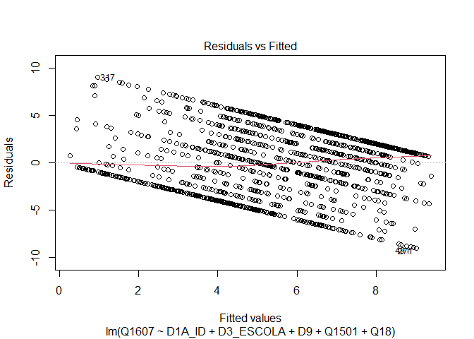
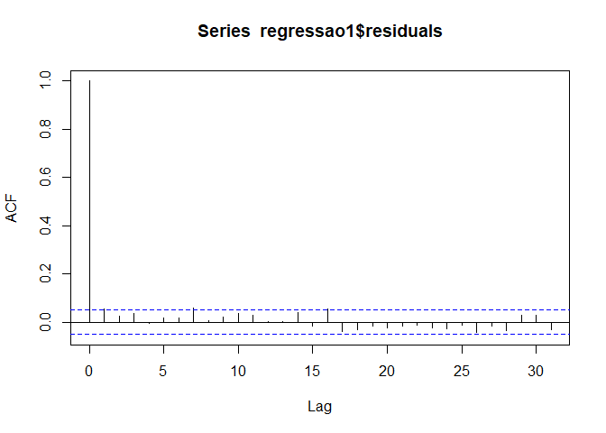
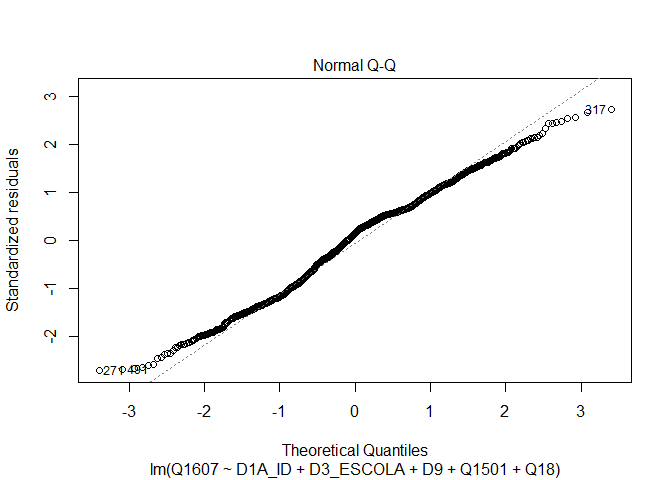

Exercicio 7
================
Helena Santos

### No exercício anterior foram feitos alguns modelos bivariados. Agora faça uma regressão multivariada mostrando como a nota atribuída a Jair Bolsonaro (variável Q1607) pode ser explicada pelas variáveis idade (D1A\_ID), educação (D3\_ESCOLA), renda (D9), nota atribuída ao PT (Q1501) e auto-atribuição ideológica (Q18) dos respondentes. Interprete o resultado a partir das informações dadas pelo sumário da regressão.

``` r
library(tidyverse)
library(haven)
banco <- read_sav("banco.sav")
write_sav(banco, "banco.sav")

banco_filtrado <- banco %>%
  filter(Q1607 <= 10) %>%
  filter(D9 != 9999999 & D9 != 9999998) %>%
  filter (Q1501 <= 10) %>%
  filter (Q18 <= 10) 
   
regressao1 <- lm (Q1607 ~ D1A_ID + D3_ESCOLA + D9 + Q1501 + Q18 , data = banco_filtrado)
summary(regressao1)
```

    ## 
    ## Call:
    ## lm(formula = Q1607 ~ D1A_ID + D3_ESCOLA + D9 + Q1501 + Q18, data = banco_filtrado)
    ## 
    ## Residuals:
    ##     Min      1Q  Median      3Q     Max 
    ## -9.0176 -2.5841  0.4915  2.1784  9.0477 
    ## 
    ## Coefficients:
    ##               Estimate Std. Error t value Pr(>|t|)    
    ## (Intercept)  5.743e+00  4.768e-01  12.044  < 2e-16 ***
    ## D1A_ID       5.816e-03  6.216e-03   0.936  0.34968    
    ## D3_ESCOLA   -1.543e-01  4.469e-02  -3.453  0.00057 ***
    ## D9          -3.067e-05  2.793e-05  -1.098  0.27230    
    ## Q1501       -4.154e-01  2.359e-02 -17.608  < 2e-16 ***
    ## Q18          3.244e-01  2.627e-02  12.349  < 2e-16 ***
    ## ---
    ## Signif. codes:  0 '***' 0.001 '**' 0.01 '*' 0.05 '.' 0.1 ' ' 1
    ## 
    ## Residual standard error: 3.336 on 1456 degrees of freedom
    ## Multiple R-squared:  0.2831, Adjusted R-squared:  0.2806 
    ## F-statistic:   115 on 5 and 1456 DF,  p-value: < 2.2e-16

``` r
confint(regressao1)
```

    ##                     2.5 %        97.5 %
    ## (Intercept)  4.807218e+00  6.677845e+00
    ## D1A_ID      -6.378648e-03  1.800966e-02
    ## D3_ESCOLA   -2.419686e-01 -6.665908e-02
    ## D9          -8.546072e-05  2.411486e-05
    ## Q1501       -4.616620e-01 -3.691133e-01
    ## Q18          2.728670e-01  3.759211e-01

### Resposta: De acordo com a regressão multivariada especificada acima nem a variável de idade (D1A\_ID) nem a de renda (D9) possuem resultados estatisticamente significantes, por isso não causam impacto na nota dada a Jair Bolsonaro (Q1607). Porém as variáveis escolaridade (D3\_ESCOLA), nota do PT (Q1501) e ideologia (Q18) causam impacto na nota atribuída a Bolsonaro. Esse impacto é de -1,543e-01, -4,154e-01 e 3,244e-01, respectivamente. O modelo explica aproximadamente 28% da variação na Q1607. De acordo com o intervalo de confiança de 95% é possível rejeitar a hipótese nula de que a escolaridade, nota do PT e ideologia causam 0 de impacto na nota de Bolsonaro.

### Em que medida os resultados se mantém ou se alteram quando comparados com os resultados do exercício anterior, quando foram utilizadas apenas regressões bivariadas?

### Resposta: Como no exercício anterior a variável (D9) de renda tem um impacto que não pode ser comprovado, não significante estatisticamente. Porém no exercício anterior a variável de idade tinha um impacto positivo de 0.025534 na nota de Jair Bolsonaro e agora esse impacto não pode ser comprovado. No exercício anterior a variável da escolaridade (D3\_ESCOLA) tinha um impacto negativo, de -0,11835 e agora esse impacto é de -1,543e-01. A variável da nota do PT (Q1501) tinha um impacto de -0,41118, e agora é de -4,154e-01. A variável da ideologia (Q18) tinha um impacto positivo de 0,40941, e agora tem de 3,244e-01. No exercício anterior ao olhar para os *Multiple R-squared* de cada modelo, as variáveis que mais explicavam a variação na nota de Bolsonaro eram as variáveis políticas. A Q18 (ideologia) explicava 13% da variação e a Q1501 (nota do PT) 15,8%. A idade explicava 1% da variação, a escolaridade 0,45% e a renda não demonstrou resultados significativos na regressão. O modelo multivariado do exercício atual tem varíaveis que combinadas explicam aproximadamente 28% da variação na nota de Jair Bolsonaro (Q1607).

### A partir da exposição de gráficos e testes, avalie se o modelo se adequa aos pressupostos que uma regressão linear exige.

### Linearidade

``` r
plot(regressao1, 1)
```

<!-- -->

### No caso da linearidade, de acordo com o gráfico, a linha vermelha se aproxima da horizontalidade e está bem próxima da linha pontilhada que cruza o eixo y no valor 0.

### Homocedasticidade

``` r
plot(regressao1, 3)
```

<!-- -->

``` r
library(lmtest)

bptest(regressao1)
```

    ## 
    ##  studentized Breusch-Pagan test
    ## 
    ## data:  regressao1
    ## BP = 57.067, df = 5, p-value = 4.898e-11

``` r
library(car)

ncvTest(regressao1) 
```

    ## Non-constant Variance Score Test 
    ## Variance formula: ~ fitted.values 
    ## Chisquare = 23.31391, Df = 1, p = 1.376e-06

### No caso da Homocedasticidade o pressuposto não é atendido. Pois o p-valor é muito baixo e por isso podemos rejeitar a hipótese nula de que a Homocedasticidade está presente.

### Autocorrelação entre casos/resíduos

``` r
acf(regressao1$residuals) 
```

<!-- -->

``` r
durbinWatsonTest(regressao1)
```

    ##  lag Autocorrelation D-W Statistic p-value
    ##    1      0.05506583      1.887184   0.024
    ##  Alternative hypothesis: rho != 0

### De acordo com o gráfico não existe autocorrelação entre os casos e resíduos. Segundo o teste, com o p-valor alto de 0.038, não é possível rejeitar a hipótese nula de que não existe correlação.

### Normalidade dos Resíduos

``` r
plot(regressao1, 2)
```

<!-- -->

``` r
library(MASS)
sresid <- studres(regressao1) 
shapiro.test(sresid)
```

    ## 
    ##  Shapiro-Wilk normality test
    ## 
    ## data:  sresid
    ## W = 0.98814, p-value = 1.522e-09

### No caso do gráfico os pontos estão bem próximos da linha diagonal. O teste não corrobora que a distribuição dos resíduos é normal, de acordo com o p-valor de 1.522e-09 podemos rejeitar a hipótese nula de normalidade na distribuição dos resíduos.

### Caso algum pressuposto não seja satisfeito, quais são as consequências específicas para o modelo estimado?

### Resposta: A Lineariade é um pressuposto sobre o parâmetro β (deve ser constante), ou seja, como as variáveis independentes impactam na variável dependente. A a violação desse pressuposto impede que a estimação por mínimos quadrados ordinários produza o melhor estimador linear não-viesado. A Homocedasticidade significa que a variância do termo de erro é constante para os diferentes valores da variável independente, a diferença entre os resultados observados dos resíduos e os resultados preditos pelo modelo devem variar uniformemente. A violação desse pressuposto é preocupante na medida em que afeta a confiabilidade dos testes de significância e intervalos de confiança. Autocorrelação entre casos/resíduos, os termos de erros são independentes entre si. As observações devem ser independentes, uma observação não pode afetar a outra, a violação desse pressuposto causa problemas na confiabilidade dos testes de significância e intervalos de confiança. A Normalidade dos Resíduos pressupõe que o erro amostral deve seguir uma distribuição aproximadamente normal para que os estimadores dos βs das variáveis independentes e σ (sigma) encontrados sejam não-viesados e eficientes. O modelo estimado anterior não satisfaz os pressupostos da Homocedasticidade e da distribuição normal dos resíduos, portanto são afetadas a confiabilidade dos testes de significância e intervalos de confiança e os estimadores dos βs e do σ são viesados e ineficientes.

### Considerando o 4o hurdle do livro *Fundamentals…*, faça um modelo de regressão extra adicionando uma variável **numérica** que foi omitida do modelo anterior, mas que possa ter relação causal com a variável dependente (e talvez alguma associação com as independentes anteriores). Justifique a variável extra e analise o resultado.

### Compare o resultado obtido com o modelo e conclusões anteriores.

### Nesse caso utilizarei a variável que indica Religião (D10) que possui os valores 98 (Não sabe) e 99 (Não respondeu) que não são necessários para a análise, por isso serão retirados do banco. A escolha dessa variável se deve ao fato de que o candidato Bolsonaro tem bases mais fortes em certos tipos de religiões no Brasil.

``` r
banco_religiao  <- banco_filtrado %>%
  filter(D10 != 99 & D10 != 98) 


regressao2 <- lm (Q1607 ~ D1A_ID + D3_ESCOLA + D9 + Q1501 + Q18 + D10 , data = banco_religiao)
summary(regressao2)
```

    ## 
    ## Call:
    ## lm(formula = Q1607 ~ D1A_ID + D3_ESCOLA + D9 + Q1501 + Q18 + 
    ##     D10, data = banco_religiao)
    ## 
    ## Residuals:
    ##     Min      1Q  Median      3Q     Max 
    ## -9.0447 -2.5911  0.4927  2.1784  9.1358 
    ## 
    ## Coefficients:
    ##               Estimate Std. Error t value Pr(>|t|)    
    ## (Intercept)  5.760e+00  4.814e-01  11.966  < 2e-16 ***
    ## D1A_ID       6.030e-03  6.252e-03   0.965 0.334905    
    ## D3_ESCOLA   -1.515e-01  4.493e-02  -3.372 0.000767 ***
    ## D9          -3.356e-05  2.794e-05  -1.201 0.229856    
    ## Q1501       -4.202e-01  2.366e-02 -17.755  < 2e-16 ***
    ## Q18          3.240e-01  2.636e-02  12.291  < 2e-16 ***
    ## D10         -8.672e-04  3.346e-03  -0.259 0.795533    
    ## ---
    ## Signif. codes:  0 '***' 0.001 '**' 0.01 '*' 0.05 '.' 0.1 ' ' 1
    ## 
    ## Residual standard error: 3.331 on 1442 degrees of freedom
    ## Multiple R-squared:  0.2871, Adjusted R-squared:  0.2841 
    ## F-statistic: 96.78 on 6 and 1442 DF,  p-value: < 2.2e-16

``` r
confint(regressao2)
```

    ##                     2.5 %        97.5 %
    ## (Intercept)  4.8159051913  6.704535e+00
    ## D1A_ID      -0.0062330487  1.829401e-02
    ## D3_ESCOLA   -0.2396223310 -6.335455e-02
    ## D9          -0.0000883719  2.124528e-05
    ## Q1501       -0.4665944346 -3.737532e-01
    ## Q18          0.2722950434  3.757165e-01
    ## D10         -0.0074305798  5.696184e-03

### Resposta: A variável adicionada ao modelo não possui resultados estatisticamente significantes. Além disso com um intervalo de confiança de 95% ( -0,0074305798 a 5,696184e-03) não é possível rejeitar a hipótese nula de que a variável da religião impacta na nota de Bolsonaro. De acordo com o novo modelo as variáveis que impactam na nota de Bolsonaro continuam sendo escolaridade, nota do PT e ideologia. O novo modelo explica apenas 0,30% a mais que o modelo anterior de acordo com o *Multiple R-squared*. No modelo que inclui religião o impacto que a escolaridade, nota do PT e ideologia causa na nota de Bolsonaro variou muito pouco, -1,515e-01, -4,202e-01 e 3,240e-01, respectivamente.
