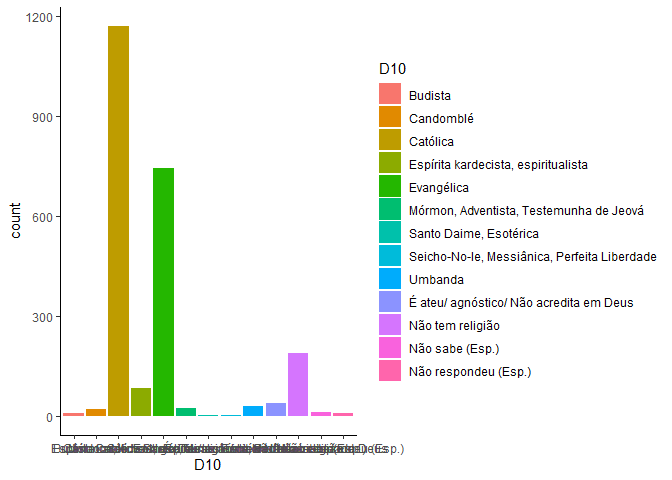
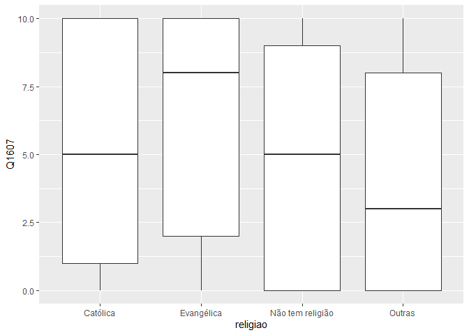
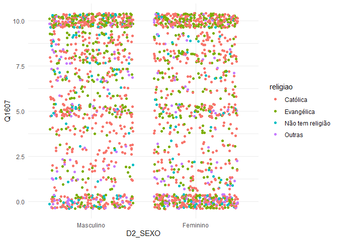
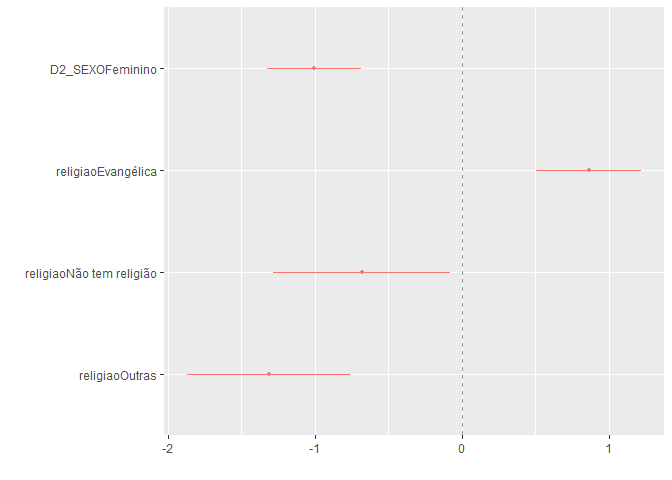

Exercício 8
================
Helena Santos

### Continuaremos com a utilização dos dados do ESEB2018. Carregue o banco da mesma forma que nos exercicios anteriores

``` r
library(tidyverse)
library(haven)
library(scales)

link <- "https://github.com/MartinsRodrigo/Analise-de-dados/blob/master/04622.sav?raw=true"

download.file(link, "04622.sav", mode = "wb")

banco <- read_spss("04622.sav") 

banco <- banco %>%
  mutate(D2_SEXO = as_factor(D2_SEXO),
         D10 = as_factor(D10)) %>%
  filter(Q1607 < 11)
```

### Começaremos a utilizar no modelo de regressão variáveis qualitativas/categóricas. A primeira delas é sexo (D2\_SEXO). Represente esta variável graficamente.

``` r
ggplot(banco, aes(D2_SEXO)) +
geom_bar()
```

<!-- -->

### Represente graficamente a associação entre sexo e nota atribuida a Bolsonaro (Q1607)

``` r
ggplot(banco, aes(D2_SEXO, Q1607)) +
geom_boxplot()
```

<!-- -->

### Teste a associação entre sexo e aprovação de Bolsonaro. Qual é sua conclusão?

``` r
banco %>%
group_by(D2_SEXO) %>%
summarise(mediana = median(Q1607),
          media = mean(Q1607),
          desvio = sd(Q1607),
          n = n())
```

    ## # A tibble: 2 x 5
    ##   D2_SEXO   mediana media desvio     n
    ##   <fct>       <dbl> <dbl>  <dbl> <int>
    ## 1 Masculino       7  6.02   3.78  1120
    ## 2 Feminino        5  5.06   4.08  1206

``` r
t.test(Q1607 ~ D2_SEXO, data = banco)
```

    ## 
    ##  Welch Two Sample t-test
    ## 
    ## data:  Q1607 by D2_SEXO
    ## t = 5.88, df = 2324, p-value = 4.693e-09
    ## alternative hypothesis: true difference in means is not equal to 0
    ## 95 percent confidence interval:
    ##  0.6392909 1.2790608
    ## sample estimates:
    ## mean in group Masculino  mean in group Feminino 
    ##                6.020536                5.061360

### Resposta: Nesse caso existe diferença entre as médias do sexo masculino e feminino. Com o p-valor = 4,693e-09 é com o intervalo de confiança de 95% (0,6392909 a 1,2790608) podemos descartar a hipótese nula de que a diferença das médias é igual a zero, corroborando a hipótese alternativa de que a diferença das médias é diferente de zero.

### Faça uma regressão bivariada com estas duas variáveis, verificando em que medida sexo explica a nota atribuida a Bolsonaro. Interprete o resultado da regressão (o \(\beta\), o \(\alpha\), p-valores e medidas de desempenho do modelo)

``` r
regressao1 <- lm(Q1607 ~ D2_SEXO, data = banco)
summary (regressao1)
```

    ## 
    ## Call:
    ## lm(formula = Q1607 ~ D2_SEXO, data = banco)
    ## 
    ## Residuals:
    ##     Min      1Q  Median      3Q     Max 
    ## -6.0205 -4.0614 -0.0205  3.9795  4.9386 
    ## 
    ## Coefficients:
    ##                 Estimate Std. Error t value Pr(>|t|)    
    ## (Intercept)       6.0205     0.1178  51.112  < 2e-16 ***
    ## D2_SEXOFeminino  -0.9592     0.1636  -5.863 5.18e-09 ***
    ## ---
    ## Signif. codes:  0 '***' 0.001 '**' 0.01 '*' 0.05 '.' 0.1 ' ' 1
    ## 
    ## Residual standard error: 3.942 on 2324 degrees of freedom
    ## Multiple R-squared:  0.01458,    Adjusted R-squared:  0.01415 
    ## F-statistic: 34.38 on 1 and 2324 DF,  p-value: 5.178e-09

``` r
confint(regressao1)
```

    ##                     2.5 %     97.5 %
    ## (Intercept)      5.789550  6.2515214
    ## D2_SEXOFeminino -1.279962 -0.6383893

### Resposta: De acordo com o p-valor, estatisticamente significante, de \< 2e-16 podemos considerar que o alfa ou intercept é igual a 6,0205. Quando a pessoa for do sexo feminino o impacto na nota de Bolsonaro é negativo de - 0,9591, se comparado ao sexo masculino. De acordo com o intervalo de confiança de 95% (-1,279962 a -0,6383893) e, também, de acordo com o p-valor de 5,18e-09 podemos descartar a hipótese de que o impacto causado por ser do sexo feminino, em comparação ao masculino, é igual a O. Porém, de acordo com o R^2 a variável do sexo explica apenas 1,45% da variação na nota de Bolsonaro. Nesse modelo o erro residual é de 3,942.

### Outra variável categórica bastante presente no debate sobre voto na última eleição é religião (D10). Represente esta variável graficamente.

``` r
ggplot( banco, aes(D10, fill = D10 ) ) +
        geom_bar( )+
        theme_classic () 
```

<!-- -->

### Crie no banco de dados uma variável de religião modificada chamada `religiao` com as categorias “Evangélica”, “Católica”, “Não tem religião”, e agregue todas as outras na categoria “Outras”.

``` r
Outras <- levels(banco$D10)[-c(3,5,13)]

banco <- banco %>%
  mutate(religiao = case_when(D10 %in% Outras ~ "Outras",
                              D10 == "Católica" ~ "Católica",
                              D10 == "Evangélica" ~ "Evangélica",
                              D10 == "Não tem religião" ~ "Não tem religião"))


ggplot(banco, aes(religiao, ..count../sum(..count..) )) +
  geom_bar() +
  scale_y_continuous(labels = percent)
```

<!-- -->

### Represente graficamente a associação entre religiao e nota atribuida a Bolsonaro

``` r
ggplot(banco, aes(religiao, Q1607)) +
geom_boxplot()
```

<!-- -->

### Para fazer o teste estatistico da associação entre as variáveis, não podemos usar o teste-t pois neste caso a variável categórica possui diversos níveis. O adequado é utilizar o teste de ANOVA ou o teste de Kruskal. Abaixo ilustramos como fazer esse teste. O Kruskal-test indica se há diferença entre alguma das categorias da variável e a variável contínua, mas não especifica como as diferentes categorias se diferenciam. Isso pode ser obtido com o teste de Wilcox, que compara os agrupamentos par a par. Como você interpreta esse resultado?

``` r
kruskal.test(Q1607 ~ religiao, data = banco)
```

    ## 
    ##  Kruskal-Wallis rank sum test
    ## 
    ## data:  Q1607 by religiao
    ## Kruskal-Wallis chi-squared = 61.013, df = 3, p-value = 3.571e-13

``` r
pairwise.wilcox.test(banco$Q1607, banco$religiao,
                     p.adjust.method = "BH")
```

    ## 
    ##  Pairwise comparisons using Wilcoxon rank sum test with continuity correction 
    ## 
    ## data:  banco$Q1607 and banco$religiao 
    ## 
    ##                  Católica Evangélica Não tem religião
    ## Evangélica       7.4e-06  -          -               
    ## Não tem religião 0.043    8.3e-06    -               
    ## Outras           1.2e-05  4.4e-11    0.126           
    ## 
    ## P value adjustment method: BH

### Resposta: O teste de Kruskal-Wallis teve um p-valor bem baixo e estatisticamente significante de 3,571e-13, ou seja, ao menos uma amostra domina estocasticamente (o padrão estocástico é aquele cujo estado é indeterminado, com origem em eventos aleatórios) outra amostra. No caso do teste *Pairwise comparisons* ou comparação por pares, o resultado indica que existe uma diferença estatisticamente significante entre a o impacto causado na nota de Bolsonaro pela categoria Católica e Evangélica (p-valor = 7,4e-06), Católica e Não tem religião (p-valor = 0,043), Católica e Outras (p-valor = 1,2e-05). Existe uma diferença estatisticamente significante entre a categoria Evangélica e Não tem religião (p-valor = 8,3e-06) e entre Evangélica e Outras (p-valor = 4,4e-11). Entre a categoria Não tem religião e Outras não há diferença estatisticamente significante (p-valor = 0,126).

### Faça uma regressão linear para verificar em que medida religião explica a avaliação de Bolsonaro. Interprete o resultado da regressão (cada um dos \(\beta\)s, o \(\alpha\), p-valores e medidas de desempenho do modelo)

``` r
glimpse (banco$religiao)
```

    ##  chr [1:2326] "Evangélica" "Católica" "Católica" "Católica" "Evangélica" ...

``` r
regressao2 <- lm(Q1607 ~ religiao, data = banco)
summary(regressao2)
```

    ## 
    ## Call:
    ## lm(formula = Q1607 ~ religiao, data = banco)
    ## 
    ## Residuals:
    ##    Min     1Q Median     3Q    Max 
    ## -6.259 -4.107  0.559  3.741  5.893 
    ## 
    ## Coefficients:
    ##                          Estimate Std. Error t value Pr(>|t|)    
    ## (Intercept)                5.4410     0.1146  47.470  < 2e-16 ***
    ## religiaoEvangélica         0.8184     0.1838   4.452 8.93e-06 ***
    ## religiaoNão tem religião  -0.6325     0.3081  -2.053   0.0402 *  
    ## religiaoOutras            -1.3339     0.2859  -4.665 3.26e-06 ***
    ## ---
    ## Signif. codes:  0 '***' 0.001 '**' 0.01 '*' 0.05 '.' 0.1 ' ' 1
    ## 
    ## Residual standard error: 3.921 on 2322 degrees of freedom
    ## Multiple R-squared:  0.0261, Adjusted R-squared:  0.02484 
    ## F-statistic: 20.74 on 3 and 2322 DF,  p-value: 2.936e-13

``` r
confint(regressao2)
```

    ##                               2.5 %      97.5 %
    ## (Intercept)               5.2162572  5.66579408
    ## religiaoEvangélica        0.4578709  1.17889504
    ## religiaoNão tem religião -1.2366115 -0.02841855
    ## religiaoOutras           -1.8945985 -0.77316710

### Resposta: No caso dessa regressão a categoria de referência é a Católica, ou seja, as outras categorias tem valores em relação à categoria católica. De acordo com o p-valor \< 2e-16, podemos considerar o intercepto de 5,4410 estatisticamente significante. Já no caso da religião Evangélica, que tem o intevalo de confiança (95%) de 0,4578709 a 1,17889504 e o p-valor = 8,93e-06 podemos dizer que os Evangélicos dão uma nota pra Bolsonaro 0,8184 maior que os Católicos. Os que não têm religião dão uma nota pra Bolsonaro 0,6325 menor que os Católicos, o p-valor de 0,0402 e o intervalo de confiança (95%) de -1,2366115 a -0,02841855, corroboram esse resultado. No caso da categoria “Outras” a nota dada a Bolsonaro é 1,3339 menor que a nota que os Católicos dão, tanto o p-valor de 3,26e-06, quanto o intervalo de confiança de 95% (-1,8945985 a -0,7316710) confirmam esse resultado. A religião explica 2,61% na variação da nota de Bolsonaro. Nesse modelo o erro residual é de 3,921.

### Faça uma regressao linear avaliando ao mesmo tempo em que medida religiao e sexo explicam a avaliacao de Bolsonaro. Interprete o resultado de cada um dos coeficientes a partir da representação gráfica destes.

``` r
ggplot (banco, aes (D2_SEXO, Q1607, color = religiao)) + 
  geom_jitter()+ 
  theme_minimal ()
```

<!-- -->

``` r
regressao3 <- lm(Q1607 ~ D2_SEXO + religiao, data = banco)
summary(regressao3)
```

    ## 
    ## Call:
    ## lm(formula = Q1607 ~ D2_SEXO + religiao, data = banco)
    ## 
    ## Residuals:
    ##     Min      1Q  Median      3Q     Max 
    ## -6.8130 -3.9448  0.1915  3.7365  6.3682 
    ## 
    ## Coefficients:
    ##                          Estimate Std. Error t value Pr(>|t|)    
    ## (Intercept)                5.9493     0.1401  42.477  < 2e-16 ***
    ## D2_SEXOFeminino           -1.0045     0.1616  -6.215 6.07e-10 ***
    ## religiaoEvangélica         0.8637     0.1825   4.732 2.36e-06 ***
    ## religiaoNão tem religião  -0.6813     0.3057  -2.229   0.0259 *  
    ## religiaoOutras            -1.3130     0.2837  -4.629 3.88e-06 ***
    ## ---
    ## Signif. codes:  0 '***' 0.001 '**' 0.01 '*' 0.05 '.' 0.1 ' ' 1
    ## 
    ## Residual standard error: 3.889 on 2321 degrees of freedom
    ## Multiple R-squared:  0.04204,    Adjusted R-squared:  0.04039 
    ## F-statistic: 25.46 on 4 and 2321 DF,  p-value: < 2.2e-16

``` r
confint(regressao3)
```

    ##                               2.5 %      97.5 %
    ## (Intercept)               5.6746301  6.22393694
    ## D2_SEXOFeminino          -1.3214476 -0.68754476
    ## religiaoEvangélica        0.5057662  1.22158996
    ## religiaoNão tem religião -1.2807278 -0.08181084
    ## religiaoOutras           -1.8692530 -0.75671984

``` r
library(dotwhisker)

dwplot(regressao3,
vline = geom_vline(xintercept = 0, colour = "grey60", linetype = 2))
```

<!-- -->

### Resposta: De acordo com o gráfico dwplot nenhum dos intervalos de confiança dos coeficientes cruza o 0, portanto todos os coeficientes são estatisticamente significantes.

### Aqui o valor do intercepto estimado é 5,9493 de acordo com o p-valor \< 2e-16, esse resultado é estatisticamente significante, ou seja, a nota de Bolsonaro assume esse valor quando as variáveis caregóricas forem igual a 0 (categorias de referência). Nessa regressão são duas categorias de referência uma para sexo e outra para religião, Masculino e Católica, respectivamente. No caso da variável do sexo o resultado da regressão com p-valor estatisticamente significante de 6,07e-10 e intervalo de confiança de 95% (-1,3214476 a -0,68754476) é possível afirmar que as pessoas do sexo feminino dão uma nota 1,0045 menor que as do sexo masculino. A categoria Evangélica atribui uma nota 0,8637 maior que os Católicos, dado o p-valor = 2,36e-06 e o intervalo de confiança (95%) de 0,5057662 a 1,22158996. A categoria “Não tem religião” atribui uma nota 0,6813 menor a Bolsonaro que os Católicos, tanto o p-valor de 0,0259, quanto o intervalo de confiança (95%) de -1,2807278 a -0,08181084 corroboram esse resultado. No caso dos que tem outras religiões a nota é 1,3130 menor que a nota dos Católicos.O p-valor de 3,88e-06 e o intervalo de confiança (95%), de -1,8692530 a -0,75671984, confirmam esse resultado. A religião e o sexo explicam 4,20% na variação da nota de Bolsonaro. Nesse modelo o erro residual é de 3,889.
