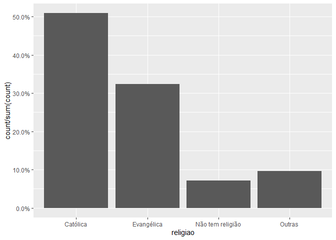

Exercicio 9
================

### Continuaremos com a utilização dos dados do ESEB2018. Carregue o banco da mesma forma que nos exercicios anteriores

``` r
library(tidyverse)
library(haven)
library(scales)

banco <- read_spss("04622.sav") 

banco <- banco %>%
  mutate(D10 = as_factor(D10)) %>%
  filter(Q1607 < 11, 
         Q18 < 11,
         D9 < 9999998,
         Q1501 < 11)
```

### Crie a mesma variável de religião utilizada no exercício anterior

``` r
Outras <- levels(banco$D10)[-c(3,5,13)]

banco <- banco %>%
  mutate(religiao = case_when(D10 %in% Outras ~ "Outras",
                              D10 == "Católica" ~ "Católica",
                              D10 == "Evangélica" ~ "Evangélica",
                              D10 == "Não tem religião" ~ "Não tem religião"))


ggplot(banco, aes(religiao, ..count../sum(..count..) )) +
  geom_bar() +
  scale_y_continuous(labels = percent)
```

<!-- -->

### Faça uma regressão linear avaliando em que medida as variáveis independentes utilizadas nos exercícios 7 e 8, idade(D1A\_ID), educação (D3\_ESCOLA), renda (D9), nota atribuída ao PT (Q1501), auto-atribuição ideológica (Q18), sexo (D2\_SEXO) e religião (variável criada no passo anterior) explicam a avaliação de Bolsonaro (Q1607), mas com uma interação entre as variáveis religião e sexo. Exiba o resultado da regressão e interprete os valores dos coeficientes \(\beta\)s estimados.

``` r
regressao <- lm( Q1607 ~ D1A_ID + D3_ESCOLA + D9 + Q1501 + Q18 + D2_SEXO + religiao + religiao * D2_SEXO, data = banco )

summary(regressao)
```

    ## 
    ## Call:
    ## lm(formula = Q1607 ~ D1A_ID + D3_ESCOLA + D9 + Q1501 + Q18 + 
    ##     D2_SEXO + religiao + religiao * D2_SEXO, data = banco)
    ## 
    ## Residuals:
    ##    Min     1Q Median     3Q    Max 
    ## -8.942 -2.561  0.361  2.303  9.052 
    ## 
    ## Coefficients:
    ##                                    Estimate Std. Error t value Pr(>|t|)    
    ## (Intercept)                       6.114e+00  5.915e-01  10.338   <2e-16 ***
    ## D1A_ID                            1.065e-02  6.255e-03   1.703   0.0888 .  
    ## D3_ESCOLA                        -1.134e-01  4.491e-02  -2.524   0.0117 *  
    ## D9                               -3.632e-05  2.768e-05  -1.312   0.1897    
    ## Q1501                            -3.956e-01  2.370e-02 -16.696   <2e-16 ***
    ## Q18                               3.150e-01  2.607e-02  12.083   <2e-16 ***
    ## D2_SEXO                          -6.115e-01  2.438e-01  -2.508   0.0122 *  
    ## religiaoEvangélica                1.181e+00  6.146e-01   1.921   0.0549 .  
    ## religiaoNão tem religião          1.986e-01  1.059e+00   0.188   0.8512    
    ## religiaoOutras                   -1.583e+00  9.503e-01  -1.666   0.0960 .  
    ## D2_SEXO:religiaoEvangélica       -3.412e-01  3.895e-01  -0.876   0.3812    
    ## D2_SEXO:religiaoNão tem religião -1.889e-01  6.979e-01  -0.271   0.7867    
    ## D2_SEXO:religiaoOutras            5.041e-01  6.067e-01   0.831   0.4062    
    ## ---
    ## Signif. codes:  0 '***' 0.001 '**' 0.01 '*' 0.05 '.' 0.1 ' ' 1
    ## 
    ## Residual standard error: 3.297 on 1449 degrees of freedom
    ## Multiple R-squared:  0.3028, Adjusted R-squared:  0.297 
    ## F-statistic: 52.44 on 12 and 1449 DF,  p-value: < 2.2e-16

``` r
confint(regressao)
```

    ##                                          2.5 %        97.5 %
    ## (Intercept)                       4.954254e+00  7.274692e+00
    ## D1A_ID                           -1.616843e-03  2.292432e-02
    ## D3_ESCOLA                        -2.014868e-01 -2.527982e-02
    ## D9                               -9.061286e-05  1.797812e-05
    ## Q1501                            -4.421265e-01 -3.491597e-01
    ## Q18                               2.638804e-01  3.661651e-01
    ## D2_SEXO                          -1.089711e+00 -1.332397e-01
    ## religiaoEvangélica               -2.490748e-02  2.386365e+00
    ## religiaoNão tem religião         -1.877835e+00  2.275016e+00
    ## religiaoOutras                   -3.447227e+00  2.810461e-01
    ## D2_SEXO:religiaoEvangélica       -1.105272e+00  4.228513e-01
    ## D2_SEXO:religiaoNão tem religião -1.557861e+00  1.180062e+00
    ## D2_SEXO:religiaoOutras           -6.860878e-01  1.694284e+00

### Interprete a significancia estatística dos coeficientes estimados

### Resposta: O intercepto estimado dessa regressão é 6,114e+00, o p-valor \< 2e-16 e o intervalo de confiança de 95% (4,954254e+00 a 7,274692e+00) corroboram esse resultado. O intercepto indica a nota de Bolsonaro quando todos os coeficientes são iguais a 0. A variável que indica a idade (D1A\_ID) não causa impacto na nota de Bolsonaro. A variável D3\_ESCOLA causa um impacto negativo de 1,134e-01 na nota de Bolsonaro, o p-valor de 0,0117 e o intervalo de confiança de 95% (-2,014868e-01 a -2,527982e-02) confirmam esse resultado. A variável que indica a renda (D9) não causa impacto na nota de Bolsonaro. A variável Q1501 que indica a nota atribuída ao PT causa um impacto negativo de 3,956e-01 na nota de Bolsonaro, aqui o intervalo de confiança de 95% (-4,421265e-01 a -3,491597e-01) e o p-valor \<2e-16 comprovam esse resultado. A variável de auto-atribuição ideológica (Q18) causa um impacto positivo na nota de Bolsonaro de 3,150e-01, tanto o p-valor \<2e-16, quanto o intervalo de confiança de 95% (2,638804e-01 a 3,661651e-01) confirmam que a variável Q18 causa esse impacto. De acordo com o R^2, o modelo explica 30% da variação na nota de Bolsonaro. Porém ele erra em média 3,297 no valor da variável dependente.

### Faça um gráfico que mostre a interação entre as duas variáveis. Interprete o resultado apresentado

``` r
library(sjPlot)

plot_model(regressao, type = "pred", 
           terms = c("religiao", "D2_SEXO"), 
           ci.lvl = 0.9)
```

<!-- -->

### Resposta: Nas variáveis categóricas, sexo e religião, as categorias de referência são homens e religião católica. Então se o sexo for feminino a variável de sexo causa um impacto de -6,115e-01 na nota de Bolsonaro em relação aos homens católicos. Quando o sexo é masculino (0) a religião evangélica causa um impacto de 1,181e+00 na variável Q1607 em relação à religião católica, porém mesmo com esse impacto o p-valor só é estatisticamente significante no nível 0,1. No caso da categoria de religião “outras” o p-valor também é estatisticamente significante no nível 0,1, no entanto o gráfico não corrobora esse resultado. De acordo com o gráfico só existe diferença de impacto na nota de Bolsonaro entre homem e mulher na religião evangélica e na religião católica. Na categoria “outras” e “não tem religião” não faz diferença ser homem ou mulher em relação a nota dada a Bolsonaro, o p-valor da categoria “não tem religião” (0,8512) confirma esse resultado.
